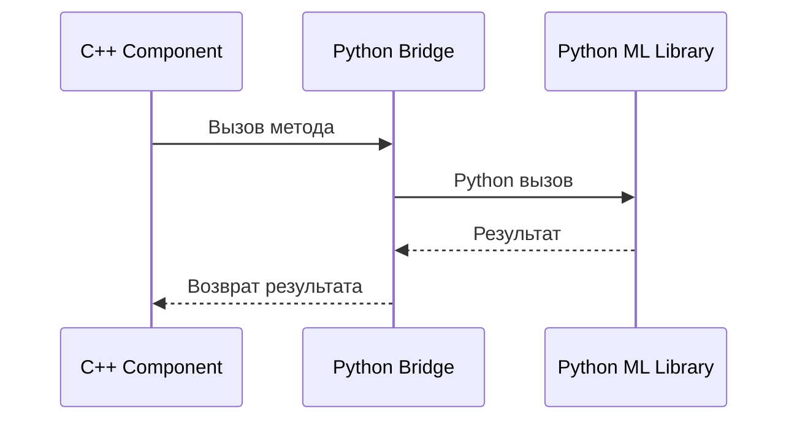
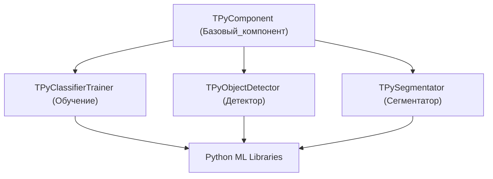
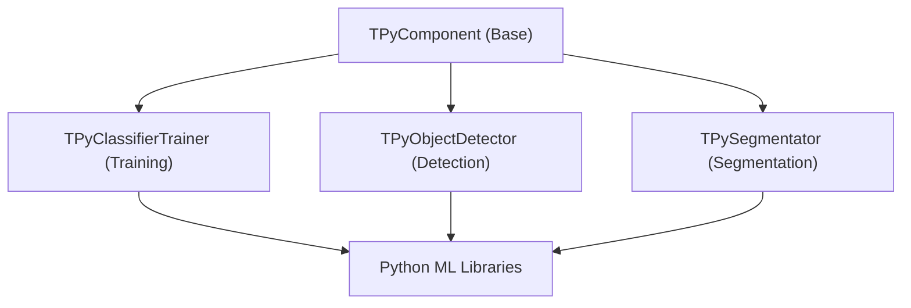

# Архитектура Rdk-PyMachineLearningLib

## RU

### Обзор

Rdk-PyMachineLearningLib предоставляет мост между C++ кодом Rdk и Python библиотеками машинного обучения.

### Структура библиотеки



### Архитектура компонентов



### Основные модули

#### Базовые компоненты

- **TPyComponent** - базовый компонент для всех Python-интегрированных компонентов. Предоставляет общую функциональность для работы с Python
- **TPythonIntegration** - интеграция с Python, основной класс для управления Python интерпретатором и выполнения Python кода
- **TPythonIntegrationUtil** - утилиты для работы с Python интеграцией
- **TPythonIntegrationInclude** - вспомогательные заголовки для интеграции

#### Классификаторы

- **TPyClassifierTrainer** - тренер классификаторов через Python. Обучение классификаторов с использованием Python ML библиотек
- **TPyUBitmapClassifier** - классификатор растровых изображений через Python
- **TPyAggregateClassifier** - агрегированный классификатор (ансамбль классификаторов)

#### Детекторы объектов

- **TPyObjectDetector** - детектор объектов через Python
- **TPyObjectDetectorYolo** - детектор объектов YOLO через Python
- **TPyObjectDetectorYoloEx** - расширенный детектор YOLO
- **TPyObjectDetectorSqueezeDet** - детектор SqueezeDet через Python
- **TPyDetPredict** - предсказание детекции через Python
- **TPyDetectorTrainer** - тренер детекторов через Python

#### Сегментаторы

- **TPySegmentator** - сегментатор через Python
- **TPySegmentatorUNet** - сегментатор U-Net через Python
- **TPySegmentatorProtobuf** - сегментатор с использованием Protobuf
- **TPySegmenterTrainer** - тренер сегментаторов через Python

#### Базовые классы

- **TPyBaseTrainer** - базовый класс тренера через Python

#### Сортировка предсказаний

- **TPyPredictSort** - сортировка предсказаний

#### Конвертеры

- **pyboost_cv3_converter / pyboostcvconverter** - конвертеры между OpenCV и Python (используя Boost.Python)

### Ключевые классы

#### PyMachineLearningLib

Главный класс библиотеки.

Библиотека загружается условно:

```cpp
#ifdef RDK_USE_PYTHON
libs_list.push_back(&RDK::PyMachineLearningLib);
#endif
```

### Зависимости

- **rdk.static.qt** - ядро Rdk
- **Python** (C API) - интерпретатор Python
- **NumPy** - для работы с массивами
- **OpenCV** - для работы с изображениями (через конвертеры)
- **Boost.Python** (опционально) - для конвертеров

### Особенности

- Использует Python C API для вызова Python кода из C++
- Поддерживает передачу данных между C++ и Python
- Конвертеры для OpenCV изображений
- Поддержка различных Python ML библиотек (TensorFlow, PyTorch, scikit-learn, YOLO и др.)

### Примеры использования

#### Python классификатор

```cpp
#ifdef RDK_USE_PYTHON
// Создание Python классификатора
TPyUBitmapClassifier* classifier = storage->CreateComponent<TPyUBitmapClassifier>();
// Настройка пути к Python скрипту и модели
// Классификация изображений
#endif
```

### См. также

- [Usage-Examples.md](Usage-Examples.md) - примеры использования
- [API-Overview.md](API-Overview.md) - обзор API

---

## EN

### Overview

Rdk-PyMachineLearningLib provides a bridge between C++ Rdk code and Python machine learning libraries.

### Component Architecture



The flowchart reflects the main idea: C++ components manage the engine lifecycle and data exchange, while heavy ML logic runs inside Python (models, inference, postprocessing). The bridge layer (`TPythonIntegration` / `TPythonIntegrationUtil`) handles interpreter setup, module loading and function calls.

### Main Modules

#### Base Components

- **TPyComponent** - base component for all Python-integrated components. Provides common functionality for working with Python
- **TPythonIntegration** - Python integration, main class for managing Python interpreter and executing Python code
- **TPythonIntegrationUtil** - utilities for Python integration
- **TPythonIntegrationInclude** - helper headers for integration

#### Classifiers

- **TPyClassifierTrainer** - classifier trainer via Python. Training classifiers using Python ML libraries
- **TPyUBitmapClassifier** - bitmap image classifier via Python
- **TPyAggregateClassifier** - aggregate classifier (ensemble of classifiers)

#### Object Detectors

- **TPyObjectDetector** - object detector via Python
- **TPyObjectDetectorYolo** - YOLO object detector via Python
- **TPyObjectDetectorYoloEx** - extended YOLO detector
- **TPyObjectDetectorSqueezeDet** - SqueezeDet detector via Python
- **TPyDetPredict** - detection prediction via Python
- **TPyDetectorTrainer** - detector trainer via Python

#### Segmentators

- **TPySegmentator** - segmentator via Python
- **TPySegmentatorUNet** - U-Net segmentator via Python
- **TPySegmentatorProtobuf** - segmentator using Protobuf
- **TPySegmenterTrainer** - segmentator trainer via Python

#### Base Classes

- **TPyBaseTrainer** - base trainer class via Python

#### Prediction Sorting

- **TPyPredictSort** - prediction sorting

#### Converters

- **pyboost_cv3_converter / pyboostcvconverter** - converters between OpenCV and Python (using Boost.Python)

### Key Classes

#### PyMachineLearningLib

Main library class.

The library is loaded conditionally:

```cpp
#ifdef RDK_USE_PYTHON
libs_list.push_back(&RDK::PyMachineLearningLib);
#endif
```

### Dependencies

- **rdk.static.qt** - Rdk core
- **Python** (C API) - Python interpreter
- **NumPy** - for array operations
- **OpenCV** - for image operations (via converters)
- **Boost.Python** (optional) - for converters

### Features

- Uses Python C API to call Python code from C++
- Supports data transfer between C++ and Python
- Converters for OpenCV images
- Support for various Python ML libraries (TensorFlow, PyTorch, scikit-learn, YOLO, etc.)

### Usage Examples

#### Python Classifier

```cpp
#ifdef RDK_USE_PYTHON
// Create Python classifier
TPyUBitmapClassifier* classifier = storage->CreateComponent<TPyUBitmapClassifier>();
// Configure path to Python script and model
// Classify images
#endif
```

### See Also

- [Usage-Examples.md](Usage-Examples.md) - usage examples
- [API-Overview.md](API-Overview.md) - API overview
