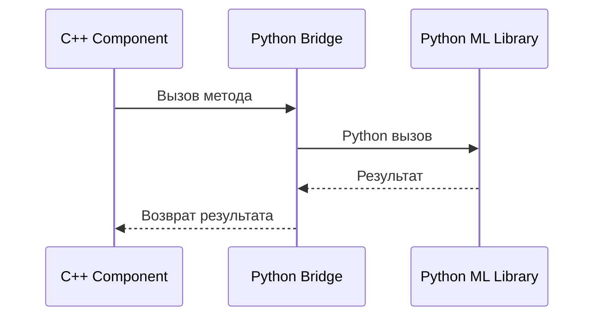
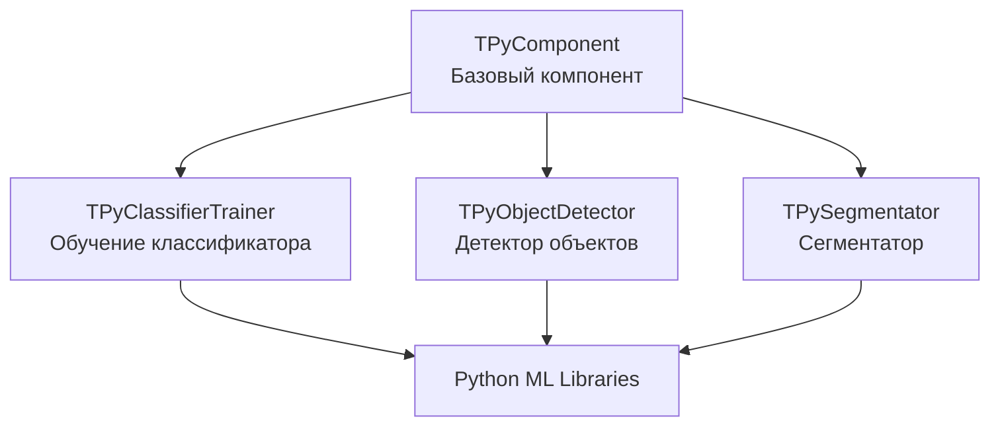

# Архитектура Rdk-PyMachineLearningLib

## RU

### Обзор

Rdk-PyMachineLearningLib предоставляет мост между C++ кодом Rdk и Python библиотеками машинного обучения.

### Структура библиотеки

### Архитектура компонентов

### Основные модули

#### Базовый компонент

- **TPyComponent** - базовый компонент для работы с Python

#### Классификация

- **TPyClassifierTrainer** - обучение классификатора
- **TPyUBitmapClassifier** - классификатор изображений

#### Детекция объектов

- **TPyObjectDetector** - базовый детектор объектов
- **TPyObjectDetectorYolo** - детектор YOLO
- **TPyObjectDetectorYoloEx** - расширенный YOLO детектор
- **TPyObjectDetectorSqueezeDet** - детектор SqueezeDet

#### Сегментация

- **TPySegmentator** - базовый сегментатор
- **TPySegmentatorUNet** - сегментатор UNet
- **TPySegmentatorProtobuf** - сегментатор Protobuf
- **TPySegmenterTrainer** - обучение сегментатора

#### Интеграция Python

- **TPythonIntegration** - интеграция с Python
- **TPythonIntegrationUtil** - утилиты интеграции

### Зависимости

- `rdk.static.qt` - ядро Rdk
- Python3 - интерпретатор Python
- Python ML библиотеки (TensorFlow, PyTorch, etc.)

### См. также

- [Usage-Examples.md](Usage-Examples.md) - примеры использования
- [API-Overview.md](API-Overview.md) - обзор API

---

## EN

### Overview

Rdk-PyMachineLearningLib provides a bridge between C++ Rdk code and Python machine learning libraries.

### Component Architecture

### Main Modules

#### Base Component

- **TPyComponent** - base component for Python operations

#### Classification

- **TPyClassifierTrainer** - classifier training
- **TPyUBitmapClassifier** - image classifier

#### Object Detection

- **TPyObjectDetector** - base object detector
- **TPyObjectDetectorYolo** - YOLO detector
- **TPyObjectDetectorYoloEx** - extended YOLO detector
- **TPyObjectDetectorSqueezeDet** - SqueezeDet detector

#### Segmentation

- **TPySegmentator** - base segmentator
- **TPySegmentatorUNet** - UNet segmentator
- **TPySegmentatorProtobuf** - Protobuf segmentator
- **TPySegmenterTrainer** - segmentator training

#### Python Integration

- **TPythonIntegration** - Python integration
- **TPythonIntegrationUtil** - integration utilities

### Dependencies

- `rdk.static.qt` - Rdk core
- Python3 - Python interpreter
- Python ML libraries (TensorFlow, PyTorch, etc.)

### See Also

- [Usage-Examples.md](Usage-Examples.md) - usage examples
- [API-Overview.md](API-Overview.md) - API overview
