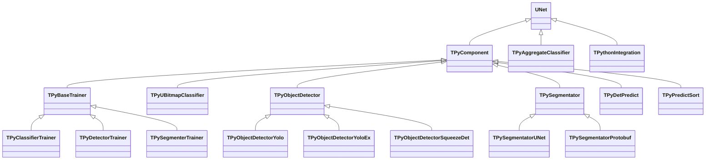

# Компоненты Rdk-PyMachineLearningLib

## Обзор

Эта директория содержит документацию для всех компонентов библиотеки Rdk-PyMachineLearningLib с детальными UML-диаграммами.

## Структура документации

Каждый компонент имеет полную документацию, включающую:

1. **UML-диаграмма классов** (Class Diagram) — иерархия наследования, свойства, методы
2. **UML-диаграмма последовательности** (Sequence Diagram) — жизненный цикл объекта
3. **UML-диаграмма состояний** (State Diagram) — состояния компонента
4. **UML-диаграмма активности** (Activity Diagram) — алгоритмы работы методов
5. **UML-диаграмма компонентов** (Component Diagram) — зависимости и связи
6. **Описание свойств** — все свойства с типами и назначением
7. **Описание методов** — все методы с параметрами и возвращаемыми значениями
8. **Примеры использования** — примеры в C++ и XML конфигурации

## Компоненты

### Базовые компоненты

- **[TPyComponent](TPyComponent.md)** — базовый компонент для всех Python-интегрированных компонентов
- **[TPyBaseTrainer](TPyBaseTrainer.md)** — базовый класс тренера через Python
- **[TPythonIntegration](TPythonIntegration.md)** — вспомогательный класс интеграции с Python (пример)

### Классификаторы

- **[TPyUBitmapClassifier](TPyUBitmapClassifier.md)** — классификатор растровых изображений через Python
- **[TPyAggregateClassifier](TPyAggregateClassifier.md)** — агрегатный классификатор (ансамбль)
- **[TPyClassifierTrainer](TPyClassifierTrainer.md)** — тренер классификаторов через Python

### Детекторы объектов

- **[TPyObjectDetector](TPyObjectDetector.md)** — базовый детектор объектов через Python
- **[TPyObjectDetectorYolo](TPyObjectDetectorYolo.md)** — YOLO детектор объектов
- **[TPyObjectDetectorYoloEx](TPyObjectDetectorYoloEx.md)** — расширенный YOLO детектор с фильтрацией классов
- **[TPyObjectDetectorSqueezeDet](TPyObjectDetectorSqueezeDet.md)** — SqueezeDet детектор объектов
- **[TPyDetectorTrainer](TPyDetectorTrainer.md)** — тренер детекторов через Python
- **[TPyDetPredict](TPyDetPredict.md)** — предикт детекции через Python

### Сегментаторы

- **[TPySegmentator](TPySegmentator.md)** — базовый сегментатор через Python
- **[TPySegmentatorUNet](TPySegmentatorUNet.md)** — U-Net сегментатор через Python
- **[TPySegmentatorProtobuf](TPySegmentatorProtobuf.md)** — сегментатор с использованием Protobuf
- **[TPySegmenterTrainer](TPySegmenterTrainer.md)** — тренер сегментаторов через Python

### Вспомогательные компоненты

- **[TPyPredictSort](TPyPredictSort.md)** — сортировка предсказаний через Python

## Иерархия компонентов

## См. также

- [Component-Catalog.md](../Component-Catalog.md) — каталог компонентов
- [Architecture.md](../Architecture.md) — архитектура библиотеки
- [API-Overview.md](../API-Overview.md) — обзор API
