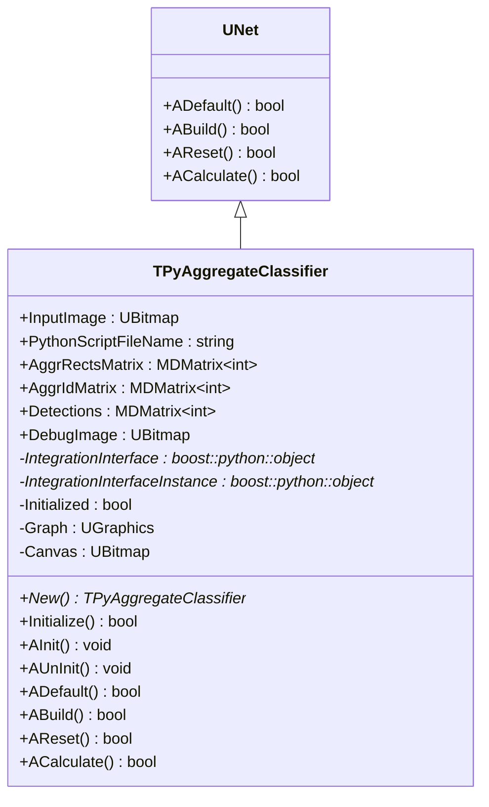
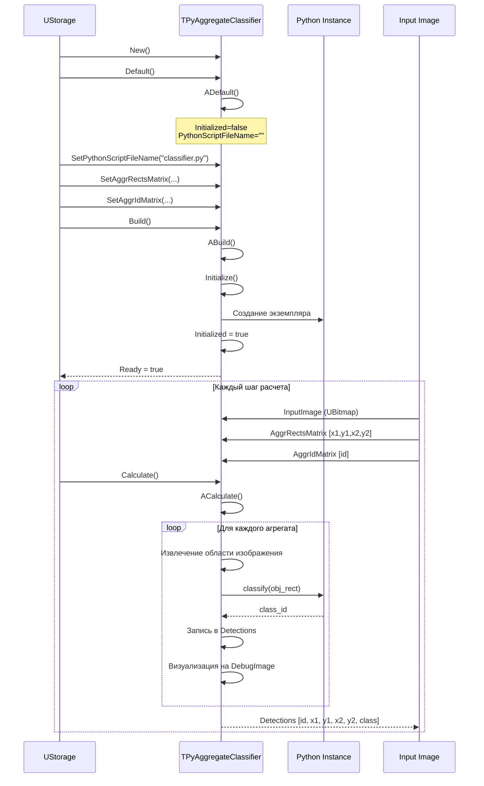
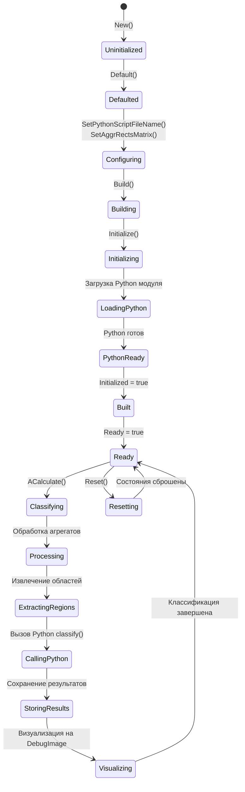
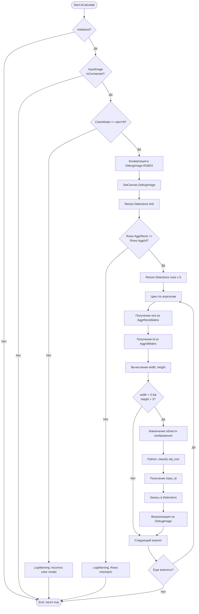
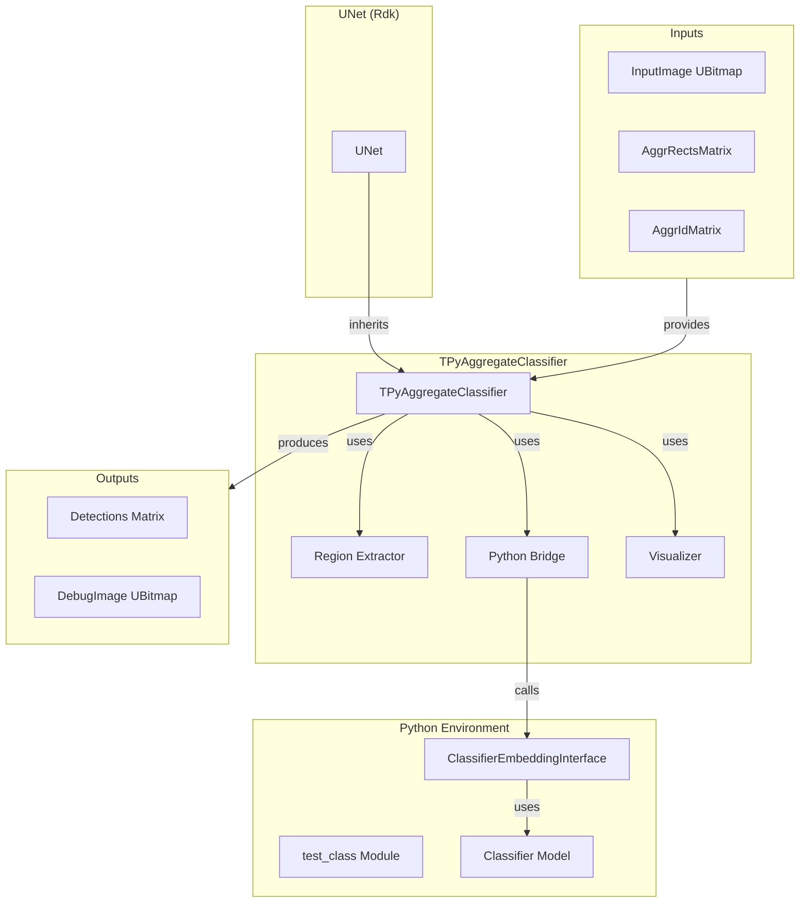

# TPyAggregateClassifier — агрегатный классификатор (ансамбль)

## RU

### Назначение

**Класс**: `TPyAggregateClassifier` — агрегатный классификатор для классификации объектов в заданных областях изображения через Python.  
**Регистрация**: `Core/Lib.cpp` → `UploadClass("TPyAggregateClassifier", "PyAggregateClassifier")`.  
**Storage-инстансы**: `ClassName = "PyAggregateClassifier"` в конфигурационных проектах.

`TPyAggregateClassifier` классифицирует объекты в заданных прямоугольных областях (агрегатах) изображения. Наследуется от `UNet` и использует Python для классификации каждого агрегата. Результаты классификации сохраняются в матрице детекций.

**Использование:** Классификация объектов в заданных областях изображения (постобработка детекции)

### UML-диаграмма классов



**Иерархия наследования:**
- `UNet` (Rdk) — базовая сеть компонентов
- `TPyAggregateClassifier` — агрегатный классификатор

### UML-диаграмма последовательности



### UML-диаграмма состояний



### UML-диаграмма активности



### UML-диаграмма компонентов



### Свойства

#### Параметры (ptPubParameter)

- **`InputImage`** (UBitmap) — входное изображение для классификации. Должно быть подключено через `IsConnected()`. Значение по умолчанию: не подключено

- **`PythonScriptFileName`** (string) — путь к Python скрипту с классификатором. Используется при инициализации. Значение по умолчанию: пустая строка

- **`AggrRectsMatrix`** (MDMatrix<int>, ptPubInput) — матрица прямоугольников агрегатов [Left, Top, Right, Bottom]. Каждая строка содержит координаты одного агрегата. Значение по умолчанию: пустая матрица

- **`AggrIdMatrix`** (MDMatrix<int>, ptPubInput) — матрица идентификаторов агрегатов [AggrID]. Соответствует строкам `AggrRectsMatrix`. Значение по умолчанию: пустая матрица

- **`DebugImage`** (UBitmap, ptPubParameter) — изображение для визуализации результатов классификации. На нем рисуются прямоугольники с цветами в зависимости от класса. Значение по умолчанию: пустое изображение

#### Состояние

- **`Detections`** (MDMatrix<int>) — выходная матрица детекций [AggrID, x1, y1, x2, y2, class_id]. Создается в `ACalculate()`. Значение по умолчанию: пустая матрица

#### Защищенные свойства

- **`IntegrationInterface`** (boost::python::object*) — указатель на объект Python класса
- **`IntegrationInterfaceInstance`** (boost::python::object*) — указатель на экземпляр Python класса
- **`Initialized`** (bool) — флаг инициализации Python модуля
- **`Graph`** (UGraphics) — графический контекст для визуализации
- **`Canvas`** (UBitmap) — холст для визуализации

### Методы

#### Публичные методы

- **`New()`** → `TPyAggregateClassifier*` — создает новый экземпляр класса

- **`Initialize()`** → `bool` — инициализирует Python модуль:
  - Проверяет инициализацию потоков Python
  - Импортирует главный модуль Python
  - Загружает пользовательский модуль из файла
  - Создает экземпляр класса `ClassifierEmbeddingInterface`
  - Устанавливает `Initialized = true`
  - Возвращает `true` при успехе

#### Защищенные методы жизненного цикла

- **`AInit()`** → `void` — инициализация компонента. В текущей реализации пустая

- **`AUnInit()`** → `void` — деинициализация компонента. В текущей реализации пустая

- **`ADefault()`** → `bool` — установка значений по умолчанию:
  - `Initialized = false`
  - Возвращает `true`

- **`ABuild()`** → `bool` — сборка компонента:
  - Если `IsInit()`, вызывает `Initialize()`
  - Возвращает `true`

- **`AReset()`** → `bool` — сброс состояния:
  - Если не инициализирован, вызывает `Initialize()`
  - Возвращает `true`

- **`ACalculate()`** → `bool` — выполнение расчета:
  - Проверяет подключение `InputImage`
  - Проверяет цветовую модель (должна быть `ubmY8`)
  - Конвертирует изображение в `DebugImage` (RGB24)
  - Проверяет соответствие размеров `AggrRectsMatrix` и `AggrIdMatrix`
  - Для каждого агрегата:
    - Извлекает область изображения
    - Вызывает Python `classify(obj_rect)`
    - Сохраняет результат в `Detections`
    - Визуализирует результат на `DebugImage`
  - Возвращает `true`

### Примеры использования

#### Пример 1: C++ код

```cpp
auto classifier = storage->CreateComponent<TPyAggregateClassifier>();
classifier->SetPythonScriptFileName("classifier.py");
classifier->Build();

// Подключение входов
UBitmap inputImage;
MDMatrix<int> aggrRects;  // [x1, y1, x2, y2]
MDMatrix<int> aggrIds;    // [id]

// Заполнение данных
aggrRects.Resize(2, 4);
aggrRects(0, 0) = 10; aggrRects(0, 1) = 20;
aggrRects(0, 2) = 50; aggrRects(0, 3) = 60;
aggrRects(1, 0) = 100; aggrRects(1, 1) = 120;
aggrRects(1, 2) = 150; aggrRects(1, 3) = 160;

aggrIds.Resize(2, 1);
aggrIds(0, 0) = 1;
aggrIds(1, 0) = 2;

classifier->InputImage.Connect(&inputImage);
classifier->AggrRectsMatrix.Connect(&aggrRects);
classifier->AggrIdMatrix.Connect(&aggrIds);

// Расчет
classifier->Reset();
classifier->Calculate();

// Получение результатов
MDMatrix<int>& detections = *classifier->Detections;
for (int i = 0; i < detections.GetRows(); i++) {
    std::cout << "Aggregate " << detections(i, 0) 
              << ": class=" << detections(i, 5) << std::endl;
}
```

#### Пример 2: XML конфигурация

```xml
<AggregateClassifier ClassName="PyAggregateClassifier">
    <Property Name="PythonScriptFileName" Value="classifier_interface.py" />
    <Property Name="InputImage" Connect="SourceComponent.OutputImage" />
    <Property Name="AggrRectsMatrix" Connect="DetectorComponent.OutputRects" />
    <Property Name="AggrIdMatrix" Connect="DetectorComponent.OutputIds" />
</AggregateClassifier>
```

### Особенности работы

1. **Обработка агрегатов**: Компонент обрабатывает каждый агрегат независимо, вызывая Python классификатор для каждой области

2. **Визуализация**: Результаты визуализируются на `DebugImage` с цветовым кодированием классов:
   - Класс 0 — синий (0x0000FF)
   - Класс 1 — зеленый (0x00FF00)

3. **Фильтрация**: Агрегаты с размерами меньше 3x3 пикселей пропускаются

4. **Формат выходных данных**: `Detections` содержит [AggrID, x1, y1, x2, y2, class_id] для каждого агрегата

### Связи с другими компонентами

- **Использует**: Python модуль `test_class` с классом `ClassifierEmbeddingInterface`
- **Типичное использование**: В паре с детекторами объектов для классификации обнаруженных областей

### См. также

- [`TPyUBitmapClassifier`](TPyUBitmapClassifier.md) — классификатор изображений
- [`TPyObjectDetector`](TPyObjectDetector.md) — детектор объектов
- [Architecture.md](../Architecture.md) — архитектура библиотеки

---

## EN

### Purpose

**Class**: `TPyAggregateClassifier` — aggregate classifier for classifying objects in specified image regions via Python.  
**Registration**: `Core/Lib.cpp` → `UploadClass("TPyAggregateClassifier", "PyAggregateClassifier")`.  
**Instances**: `ClassName = "PyAggregateClassifier"` in configuration projects.

`TPyAggregateClassifier` classifies objects in specified rectangular regions (aggregates) of an image. Inherits from `UNet` and uses Python to classify each aggregate.

**Usage:** Classifying objects in specified image regions (post-processing of detection)

### See also

- [`TPyUBitmapClassifier`](TPyUBitmapClassifier.md) — image classifier
- [`TPyObjectDetector`](TPyObjectDetector.md) — object detector
- [Architecture.md](../Architecture.md) — library architecture
