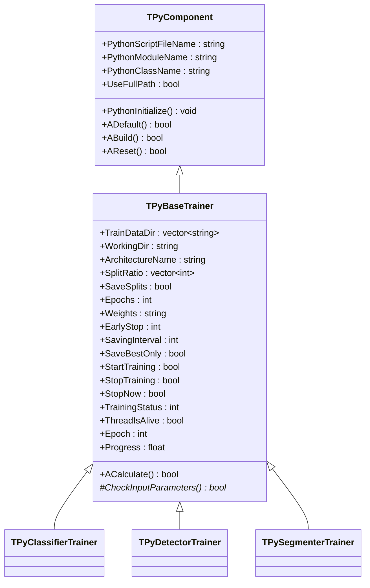
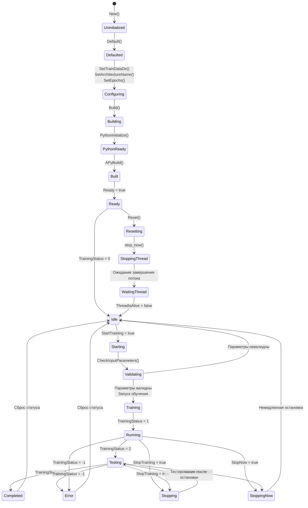
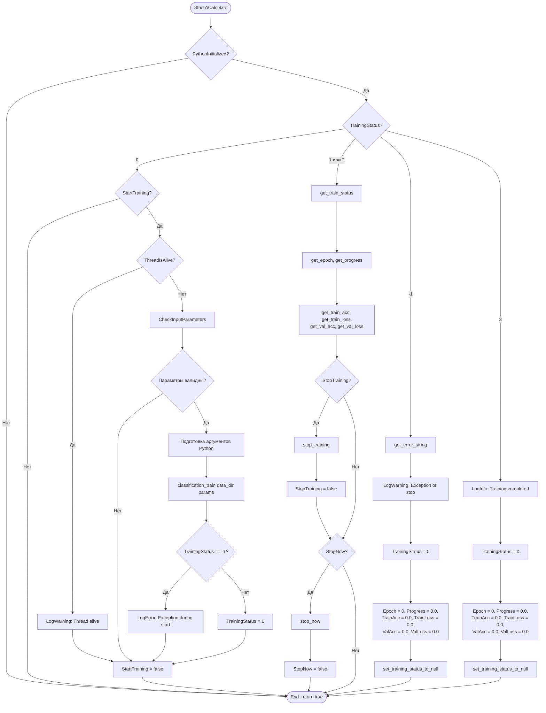
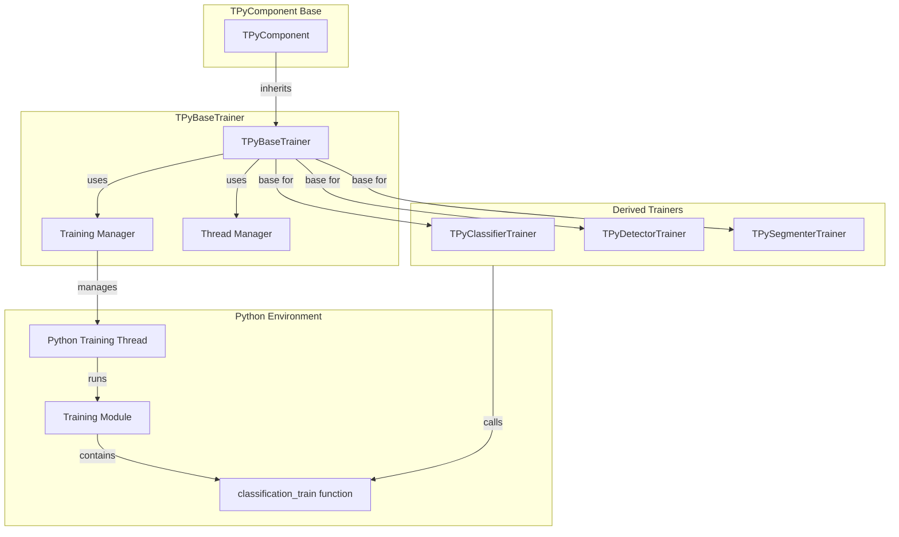

# TPyBaseTrainer — базовый класс тренера через Python

## RU

### Назначение

**Класс**: `TPyBaseTrainer` — базовый класс для всех тренеров машинного обучения через Python.  
**Регистрация**: `Core/Lib.cpp` → не регистрируется напрямую, используется как базовый класс для `TPyClassifierTrainer`, `TPyDetectorTrainer`, `TPySegmenterTrainer`.  
**Storage-инстансы**: Используется как базовый класс для специализированных тренеров.

`TPyBaseTrainer` предоставляет базовую функциональность для обучения моделей машинного обучения через Python в отдельном потоке. Управляет жизненным циклом обучения, отслеживает статус обучения, обрабатывает остановку обучения и предоставляет интерфейс для мониторинга прогресса.

**Использование:** Базовый класс для всех Python-тренеров (классификаторы, детекторы, сегментаторы)

### UML-диаграмма классов



**Иерархия наследования:**
- `TPyComponent` — базовый компонент для Python-интеграции
- `TPyBaseTrainer` — базовый класс тренера

**Ключевые свойства:**
- Параметры обучения: `TrainDataDir`, `WorkingDir`, `ArchitectureName`, `SplitRatio`, `Epochs`, `Weights`, `EarlyStop`, `SavingInterval`, `SaveBestOnly`
- Управление: `StartTraining`, `StopTraining`, `StopNow`
- Состояние: `TrainingStatus`, `ThreadIsAlive`, `Epoch`, `Progress`

### UML-диаграмма последовательности

```mermaid
sequenceDiagram
    participant Storage as UStorage
    participant Trainer as TPyBaseTrainer
    participant Python as Python Thread
    participant Instance as Python Instance
    
    Storage->>Trainer: New()
    Storage->>Trainer: Default()
    Trainer->>Trainer: APyDefault()
    Note over Trainer: Инициализация параметров<br/>TrainDataDir={}<br/>WorkingDir=""<br/>ArchitectureName="MobileNet"<br/>SplitRatio={70,20,10}<br/>Epochs=5<br/>StartTraining=false<br/>TrainingStatus=0
    Storage->>Trainer: SetTrainDataDir(...)
    Storage->>Trainer: SetArchitectureName(...)
    Storage->>Trainer: Build()
    Trainer->>Trainer: ABuild()
    Trainer->>Trainer: PythonInitialize()
    Trainer->>Instance: Создание экземпляра
    Trainer-->>Storage: Ready = true
    
    loop Каждый шаг расчета
        Storage->>Trainer: Calculate()
        Trainer->>Trainer: ACalculate()
        alt StartTraining == true && TrainingStatus == 0
            Trainer->>Trainer: CheckInputParameters()
            alt Параметры валидны
                Trainer->>Instance: classification_train(data_dir, params)
                Note over Python: Запуск обучения в отдельном потоке
                Trainer->>Trainer: TrainingStatus = 1
            else Параметры невалидны
                Trainer->>Trainer: StartTraining = false
            end
        end
        
        alt TrainingStatus == 1 || TrainingStatus == 2
            Trainer->>Instance: train_status()
            Instance-->>Trainer: TrainingStatus
            Trainer->>Instance: get_epoch()
            Instance-->>Trainer: Epoch
            Trainer->>Instance: get_progess()
            Instance-->>Trainer: Progress
            alt StopTraining == true
                Trainer->>Instance: stop_training()
                Trainer->>Trainer: StopTraining = false
            end
            alt StopNow == true
                Trainer->>Instance: stop_now()
                Trainer->>Trainer: StopNow = false
            end
        end
        
        alt TrainingStatus == -1
            Trainer->>Instance: get_error_string()
            Instance-->>Trainer: ErrorString
            Trainer->>Trainer: TrainingStatus = 0
            Trainer->>Trainer: Epoch = 0, Progress = 0.0
        end
        
        alt TrainingStatus == 3
            Note over Trainer: Обучение завершено успешно
            Trainer->>Trainer: TrainingStatus = 0
            Trainer->>Trainer: Epoch = 0, Progress = 0.0
        end
    end
    
    Storage->>Trainer: Reset()
    Trainer->>Trainer: APyReset()
    Trainer->>Instance: stop_now()
    loop Пока ThreadIsAlive
        Trainer->>Instance: get_thread_is_alive()
        Instance-->>Trainer: ThreadIsAlive
        Note over Trainer: Ожидание завершения потока
    end
    Trainer->>Trainer: StartTraining = false
    Trainer->>Trainer: StopTraining = false
    Trainer->>Trainer: StopNow = false
```



**Жизненный цикл:**
1. **Инициализация**: Установка параметров обучения по умолчанию
2. **Настройка**: Установка путей к данным, архитектуры, гиперпараметров
3. **Сборка**: Инициализация Python модуля
4. **Запуск обучения**: Установка `StartTraining = true` запускает обучение в отдельном потоке
5. **Мониторинг**: Отслеживание статуса, эпохи, прогресса
6. **Остановка**: Управление остановкой через `StopTraining` или `StopNow`
7. **Завершение**: Обработка успешного завершения или ошибок

### UML-диаграмма состояний



**Состояния:**
- **Uninitialized** — создан, но не инициализирован
- **Defaulted** — параметры установлены по умолчанию
- **Configuring** — настройка параметров обучения
- **Building** — выполняется сборка компонента
- **PythonReady** — Python модуль готов
- **Built** — компонент собран
- **Ready** — готов к выполнению расчетов
- **Idle** — обучение не запущено (TrainingStatus = 0)
- **Starting** — запуск обучения
- **Validating** — проверка входных параметров
- **Training** — обучение запущено
- **Running** — обучение выполняется (TrainingStatus = 1)
- **Testing** — тестирование модели (TrainingStatus = 2)
- **Stopping** — остановка обучения (StopTraining = true)
- **StoppingNow** — немедленная остановка (StopNow = true)
- **Completed** — обучение завершено успешно (TrainingStatus = 3)
- **Error** — ошибка при обучении (TrainingStatus = -1)
- **Resetting** — выполняется сброс
- **StoppingThread** — остановка Python потока
- **WaitingThread** — ожидание завершения потока

### UML-диаграмма активности



**Алгоритм расчета:**
1. Проверка инициализации Python
2. Проверка статуса обучения
3. Если статус 0 и `StartTraining = true`: проверка параметров и запуск обучения
4. Если статус 1 или 2: получение метрик и обработка команд остановки
5. Если статус -1: обработка ошибки
6. Если статус 3: обработка успешного завершения

### UML-диаграмма компонентов



**Зависимости:**
- **Базовый класс**: `TPyComponent` — Python-интеграция
- **Python модули**: Модули обучения (классификация, детекция, сегментация)
- **Производные классы**: `TPyClassifierTrainer`, `TPyDetectorTrainer`, `TPySegmenterTrainer`

### Свойства

#### Параметры (ptPubParameter)

- **`TrainDataDir`** (vector<string>) — список директорий с обучающими данными. Может содержать несколько путей. Значение по умолчанию: пустой вектор

- **`WorkingDir`** (string) — рабочая директория для сохранения результатов обучения (модели, логи). Должна быть пустой при запуске. Значение по умолчанию: пустая строка

- **`ArchitectureName`** (string) — имя архитектуры модели (например, "MobileNet", "ResNet50"). Значение по умолчанию: "MobileNet"

- **`SplitRatio`** (vector<int>) — соотношение разделения данных [train, val, test] в процентах. Должно содержать 3 значения. Значение по умолчанию: {70, 20, 10}

- **`SaveSplits`** (bool) — сохранять ли информацию о разделении данных. Значение по умолчанию: `false`

- **`Epochs`** (int) — количество эпох обучения. Значение по умолчанию: 5

- **`Weights`** (string) — путь к предобученным весам или "imagenet" для загрузки весов ImageNet. Значение по умолчанию: "imagenet"

- **`EarlyStop`** (int) — количество эпох без улучшения для early stopping (0 = отключено). Значение по умолчанию: 0

- **`SavingInterval`** (int) — интервал сохранения моделей в эпохах. Значение по умолчанию: 1

- **`SaveBestOnly`** (bool) — сохранять только лучшую модель (по val_loss). Значение по умолчанию: `false`

- **`StartTraining`** (bool) — флаг запуска обучения. Устанавливается в `true` для начала обучения, автоматически сбрасывается после запуска. Значение по умолчанию: `false`

- **`StopTraining`** (bool) — флаг остановки обучения с завершением текущей эпохи и тестированием. Автоматически сбрасывается после обработки. Значение по умолчанию: `false`

- **`StopNow`** (bool) — флаг немедленной остановки обучения без тестирования. Автоматически сбрасывается после обработки. Значение по умолчанию: `false`

#### Состояние (ptPubState)

- **`TrainingStatus`** (int) — статус обучения:
  - -1 — ошибка или остановка
  - 0 — не запущено (готов к запуску)
  - 1 — обучение выполняется
  - 2 — тестирование выполняется
  - 3 — обучение завершено успешно
  Значение по умолчанию: 0

- **`ThreadIsAlive`** (bool) — флаг активности Python потока обучения. `true` если поток активен, `false` если завершен. Значение по умолчанию: `false`

- **`Epoch`** (int) — текущая эпоха обучения. Обновляется во время обучения. Значение по умолчанию: 0

- **`Progress`** (float) — прогресс текущей эпохи (0.0 - 1.0). Обновляется во время обучения. Значение по умолчанию: 0.0

### Методы

#### Защищенные методы жизненного цикла

- **`APythonInitialize()`** → `bool` — инициализация Python. В базовом классе всегда возвращает `true`. Переопределяется в производных классах при необходимости

- **`APyDefault()`** → `bool` — установка значений по умолчанию. В базовом классе всегда возвращает `true`. Переопределяется в производных классах

- **`APyBuild()`** → `bool` — сборка компонента. В базовом классе всегда возвращает `true`. Переопределяется в производных классах при необходимости

- **`APyReset()`** → `bool` — сброс состояния. Останавливает Python поток обучения, ожидает его завершения, сбрасывает флаги управления. Всегда возвращает `true`

- **`ACalculate()`** → `bool` — выполнение расчета. Управляет жизненным циклом обучения:
  - Проверяет и запускает обучение при `StartTraining = true`
  - Мониторит статус и получает метрики во время обучения
  - Обрабатывает команды остановки
  - Обрабатывает завершение обучения и ошибки
  Всегда возвращает `true`

#### Виртуальные методы (реализуются в производных классах)

- **`CheckInputParameters()`** → `bool` — проверка валидности входных параметров перед запуском обучения. Должен возвращать `true` если параметры валидны, `false` иначе. В базовом классе всегда возвращает `true`

### Примеры использования

#### Пример 1: Создание тренера в C++

```cpp
// Создание тренера классификатора
auto trainer = storage->CreateComponent<TPyClassifierTrainer>();

// Настройка параметров
trainer->TrainDataDir = {"path/to/dataset"};
trainer->WorkingDir = "path/to/results";
trainer->ArchitectureName = "MobileNet";
trainer->Epochs = 10;
trainer->LearningRate = 0.001f;

// Сборка
trainer->Build();

// Запуск обучения
trainer->Reset();
trainer->StartTraining = true;

// Мониторинг
for (int step = 0; step < numSteps; step++) {
    trainer->Calculate();
    if (trainer->TrainingStatus == 1) {
        std::cout << "Epoch: " << trainer->Epoch 
                  << ", Progress: " << trainer->Progress 
                  << ", TrainAcc: " << trainer->TrainAcc << std::endl;
    }
    if (trainer->TrainingStatus == 3) {
        std::cout << "Training completed!" << std::endl;
        break;
    }
}
```

#### Пример 2: XML конфигурация

```xml
<Trainer ClassName="PyClassifierTrainer">
    <Property Name="TrainDataDir" Value="dataset1,dataset2" />
    <Property Name="WorkingDir" Value="Results/" />
    <Property Name="ArchitectureName" Value="MobileNet" />
    <Property Name="Epochs" Value="10" />
    <Property Name="LearningRate" Value="0.001" />
    <Property Name="SplitRatio" Value="70,20,10" />
    <Property Name="StartTraining" Value="true" />
</Trainer>
```

### Особенности работы с потоками

1. **Асинхронное обучение**: Обучение запускается в отдельном Python потоке, что позволяет продолжать работу движка во время обучения

2. **Управление GIL**: Компонент автоматически управляет GIL при взаимодействии с Python

3. **Безопасная остановка**: При деструкторе компонент гарантированно дожидается завершения Python потока

4. **Мониторинг**: Статус обучения, метрики и прогресс обновляются в каждом вызове `ACalculate()`

### Связи с другими компонентами

- **Базовый класс для**: `TPyClassifierTrainer`, `TPyDetectorTrainer`, `TPySegmenterTrainer`

- **Наследует от**: `TPyComponent` — получает функциональность Python-интеграции

### См. также

- [`TPyComponent`](TPyComponent.md) — базовый Python-компонент
- [`TPyClassifierTrainer`](TPyDetectorTrainer.md#tpyclassifiertrainer) — тренер классификаторов
- [`TPyDetectorTrainer`](TPyDetectorTrainer.md) — тренер детекторов
- [`TPySegmenterTrainer`](TPyDetectorTrainer.md#tpysegmentertrainer) — тренер сегментаторов
- [Architecture.md](../Architecture.md) — архитектура библиотеки

---

## EN

### Purpose

**Class**: `TPyBaseTrainer` — base class for all machine learning trainers via Python.  
**Registration**: `Core/Lib.cpp` → not registered directly, used as base class for specialized trainers.  
**Instances**: Used as base class for `TPyClassifierTrainer`, `TPyDetectorTrainer`, `TPySegmenterTrainer`.

`TPyBaseTrainer` provides base functionality for training machine learning models via Python in a separate thread. Manages training lifecycle, tracks training status, handles training stop and provides interface for progress monitoring.

**Usage:** Base class for all Python trainers (classifiers, detectors, segmentators)

### See also

- [`TPyComponent`](TPyComponent.md) — base Python component
- [`TPyClassifierTrainer`](TPyDetectorTrainer.md#tpyclassifiertrainer) — classifier trainer
- [`TPyDetectorTrainer`](TPyDetectorTrainer.md) — detector trainer
- [Architecture.md](../Architecture.md) — library architecture
