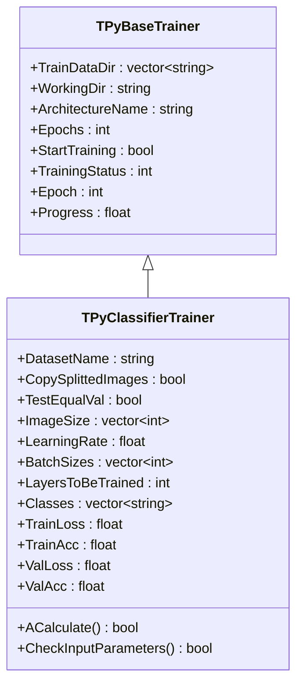
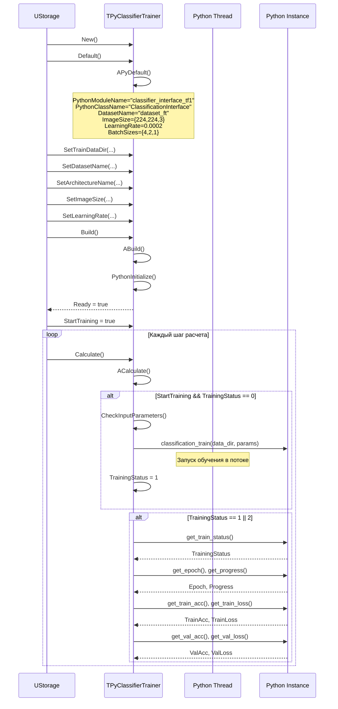
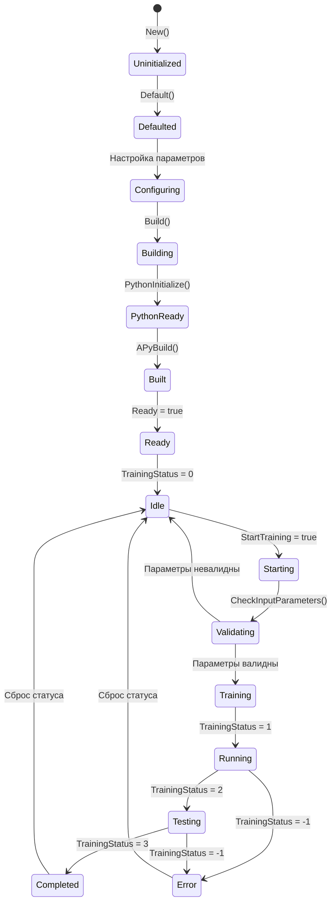
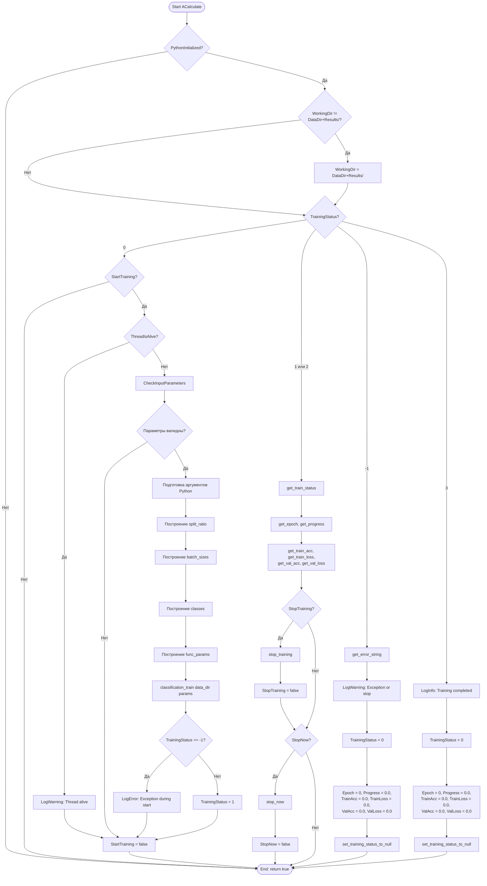
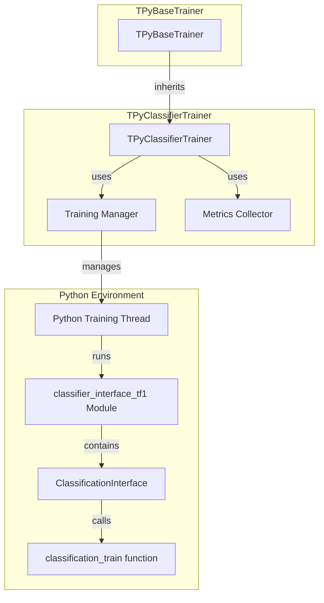

# TPyClassifierTrainer — тренер классификаторов через Python

## RU

### Назначение

**Класс**: `TPyClassifierTrainer` — тренер классификаторов через Python.  
**Регистрация**: `Core/Lib.cpp` → `UploadClass("TPyClassifierTrainer", "PyClassifierTrainer")`.  
**Storage-инстансы**: `ClassName = "PyClassifierTrainer"` в конфигурационных проектах.

`TPyClassifierTrainer` выполняет обучение моделей классификации изображений через Python в отдельном потоке. Наследуется от `TPyBaseTrainer` и предоставляет специализированную функциональность для обучения классификаторов.

**Использование:** Обучение моделей классификации изображений через Python

### UML-диаграмма классов



**Иерархия наследования:**
- `TPyComponent` — базовый Python-компонент
- `TPyBaseTrainer` — базовый класс тренера
- `TPyClassifierTrainer` — тренер классификаторов

### UML-диаграмма последовательности



### UML-диаграмма состояний



### UML-диаграмма активности



### UML-диаграмма компонентов



### Свойства

#### Параметры (ptPubParameter)

- **`DatasetName`** (string) — имя датасета для обучения. Используется при запуске обучения. Значение по умолчанию: "dataset_ft"

- **`CopySplittedImages`** (bool) — копировать ли разделенные изображения в соответствующие папки train/val/test. Значение по умолчанию: `false`

- **`TestEqualVal`** (bool) — использовать ли одинаковый размер для test и val наборов. Если `true`, размер test равен размеру val. Значение по умолчанию: `false`

- **`ImageSize`** (vector<int>) — размер изображений для обучения [width, height, channels]. Должно содержать 3 значения. Значение по умолчанию: {224, 224, 3}

- **`LearningRate`** (float) — скорость обучения. Значение по умолчанию: 0.0002

- **`BatchSizes`** (vector<int>) — размеры батчей для train, val и test [train_batch, val_batch, test_batch]. Должно содержать 3 значения. Значение по умолчанию: {4, 2, 1}

- **`LayersToBeTrained`** (int) — количество слоев для обучения. Если 0, используется значение по умолчанию. Значение по умолчанию: 0

- **`Classes`** (vector<string>) — список классов для классификации. Если пуст, классы определяются автоматически из структуры датасета. Значение по умолчанию: пустой вектор

#### Состояние (ptPubState)

- **`TrainLoss`** (float) — текущая потеря на обучающем наборе. Обновляется во время обучения. Значение по умолчанию: 0.0

- **`TrainAcc`** (float) — текущая точность на обучающем наборе (accuracy). Обновляется во время обучения. Значение по умолчанию: 0.0

- **`ValLoss`** (float) — текущая потеря на валидационном наборе. Обновляется во время обучения. Значение по умолчанию: 0.0

- **`ValAcc`** (float) — текущая точность на валидационном наборе (accuracy). Обновляется во время обучения. Значение по умолчанию: 0.0

#### Наследуемые свойства

От `TPyBaseTrainer`:
- `TrainDataDir` (vector<string>) — директории с обучающими данными
- `WorkingDir` (string) — рабочая директория
- `ArchitectureName` (string) — имя архитектуры (по умолчанию: "MobileNet")
- `SplitRatio` (vector<int>) — соотношение разделения [train, val, test] (по умолчанию: {70, 20, 10})
- `Epochs` (int) — количество эпох (по умолчанию: 5)
- `Weights` (string) — путь к предобученным весам (по умолчанию: "imagenet")
- `StartTraining` (bool) — флаг запуска обучения
- `TrainingStatus` (int) — статус обучения
- `Epoch` (int) — текущая эпоха
- `Progress` (float) — прогресс текущей эпохи

### Методы

#### Защищенные методы

- **`APythonInitialize()`** → `bool` — инициализация Python. Всегда возвращает `true`

- **`APyDefault()`** → `bool` — установка значений по умолчанию:
  - `PythonModuleName = "classifier_interface_tf1"`
  - `PythonClassName = "ClassificationInterface"`
  - Устанавливает все параметры обучения по умолчанию

- **`APyBuild()`** → `bool` — сборка компонента. Всегда возвращает `true`

- **`ACalculate()`** → `bool` — выполнение расчета:
  - Управляет жизненным циклом обучения
  - Проверяет и запускает обучение при `StartTraining = true`
  - Мониторит статус и получает метрики во время обучения
  - Обрабатывает команды остановки
  - Обрабатывает завершение обучения и ошибки
  - Всегда возвращает `true`

- **`CheckInputParameters()`** → `bool` — проверка валидности входных параметров:
  - Проверяет, что `TrainDataDir` не пуст
  - Проверяет, что `ArchitectureName` не пуст
  - Проверяет, что `DatasetName` не пуст
  - Проверяет, что `SplitRatio` содержит 3 значения
  - Проверяет, что `ImageSize` содержит 3 значения
  - Проверяет, что `BatchSizes` содержит 3 значения
  - Проверяет, что `WorkingDir` пуст (должна быть пустой при запуске)
  - Возвращает `true` если все параметры валидны, `false` иначе

### Примеры использования

#### Пример 1: C++ код

```cpp
auto trainer = storage->CreateComponent<TPyClassifierTrainer>();
trainer->TrainDataDir = {"datasets/classification"};
trainer->WorkingDir = "Results/";
trainer->ArchitectureName = "MobileNet";
trainer->DatasetName = "my_dataset";
trainer->ImageSize = {224, 224, 3};
trainer->LearningRate = 0.001f;
trainer->BatchSizes = {32, 16, 8};
trainer->Epochs = 50;
trainer->Build();

// Запуск обучения
trainer->Reset();
trainer->StartTraining = true;

// Мониторинг
for (int step = 0; step < numSteps; step++) {
    trainer->Calculate();
    if (trainer->TrainingStatus == 1) {
        std::cout << "Epoch: " << trainer->Epoch 
                  << ", Progress: " << trainer->Progress 
                  << ", TrainAcc: " << trainer->TrainAcc 
                  << ", ValAcc: " << trainer->ValAcc << std::endl;
    }
    if (trainer->TrainingStatus == 3) {
        std::cout << "Training completed!" << std::endl;
        break;
    }
}
```

#### Пример 2: XML конфигурация

```xml
<Trainer ClassName="PyClassifierTrainer">
    <Property Name="TrainDataDir" Value="datasets/classification" />
    <Property Name="WorkingDir" Value="Results/" />
    <Property Name="ArchitectureName" Value="MobileNet" />
    <Property Name="DatasetName" Value="my_dataset" />
    <Property Name="ImageSize" Value="224,224,3" />
    <Property Name="LearningRate" Value="0.001" />
    <Property Name="BatchSizes" Value="32,16,8" />
    <Property Name="Epochs" Value="50" />
    <Property Name="StartTraining" Value="true" />
</Trainer>
```

### Особенности работы

1. **Специализация для классификации**: Компонент оптимизирован для обучения моделей классификации изображений

2. **Метрики обучения**: Отслеживает точность (accuracy) и потери (loss) на train и val наборах

3. **Гибкая настройка**: Поддерживает различные архитектуры, размеры изображений, скорости обучения

4. **Автоматическое определение классов**: Если `Classes` пуст, классы определяются автоматически из структуры датасета

### См. также

- [`TPyBaseTrainer`](TPyBaseTrainer.md) — базовый класс тренера
- [`TPyUBitmapClassifier`](TPyUBitmapClassifier.md) — классификатор изображений
- [`TPyPredictSort`](TPyPredictSort.md) — сортировка предсказаний
- [Architecture.md](../Architecture.md) — архитектура библиотеки

---

## EN

### Purpose

**Class**: `TPyClassifierTrainer` — classifier trainer via Python.  
**Registration**: `Core/Lib.cpp` → `UploadClass("TPyClassifierTrainer", "PyClassifierTrainer")`.  
**Instances**: `ClassName = "PyClassifierTrainer"` in configuration projects.

`TPyClassifierTrainer` performs training of image classification models via Python in a separate thread. Inherits from `TPyBaseTrainer`.

**Usage:** Training image classification models via Python

### See also

- [`TPyBaseTrainer`](TPyBaseTrainer.md) — base trainer class
- [`TPyUBitmapClassifier`](TPyUBitmapClassifier.md) — image classifier
- [`TPyPredictSort`](TPyPredictSort.md) — prediction sorting
- [Architecture.md](../Architecture.md) — library architecture
