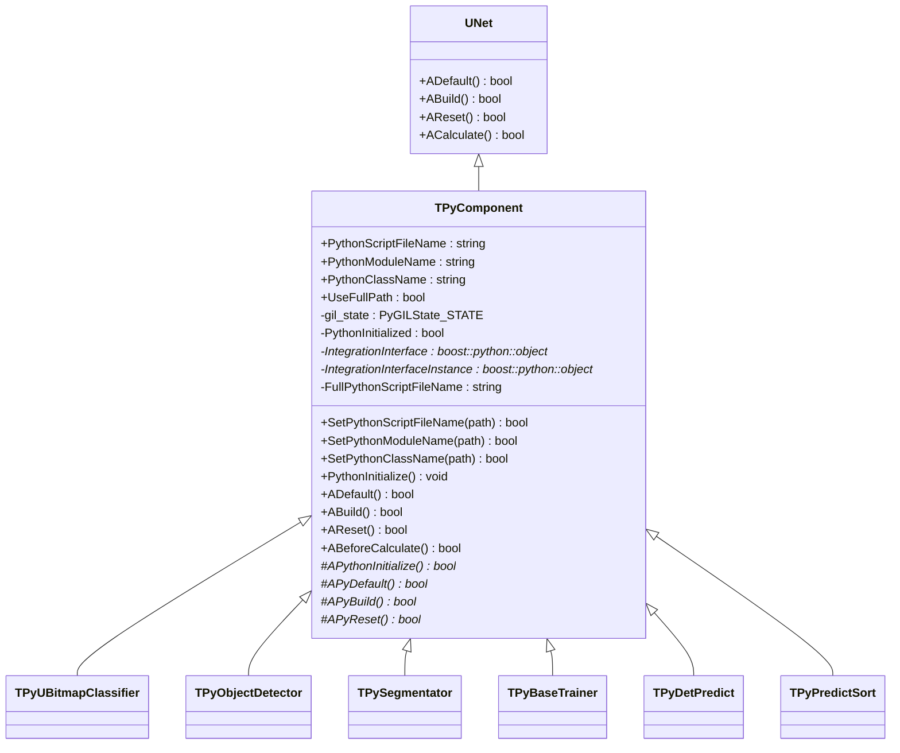
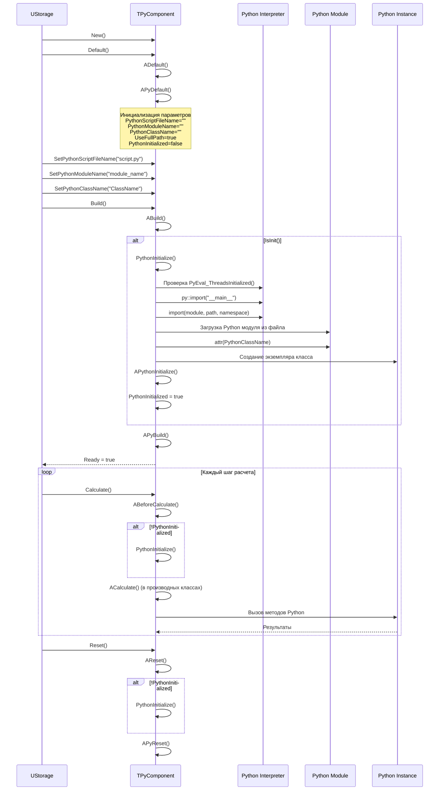
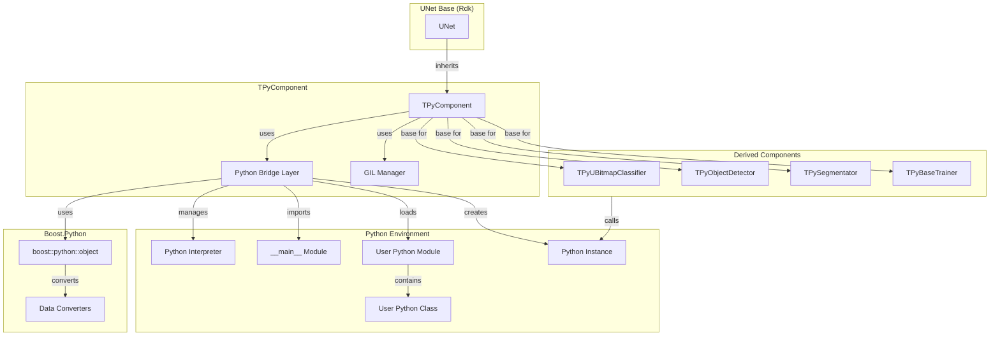
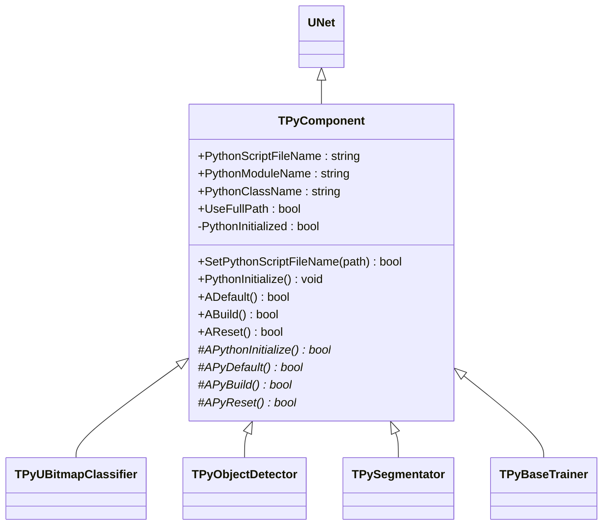

# TPyComponent — базовый Python-bridge компонент

## RU

### Назначение

**Класс**: `TPyComponent` — базовый компонент интеграции Python для всех Python-интегрированных компонентов библиотеки Rdk-PyMachineLearningLib.  
**Регистрация**: `Core/Lib.cpp` → большинство производных компонентов наследуют его (не регистрируется напрямую).  
**Storage-инстансы**: Используется как базовый класс для `TPyUBitmapClassifier`, `TPyObjectDetector`, `TPySegmentator` и других.

`TPyComponent` предоставляет базовую функциональность для работы с Python интерпретатором, управления GIL (Global Interpreter Lock), загрузки Python модулей и создания экземпляров Python классов. Все компоненты библиотеки, работающие с Python, наследуются от `TPyComponent`.

**Использование:** Базовый класс для всех Python-интегрированных компонентов машинного обучения

### UML-диаграмма классов



**Иерархия наследования:**
- `UNet` (Rdk) — базовая сеть компонентов Rdk Framework
- `TPyComponent` — базовый компонент для Python-интеграции

**Ключевые свойства:**
- Параметры Python: `PythonScriptFileName`, `PythonModuleName`, `PythonClassName`, `UseFullPath`
- Состояние: `PythonInitialized` — флаг инициализации Python
- Интерфейсы: `IntegrationInterface`, `IntegrationInterfaceInstance` — объекты Python для взаимодействия

### UML-диаграмма последовательности



**Жизненный цикл:**
1. **Инициализация**: Установка параметров Python по умолчанию
2. **Настройка**: Установка путей к скриптам и имен модулей/классов
3. **Сборка**: Загрузка Python модуля и создание экземпляра класса
4. **Использование**: Вызовы методов Python через экземпляр
5. **Сброс**: Сброс состояния без перезагрузки Python модуля

### UML-диаграмма состояний

```mermaid
stateDiagram-v2
    [*] --> Uninitialized: New()
    Uninitialized --> Defaulted: Default()
    Defaulted --> Configuring: SetPythonScriptFileName()<br/>SetPythonModuleName()<br/>SetPythonClassName()
    Configuring --> Building: Build()
    Building --> LoadingPython: PythonInitialize()
    LoadingPython --> CheckingThreads: Проверка PyEval_ThreadsInitialized()
    CheckingThreads --> ImportingMain: py::import("__main__")
    ImportingMain --> LoadingModule: import(module, path)
    LoadingModule --> CreatingInstance: attr(ClassName)()
    CreatingInstance --> Initializing: APythonInitialize()
    Initializing --> PythonReady: PythonInitialized = true
    PythonReady --> Built: APyBuild()
    Built --> Ready: Ready = true
    Ready --> Calculating: Calculate()
    Calculating --> BeforeCalculate: ABeforeCalculate()
    BeforeCalculate --> CheckInit{PythonInitialized?}
    CheckInit -->|Нет| Reinitializing: PythonInitialize()
    Reinitializing --> PythonReady
    CheckInit -->|Да| PyCalculate: ACalculate() (производный)
    PyCalculate --> Ready: Шаг завершен
    Ready --> Resetting: Reset()
    Resetting --> CheckInitReset{PythonInitialized?}
    CheckInitReset -->|Нет| Reinitializing
    CheckInitReset -->|Да| PyReset: APyReset()
    PyReset --> Ready: Состояния сброшены
```

**Состояния:**
- **Uninitialized** — создан, но не инициализирован
- **Defaulted** — параметры установлены по умолчанию
- **Configuring** — настройка параметров Python
- **Building** — выполняется сборка компонента
- **LoadingPython** — начало инициализации Python
- **CheckingThreads** — проверка инициализации потоков Python
- **ImportingMain** — импорт главного модуля Python
- **LoadingModule** — загрузка пользовательского модуля
- **CreatingInstance** — создание экземпляра Python класса
- **Initializing** — вызов APythonInitialize() в производном классе
- **PythonReady** — Python модуль готов к использованию
- **Built** — компонент собран
- **Ready** — готов к выполнению расчетов
- **Calculating** — выполняется расчет
- **Resetting** — выполняется сброс состояний

### UML-диаграмма активности

```mermaid
flowchart TD
    Start([Start ABuild]) --> CheckInit{IsInit()?}
    CheckInit -->|Да| PythonInit[PythonInitialize]
    CheckInit -->|Нет| PyBuild
    
    PythonInit --> CheckModuleName{PythonModuleName<br/>empty?}
    CheckModuleName -->|Да| Error1[LogError: ModuleName empty]
    Error1 --> EndFail([End: false])
    CheckModuleName -->|Нет| CheckClassName{PythonClassName<br/>empty?}
    CheckClassName -->|Да| Error2[LogError: ClassName empty]
    Error2 --> EndFail
    CheckClassName -->|Нет| BuildPath{UseFullPath?}
    
    BuildPath -->|Да| FullPath[FullPath = PythonScriptFileName]
    BuildPath -->|Нет| RelativePath[FullPath = DataDir + PythonScriptFileName]
    FullPath --> CheckPath{FullPath empty?}
    RelativePath --> CheckPath
    
    CheckPath -->|Да| EndFail
    CheckPath -->|Нет| CheckThreads{PyEval_ThreadsInitialized?}
    CheckThreads -->|Нет| Error3[LogFatal: Py_Initialize not called]
    Error3 --> EndFail
    CheckThreads -->|Да| ImportMain[py::import "__main__"]
    
    ImportMain --> GetNamespace[MainNamespace = MainModule.__dict__]
    GetNamespace --> ImportModule[import module, path, namespace]
    ImportModule --> GetClass[IntegrationInterface = Module.attr ClassName]
    GetClass --> CreateInstance[IntegrationInterfaceInstance = IntegrationInterface]
    CreateInstance --> CallAPythonInit[APythonInitialize]
    CallAPythonInit --> SetInitFlag[PythonInitialized = result]
    SetInitFlag --> PyBuild[APyBuild]
    PyBuild --> End([End: Ready = true])
```

**Алгоритм сборки:**
1. Проверка необходимости инициализации Python (`IsInit()`)
2. Проверка наличия `PythonModuleName` и `PythonClassName`
3. Построение полного пути к скрипту (абсолютный или относительный)
4. Проверка инициализации потоков Python
5. Импорт главного модуля Python
6. Загрузка пользовательского модуля из файла
7. Получение класса из модуля
8. Создание экземпляра класса
9. Вызов `APythonInitialize()` в производном классе
10. Вызов `APyBuild()` в производном классе

### UML-диаграмма компонентов



**Зависимости:**
- **Базовый класс**: `UNet` (Rdk Framework)
- **Python библиотеки**: Python C API, Boost.Python
- **Конвертеры**: `pyboost_cv3_converter` для конвертации OpenCV Mat ↔ NumPy arrays
- **Производные компоненты**: Все Python-интегрированные компоненты библиотеки

### Свойства

#### Параметры (ptPubParameter)

- **`PythonScriptFileName`** (string) — путь к Python скрипту с реализацией модуля. Может быть абсолютным или относительным (зависит от `UseFullPath`). Значение по умолчанию: пустая строка

- **`PythonModuleName`** (string) — имя Python модуля для импорта. Используется при загрузке модуля через функцию `import()`. Значение по умолчанию: пустая строка

- **`PythonClassName`** (string) — имя класса Python для создания экземпляра. Класс должен быть определен в загружаемом модуле. Значение по умолчанию: пустая строка

- **`UseFullPath`** (bool) — использовать абсолютный путь к скрипту. Если `true`, `PythonScriptFileName` используется как есть. Если `false`, путь строится относительно `GetEnvironment()->GetCurrentDataDir()`. Значение по умолчанию: `true`

#### Защищенные свойства

- **`gil_state`** (PyGILState_STATE) — состояние GIL (Global Interpreter Lock) для управления блокировкой в многопоточных сценариях

- **`PythonInitialized`** (bool) — флаг успешной инициализации Python модуля. Устанавливается в `true` после успешного вызова `APythonInitialize()`

- **`IntegrationInterface`** (boost::python::object*) — указатель на объект Python класса (не экземпляр)

- **`IntegrationInterfaceInstance`** (boost::python::object*) — указатель на экземпляр Python класса, через который происходят вызовы методов

- **`FullPythonScriptFileName`** (string) — полный путь к Python скрипту (абсолютный или построенный относительно DataDir)

### Методы

#### Публичные методы

- **`SetPythonScriptFileName(const std::string& path)`** → `bool` — устанавливает путь к Python скрипту. Устанавливает `Ready = false`, требуя пересборки компонента. Всегда возвращает `true`

- **`SetPythonModuleName(const std::string& path)`** → `bool` — устанавливает имя Python модуля. Устанавливает `Ready = false`, требуя пересборки компонента. Всегда возвращает `true`

- **`SetPythonClassName(const std::string& path)`** → `bool` — устанавливает имя Python класса. Устанавливает `Ready = false`, требуя пересборки компонента. Всегда возвращает `true`

#### Защищенные методы жизненного цикла

- **`PythonInitialize()`** → `void` — инициализирует Python модуль. Выполняет:
  - Проверку наличия `PythonModuleName` и `PythonClassName`
  - Построение полного пути к скрипту
  - Проверку инициализации потоков Python
  - Импорт главного модуля Python
  - Загрузку пользовательского модуля через `import()`
  - Получение класса и создание экземпляра
  - Вызов `APythonInitialize()` в производном классе
  - Установку `PythonInitialized` в зависимости от результата

- **`ADefault()`** → `bool` — восстановление настроек по умолчанию. Устанавливает `PythonInitialized = false` и `UseFullPath = true`, затем вызывает `APyDefault()` в производном классе

- **`ABuild()`** → `bool` — сборка компонента. Если `IsInit()`, вызывает `PythonInitialize()`, затем вызывает `APyBuild()` в производном классе

- **`AReset()`** → `bool` — сброс состояния. Если Python не инициализирован, вызывает `PythonInitialize()`, затем вызывает `APyReset()` в производном классе

- **`ABeforeCalculate()`** → `bool` — выполняется перед расчетом. Проверяет инициализацию Python. Всегда возвращает `true`

#### Виртуальные методы (реализуются в производных классах)

- **`APythonInitialize()`** → `bool` — виртуальный метод для дополнительной инициализации Python в производном классе. Должен возвращать `true` при успехе, `false` при ошибке

- **`APyDefault()`** → `bool` — виртуальный метод для установки значений по умолчанию в производном классе

- **`APyBuild()`** → `bool` — виртуальный метод для сборки в производном классе. Вызывается после инициализации Python

- **`APyReset()`** → `bool` — виртуальный метод для сброса состояния в производном классе

### Примеры использования

#### Пример 1: Создание компонента в C++

```cpp
// Создание компонента
auto component = storage->CreateComponent<TPyUBitmapClassifier>();

// Настройка параметров Python
component->SetPythonScriptFileName("classifier.py");
component->SetPythonModuleName("classifier_module");
component->SetPythonClassName("ClassifierInterface");
component->UseFullPath = false; // относительный путь

// Сборка
component->Build();

// Использование
component->Reset();
for (int step = 0; step < numSteps; step++) {
    component->Calculate();
}
```

#### Пример 2: XML конфигурация

```xml
<Classifier ClassName="PyUBitmapClassifier">
    <Property Name="PythonScriptFileName" Value="classifier.py" />
    <Property Name="PythonModuleName" Value="classifier_module" />
    <Property Name="PythonClassName" Value="ClassifierInterface" />
    <Property Name="UseFullPath" Value="false" />
    <!-- Другие свойства производного класса -->
</Classifier>
```

### Особенности Python-интеграции

1. **GIL управление**: Компонент использует `gil_lock` для автоматического управления GIL в конструкторе/деструкторе. В методах используется макрос `Py_BLOCK_GIL` / `Py_UNBLOCK_GIL` для явного управления

2. **Загрузка модулей**: Модули загружаются через функцию `import()` из `TPythonIntegrationUtil`, которая выполняет загрузку кода из файла в извлеченную область имен

3. **Конвертеры данных**: Библиотека предоставляет конвертеры для автоматического преобразования:
   - `cv::Mat` ↔ NumPy arrays
   - `UBitmap` ↔ NumPy arrays

4. **Обработка ошибок**: Все операции с Python обернуты в try-catch блоки для обработки `py::error_already_set` исключений

### Связи с другими компонентами

- **Базовый класс для**: `TPyUBitmapClassifier`, `TPyObjectDetector`, `TPySegmentator`, `TPyBaseTrainer`, `TPyDetPredict`, `TPyPredictSort` и других

- **Использует**: `TPythonIntegrationUtil` для утилит работы с Python, `pyboost_cv3_converter` для конвертации данных

- **Наследует от**: `UNet` (Rdk Framework) — получает функциональность сетей компонентов

### См. также

- [`TPyUBitmapClassifier`](TPyUBitmapClassifier.md) — классификатор изображений
- [`TPyObjectDetector`](TPyObjectDetector.md) — детектор объектов
- [`TPySegmentator`](TPySegmentatorUNet.md) — сегментатор
- [`TPyBaseTrainer`](TPyDetectorTrainer.md#tpybasetrainer) — базовый тренер
- [Architecture.md](../Architecture.md) — архитектура библиотеки
- [Python-Integration.md](../Diagrams/Python-Integration.md) — диаграммы интеграции с Python

---

## EN

### Purpose

**Class**: `TPyComponent` — base component for Python integration used by all Python-integrated components in Rdk-PyMachineLearningLib.  
**Registration**: `Core/Lib.cpp` → most derived components inherit from it (not registered directly).  
**Instances**: Used as base class for `TPyUBitmapClassifier`, `TPyObjectDetector`, `TPySegmentator` and others.

`TPyComponent` provides base functionality for working with Python interpreter, managing GIL (Global Interpreter Lock), loading Python modules and creating Python class instances. All library components working with Python inherit from `TPyComponent`.

**Usage:** Base class for all Python-integrated machine learning components

### UML Class Diagram



**Inheritance hierarchy:**
- `UNet` (Rdk) — base network class from Rdk Framework
- `TPyComponent` — base component for Python integration

### See also

- [`TPyUBitmapClassifier`](TPyUBitmapClassifier.md) — image classifier
- [`TPyObjectDetector`](TPyObjectDetector.md) — object detector
- [`TPySegmentator`](TPySegmentatorUNet.md) — segmentator
- [Architecture.md](../Architecture.md) — library architecture
