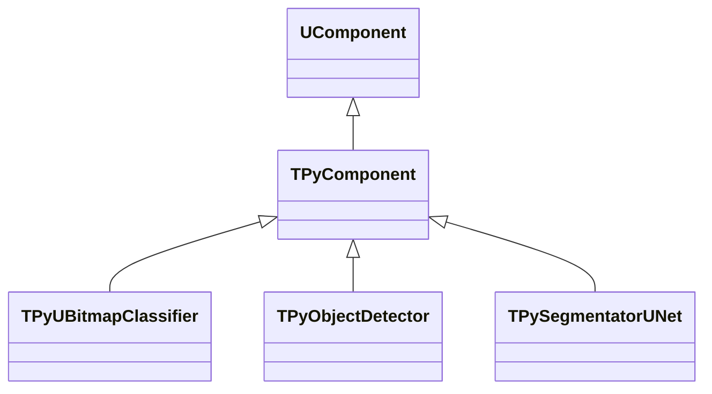
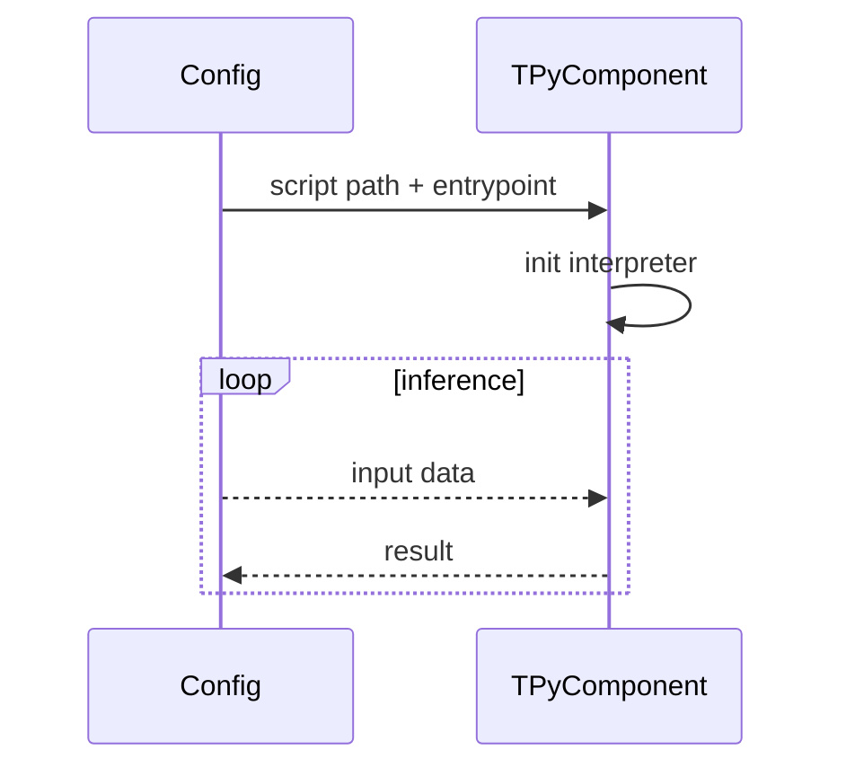

## TPyComponent — базовый Python-bridge

**Класс**: `TPyComponent` — базовый компонент интеграции Python.  
**Регистрация**: `Core/Lib.cpp` → `UploadClass("TPyComponent", ...)` (если используется); большинство производных компонентов наследуют его.



### Входы/выходы
- Вход: пути к скриптам/моделям, входные данные (изображения/тензоры).
- Выход: результаты Python-вызова (классы, боксы, маски).

```mermaid
flowchart LR
    cfg[Config (py script/model)] --> pyc[TPyComponent]
    data[Input data] --> pyc
    pyc --> out[Results]
```

Пояснение: блок-схема показывает поток данных/сигналов (входы → компонент → выходы).



Пояснение: диаграмма последовательности показывает типовой сценарий взаимодействия и порядок вызовов.

---

## TPyComponent — base Python bridge

Initialises Python, loads script/model, forwards data to Python entrypoints and returns results.
