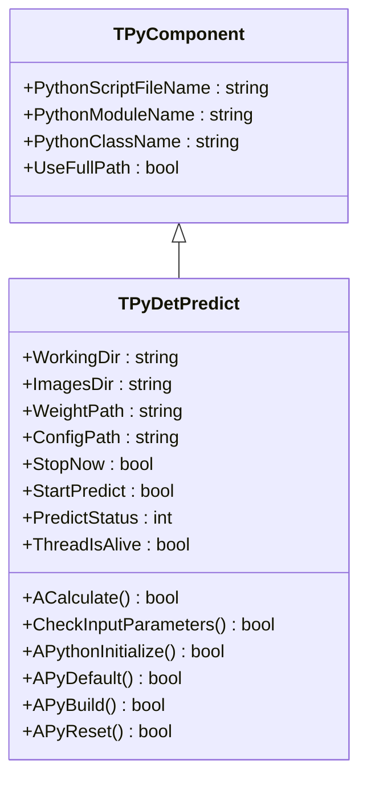
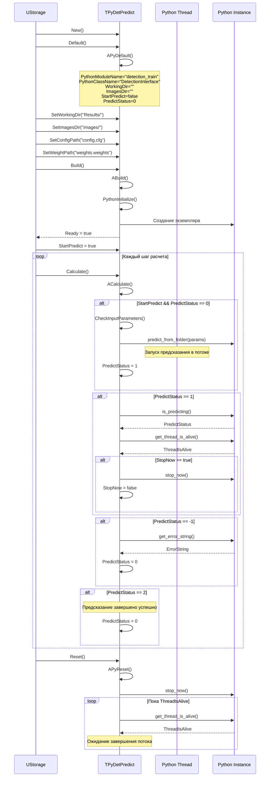
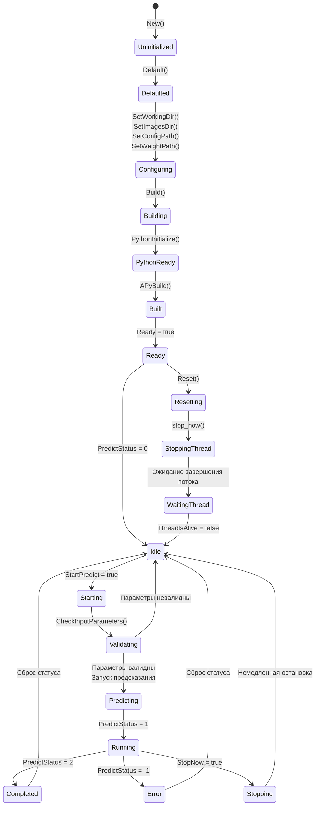
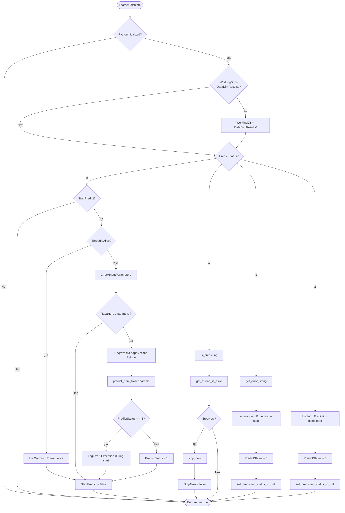
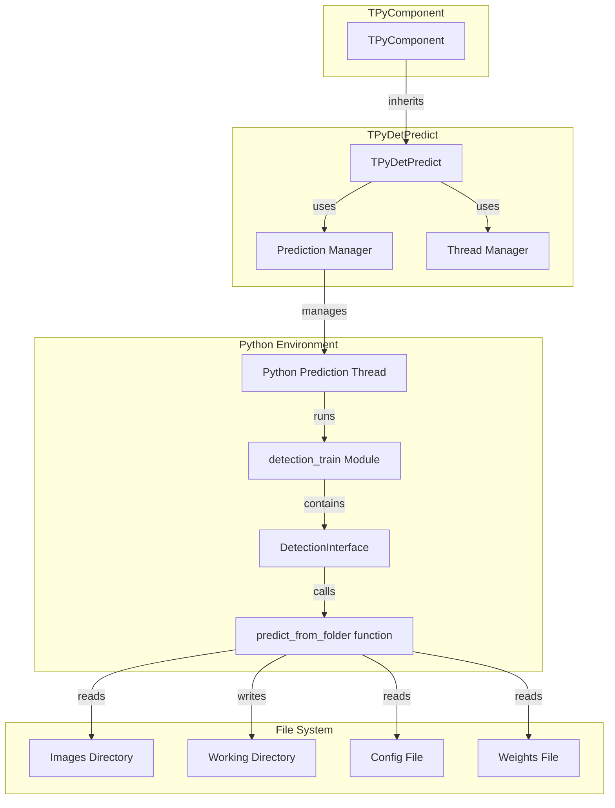

# TPyDetPredict — предикт детекции через Python

## RU

### Назначение

**Класс**: `TPyDetPredict` — компонент для пакетного предсказания детекции на множестве изображений через Python в отдельном потоке.  
**Регистрация**: `Core/Lib.cpp` → `UploadClass("TPyDetPredict", "PyDetPredict")`.  
**Storage-инстансы**: `ClassName = "PyDetPredict"` в конфигурационных проектах.

`TPyDetPredict` выполняет детекцию объектов на всех изображениях из указанной директории используя обученную модель. Работает асинхронно в отдельном Python потоке, что позволяет продолжать работу движка во время обработки.

**Использование:** Пакетная детекция объектов на множестве изображений

### UML-диаграмма классов



**Иерархия наследования:**
- `TPyComponent` — базовый Python-компонент
- `TPyDetPredict` — предикт детекции

### UML-диаграмма последовательности



### UML-диаграмма состояний



### UML-диаграмма активности



### UML-диаграмма компонентов



### Свойства

#### Параметры (ptPubParameter)

- **`WorkingDir`** (string) — рабочая директория для сохранения результатов предсказания. Автоматически устанавливается в `GetCurrentDataDir() + "Results/"` если не задана. Значение по умолчанию: пустая строка

- **`ImagesDir`** (string) — директория с изображениями для обработки. Должна быть непустой. Значение по умолчанию: пустая строка

- **`WeightPath`** (string) — путь к файлу весов обученной модели. Должен быть непустым. Значение по умолчанию: пустая строка

- **`ConfigPath`** (string) — путь к конфигурационному файлу модели. Должен быть непустым. Значение по умолчанию: пустая строка

- **`StopNow`** (bool) — флаг немедленной остановки предсказания. Автоматически сбрасывается после обработки. Значение по умолчанию: `false`

- **`StartPredict`** (bool) — флаг запуска предсказания. Устанавливается в `true` для начала предсказания, автоматически сбрасывается после запуска. Значение по умолчанию: `false`

#### Состояние (ptPubState)

- **`PredictStatus`** (int) — статус предсказания:
  - -1 — ошибка или остановка
  - 0 — не запущено (готов к запуску)
  - 1 — предсказание выполняется
  - 2 — предсказание завершено успешно
  Значение по умолчанию: 0

- **`ThreadIsAlive`** (bool) — флаг активности Python потока предсказания. `true` если поток активен, `false` если завершен. Значение по умолчанию: `false`

### Методы

#### Защищенные методы жизненного цикла

- **`APythonInitialize()`** → `bool` — инициализация Python. Всегда возвращает `true`

- **`APyDefault()`** → `bool` — установка значений по умолчанию:
  - `PythonModuleName = "detection_train"`
  - `PythonClassName = "DetectionInterface"`
  - `WorkingDir = ""`
  - `ImagesDir = ""`
  - `ConfigPath = ""`
  - `WeightPath = ""`
  - `StopNow = false`
  - `StartPredict = false`
  - `PredictStatus = 0`
  - `ThreadIsAlive = false`

- **`APyBuild()`** → `bool` — сборка компонента. Всегда возвращает `true`

- **`APyReset()`** → `bool` — сброс состояния:
  - Устанавливает `StopNow = false`, `StartPredict = false`
  - Останавливает Python поток через `stop_now()`
  - Ожидает завершения потока
  - Возвращает `true`

- **`ACalculate()`** → `bool` — выполнение расчета:
  - Обновляет `WorkingDir` если необходимо
  - Проверяет и запускает предсказание при `StartPredict = true`
  - Мониторит статус предсказания
  - Обрабатывает команды остановки
  - Обрабатывает завершение предсказания и ошибки
  - Всегда возвращает `true`

- **`CheckInputParameters()`** → `bool` — проверка валидности входных параметров:
  - Проверяет, что `WorkingDir` не пуст
  - Проверяет, что `ConfigPath` не пуст
  - Проверяет, что `WeightPath` не пуст
  - Проверяет, что `ImagesDir` не пуст
  - Возвращает `true` если все параметры валидны, `false` иначе

### Примеры использования

#### Пример 1: C++ код

```cpp
auto predictor = storage->CreateComponent<TPyDetPredict>();
predictor->SetPythonScriptFileName("detection_train.py");
predictor->WorkingDir = "Results/";
predictor->ImagesDir = "test_images/";
predictor->ConfigPath = "yolo.cfg";
predictor->WeightPath = "yolo.weights";
predictor->Build();

// Запуск предсказания
predictor->Reset();
predictor->StartPredict = true;

// Мониторинг
for (int step = 0; step < numSteps; step++) {
    predictor->Calculate();
    if (predictor->PredictStatus == 1) {
        std::cout << "Prediction in progress..." << std::endl;
    }
    if (predictor->PredictStatus == 2) {
        std::cout << "Prediction completed!" << std::endl;
        break;
    }
    if (predictor->PredictStatus == -1) {
        std::cout << "Prediction error!" << std::endl;
        break;
    }
}
```

#### Пример 2: XML конфигурация

```xml
<Predictor ClassName="PyDetPredict">
    <Property Name="PythonScriptFileName" Value="detection_train.py" />
    <Property Name="WorkingDir" Value="Results/" />
    <Property Name="ImagesDir" Value="test_images/" />
    <Property Name="ConfigPath" Value="yolo.cfg" />
    <Property Name="WeightPath" Value="yolo.weights" />
    <Property Name="StartPredict" Value="true" />
</Predictor>
```

### Особенности работы

1. **Асинхронное выполнение**: Предсказание выполняется в отдельном Python потоке, что позволяет продолжать работу движка

2. **Автоматическое управление директориями**: `WorkingDir` автоматически устанавливается в `DataDir + "Results/"` если не задана явно

3. **Безопасная остановка**: При деструкторе компонент гарантированно дожидается завершения Python потока

4. **Мониторинг**: Статус предсказания обновляется в каждом вызове `ACalculate()`

### Связи с другими компонентами

- **Использует**: Python модуль `detection_train` с классом `DetectionInterface`
- **Типичное использование**: После обучения детектора (`TPyDetectorTrainer`) для пакетной обработки тестовых изображений

### См. также

- [`TPyDetectorTrainer`](TPyDetectorTrainer.md) — тренер детекторов
- [`TPyObjectDetector`](TPyObjectDetector.md) — детектор объектов
- [`TPyPredictSort`](TPyPredictSort.md) — сортировка предсказаний
- [Architecture.md](../Architecture.md) — архитектура библиотеки

---

## EN

### Purpose

**Class**: `TPyDetPredict` — component for batch detection prediction on multiple images via Python in a separate thread.  
**Registration**: `Core/Lib.cpp` → `UploadClass("TPyDetPredict", "PyDetPredict")`.  
**Instances**: `ClassName = "PyDetPredict"` in configuration projects.

`TPyDetPredict` performs object detection on all images from specified directory using trained model. Works asynchronously in a separate Python thread.

**Usage:** Batch object detection on multiple images

### See also

- [`TPyDetectorTrainer`](TPyDetectorTrainer.md) — detector trainer
- [`TPyObjectDetector`](TPyObjectDetector.md) — object detector
- [`TPyPredictSort`](TPyPredictSort.md) — prediction sorting
- [Architecture.md](../Architecture.md) — library architecture
