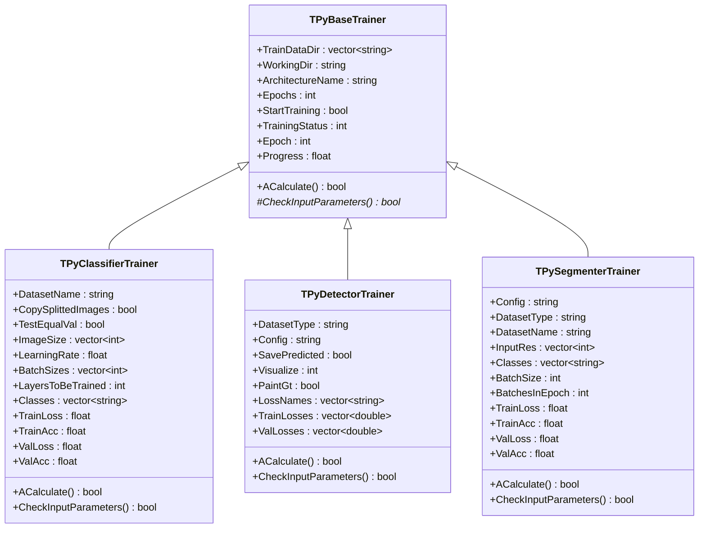
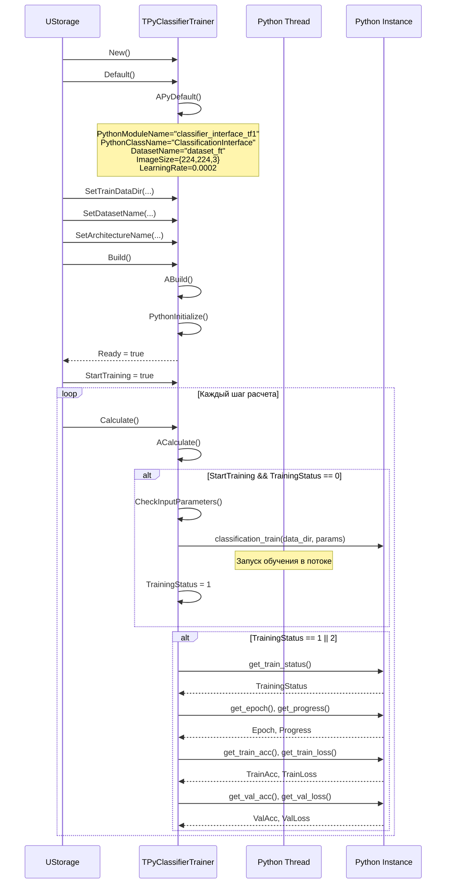
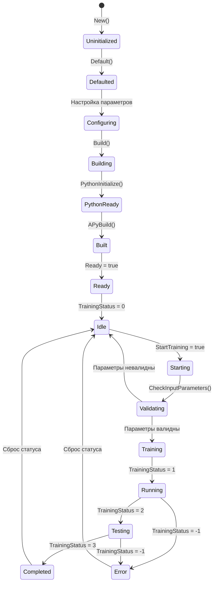
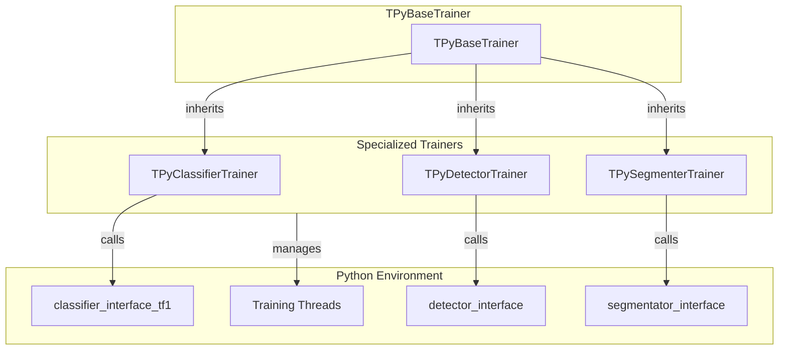

# TPyDetectorTrainer / TPySegmenterTrainer / TPyClassifierTrainer — тренеры через Python

## RU

### Назначение

**Классы**: 
- `TPyClassifierTrainer` — тренер классификаторов через Python
- `TPyDetectorTrainer` — тренер детекторов через Python  
- `TPySegmenterTrainer` — тренер сегментаторов через Python

**Регистрация**: `Core/Lib.cpp` → `UploadClass("TPyClassifierTrainer", ...)`, `UploadClass("TPyDetectorTrainer", ...)`, `UploadClass("TPySegmenterTrainer", ...)`.  
**Storage-инстансы**: Соответствующие `ClassName` в конфигурационных проектах.

Все тренеры наследуются от `TPyBaseTrainer` и предоставляют специализированную функциональность для обучения соответствующих типов моделей машинного обучения.

**Использование:** Обучение моделей классификации, детекции и сегментации через Python

### UML-диаграмма классов



**Иерархия наследования:**
- `TPyBaseTrainer` — базовый класс тренера
- `TPyClassifierTrainer` — тренер классификаторов
- `TPyDetectorTrainer` — тренер детекторов
- `TPySegmenterTrainer` — тренер сегментаторов

### UML-диаграмма последовательности



### UML-диаграмма состояний



### UML-диаграмма компонентов



### TPyClassifierTrainer

#### Свойства

- **`DatasetName`** (string) — имя датасета для обучения
- **`CopySplittedImages`** (bool) — копировать ли разделенные изображения
- **`TestEqualVal`** (bool) — использовать ли одинаковый размер для test и val
- **`ImageSize`** (vector<int>) — размер изображений [width, height, channels]
- **`LearningRate`** (float) — скорость обучения
- **`BatchSizes`** (vector<int>) — размеры батчей [train, val, test]
- **`LayersToBeTrained`** (int) — количество слоев для обучения (0 = default)
- **`Classes`** (vector<string>) — список классов
- **`TrainLoss`**, **`TrainAcc`**, **`ValLoss`**, **`ValAcc`** (float) — метрики обучения

### TPyDetectorTrainer

#### Свойства

- **`DatasetType`** (string) — тип датасета: "xml_main_dirs", "xml_txt_splits", и др.
- **`Config`** (string) — путь к конфигурационному файлу
- **`SavePredicted`** (bool) — сохранять ли предсказания
- **`Visualize`** (int) — режим визуализации (-1 = все, 0 = нет, n = n изображений)
- **`PaintGt`** (bool) — рисовать ли ground truth
- **`LossNames`**, **`TrainLosses`**, **`ValLosses`** — метрики потерь

### TPySegmenterTrainer

#### Свойства

- **`Config`** (string) — путь к конфигурационному файлу
- **`DatasetType`** (string) — тип датасета: "txt_data", "split_data", "not_split_data"
- **`DatasetName`** (string) — имя датасета
- **`InputRes`** (vector<int>) — разрешение входа [height, width, channels]
- **`Classes`** (vector<string>) — список классов
- **`BatchSize`** (int) — размер батча
- **`BatchesInEpoch`** (int) — количество батчей в эпохе
- **`TrainLoss`**, **`TrainAcc`**, **`ValLoss`**, **`ValAcc`** (float) — метрики обучения

### Примеры использования

#### Пример 1: TPyClassifierTrainer

```xml
<Trainer ClassName="PyClassifierTrainer">
    <Property Name="TrainDataDir" Value="datasets/classification" />
    <Property Name="WorkingDir" Value="Results/" />
    <Property Name="ArchitectureName" Value="MobileNet" />
    <Property Name="DatasetName" Value="my_dataset" />
    <Property Name="ImageSize" Value="224,224,3" />
    <Property Name="LearningRate" Value="0.001" />
    <Property Name="BatchSizes" Value="32,16,8" />
    <Property Name="Epochs" Value="50" />
    <Property Name="StartTraining" Value="true" />
</Trainer>
```

#### Пример 2: TPyDetectorTrainer

```xml
<Trainer ClassName="PyDetectorTrainer">
    <Property Name="TrainDataDir" Value="datasets/detection" />
    <Property Name="WorkingDir" Value="Results/" />
    <Property Name="DatasetType" Value="xml_main_dirs" />
    <Property Name="Config" Value="config.cfg" />
    <Property Name="Epochs" Value="100" />
    <Property Name="StartTraining" Value="true" />
</Trainer>
```

### См. также

- [`TPyBaseTrainer`](TPyBaseTrainer.md) — базовый класс тренера
- [`TPyComponent`](TPyComponent.md) — базовый Python-компонент
- [Architecture.md](../Architecture.md) — архитектура библиотеки

---

## EN

### Purpose

**Classes**: 
- `TPyClassifierTrainer` — classifier trainer via Python
- `TPyDetectorTrainer` — detector trainer via Python  
- `TPySegmenterTrainer` — segmentator trainer via Python

All trainers inherit from `TPyBaseTrainer` and provide specialized functionality for training corresponding types of machine learning models.

**Usage:** Training classification, detection and segmentation models via Python

### See also

- [`TPyBaseTrainer`](TPyBaseTrainer.md) — base trainer class
- [`TPyComponent`](TPyComponent.md) — base Python component
- [Architecture.md](../Architecture.md) — library architecture
