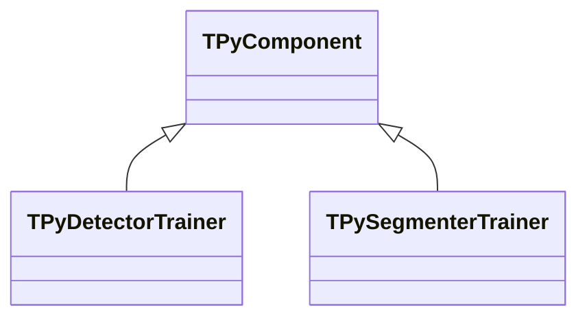
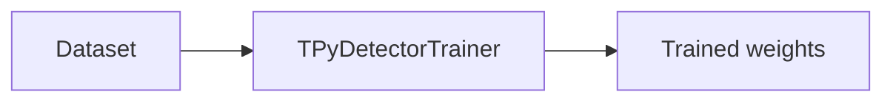
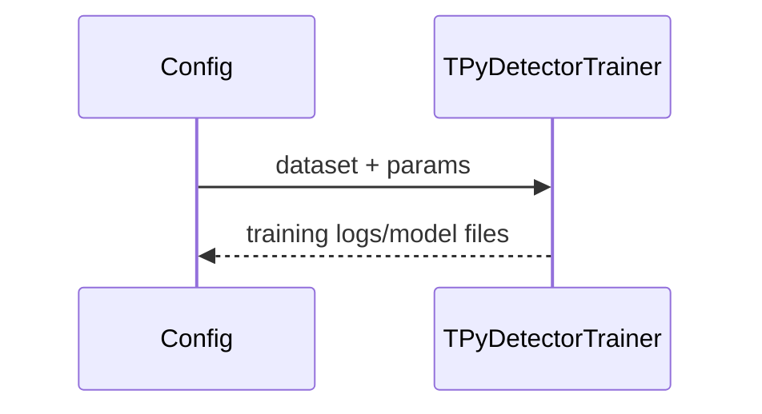

## TPyDetectorTrainer / TPySegmenterTrainer — тренеры для детекторов/сегментаторов

**Классы**: `TPyDetectorTrainer`, `TPySegmenterTrainer` — запуск обучения Python-моделей (детекция, сегментация).  
**Регистрация**: `Lib.cpp` → `UploadClass("PyDetectorTrainer", ...)`, `"PySegmenterTrainer"`.  
**Storage-инстансы**: `ClassName` тренера; параметры: датасет, скрипт, гиперпараметры.

### Входы/выходы
- Вход: пути к датасетам/аннотациям, конфиг гиперпараметров.
- Выход: обученные веса/модельные файлы.

Пояснение: блок-схема показывает поток данных/сигналов (входы → компонент → выходы).

Пояснение: диаграмма последовательности показывает типовой сценарий взаимодействия и порядок вызовов.

---

## TPyDetectorTrainer / TPySegmenterTrainer — trainers

Run Python training loops for detection/segmentation models using provided datasets and hyperparameters.
