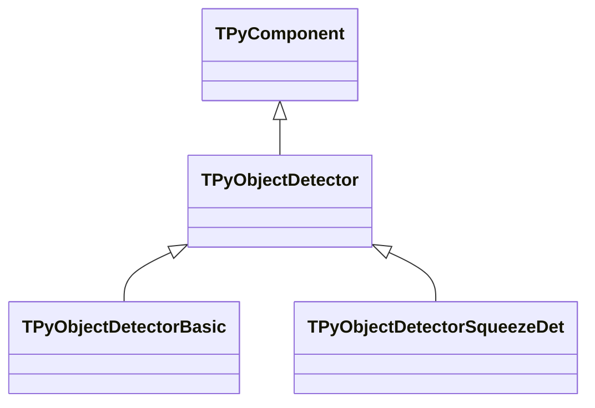
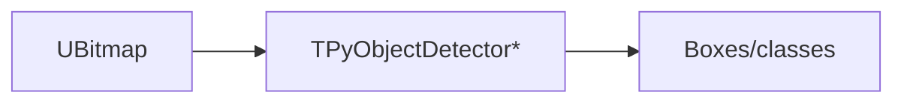
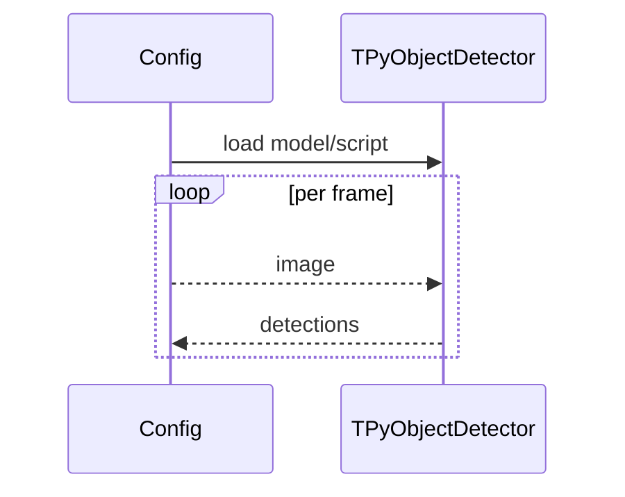

## TPyObjectDetector / Basic / SqueezeDet — Python детекторы

**Классы**: `TPyObjectDetector`, `TPyObjectDetectorBasic`, `TPyObjectDetectorSqueezeDet` — детекция объектов через Python-модели.  
**Регистрация**: `Lib.cpp` → `UploadClass("PyObjectDetector", ...)`, `"PyObjectDetectorBasic"`, `"PyObjectDetectorSqueezeDet"`.  
**Storage-инстансы**: `ClassName` соответствующего детектора; параметры: путь к модели/скрипту, имена функций препро/постпроцессинга.

### Входы/выходы
- Вход: `UBitmap` изображение.
- Выход: bounding boxes + классы + scores.

Пояснение: блок-схема показывает поток данных/сигналов (входы → компонент → выходы).

Пояснение: диаграмма последовательности показывает типовой сценарий взаимодействия и порядок вызовов.

---

## TPyObjectDetector* — Python object detectors

Run Python detection models (generic/basic/SqueezeDet) on images, returning boxes and classes.
