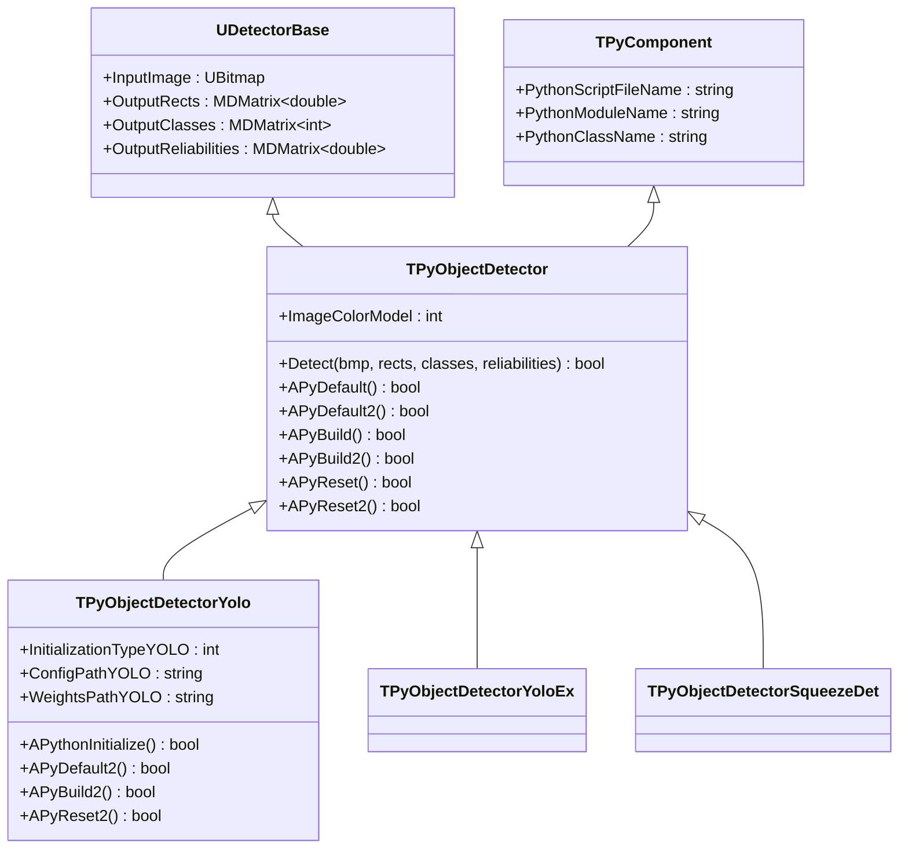
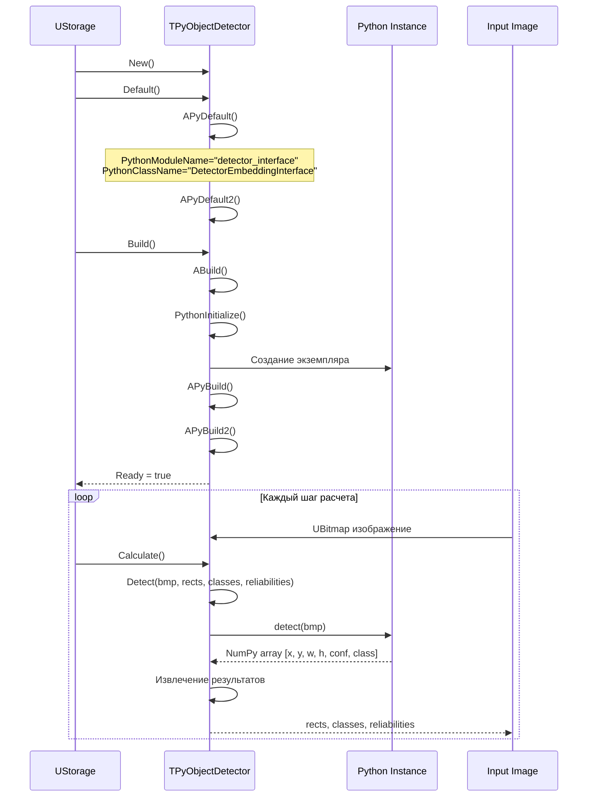
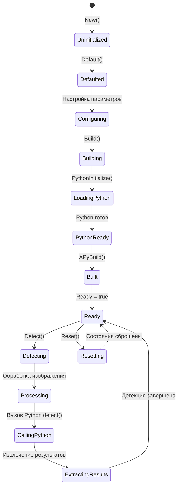
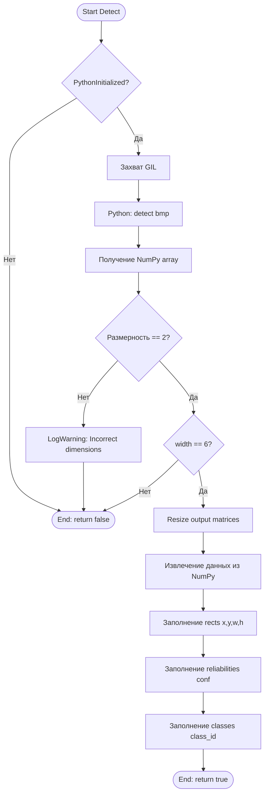
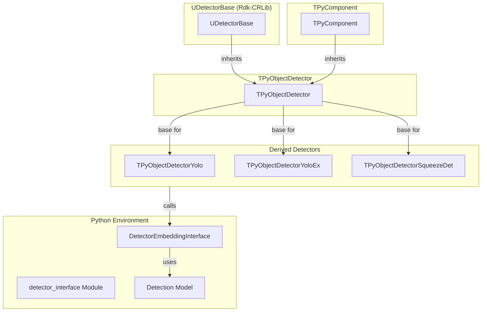

# TPyObjectDetector — базовый детектор объектов через Python

## RU

### Назначение

**Класс**: `TPyObjectDetector` — базовый детектор объектов через Python.  
**Регистрация**: `Core/Lib.cpp` → `UploadClass("TPyObjectDetector", "PyObjectDetector")`.  
**Storage-инстансы**: `ClassName = "PyObjectDetector"` в конфигурационных проектах.

`TPyObjectDetector` является базовым классом для детекторов объектов через Python. Наследуется от `UDetectorBase` и `TPyComponent`. Предоставляет базовую функциональность для детекции объектов на изображениях.

**Использование:** Базовый класс для специализированных детекторов (YOLO, SqueezeDet и др.)

### UML-диаграмма классов



**Иерархия наследования:**
- `UDetectorBase` (Rdk-CRLib) — базовый детектор
- `TPyComponent` — базовый Python-компонент
- `TPyObjectDetector` — базовый детектор объектов
- `TPyObjectDetectorYolo`, `TPyObjectDetectorYoloEx`, `TPyObjectDetectorSqueezeDet` — специализированные детекторы

### UML-диаграмма последовательности



### UML-диаграмма состояний



### UML-диаграмма активности



### UML-диаграмма компонентов



### Свойства

#### Параметры (ptPubParameter)

- **`ImageColorModel`** (int) — цветовая модель входного изображения:
  - `ubmRGB24=3` — RGB 24-битное
  - `ubmY8=400` — Grayscale 8-битное
  Значение по умолчанию: зависит от базового класса

#### Наследуемые свойства

От `UDetectorBase`:
- `InputImage` (UBitmap) — входное изображение
- `OutputRects` (MDMatrix<double>) — выходные прямоугольники [x, y, width, height]
- `OutputClasses` (MDMatrix<int>) — выходные классы объектов
- `OutputReliabilities` (MDMatrix<double>) — выходные уверенности детекции

От `TPyComponent`:
- `PythonScriptFileName` (string) — путь к Python скрипту
- `PythonModuleName` (string) — имя Python модуля (по умолчанию: "detector_interface")
- `PythonClassName` (string) — имя Python класса (по умолчанию: "DetectorEmbeddingInterface")

### Методы

#### Публичные методы

- **`Detect(UBitmap &bmp, MDMatrix<double> &output_rects, MDMatrix<int> &output_classes, MDMatrix<double> &reliabilities)`** → `bool` — выполняет детекцию объектов на изображении. В базовом классе всегда возвращает `true`. Переопределяется в производных классах

#### Защищенные методы

- **`APyDefault()`** → `bool` — установка значений по умолчанию:
  - `PythonModuleName = "detector_interface"`
  - `PythonClassName = "DetectorEmbeddingInterface"`
  - Вызывает `APyDefault2()` для дополнительной инициализации

- **`APyDefault2()`** → `bool` — дополнительная инициализация в производных классах. В базовом классе всегда возвращает `true`

- **`APyBuild()`** → `bool` — сборка компонента. Вызывает `APyBuild2()` для дополнительной сборки

- **`APyBuild2()`** → `bool` — дополнительная сборка в производных классах. В базовом классе всегда возвращает `true`

- **`APyReset()`** → `bool` — сброс состояния. Вызывает `APyReset2()` для дополнительного сброса

- **`APyReset2()`** → `bool` — дополнительный сброс в производных классах. В базовом классе всегда возвращает `true`

### Примеры использования

#### Пример 1: C++ код

```cpp
auto detector = storage->CreateComponent<TPyObjectDetectorYolo>();
detector->SetPythonScriptFileName("yolo_detector.py");
detector->InitializationTypeYOLO = YOLOV3_INITTYPE;
detector->ConfigPathYOLO = "yolo.cfg";
detector->WeightsPathYOLO = "yolo.weights";
detector->Build();

UBitmap image;
// ... загрузка изображения ...

MDMatrix<double> rects;
MDMatrix<int> classes;
MDMatrix<double> reliabilities;
detector->Detect(image, rects, classes, reliabilities);

for (int i = 0; i < rects.GetRows(); i++) {
    std::cout << "Object " << i << ": class=" << classes(i,0) 
              << ", conf=" << reliabilities(i,0) 
              << ", rect=[" << rects(i,0) << "," << rects(i,1) 
              << "," << rects(i,2) << "," << rects(i,3) << "]" << std::endl;
}
```

#### Пример 2: XML конфигурация

```xml
<Detector ClassName="PyObjectDetector">
    <Property Name="PythonScriptFileName" Value="detector_interface.py" />
    <Property Name="ImageColorModel" Value="3" />
</Detector>
```

### Специализированные детекторы

#### TPyObjectDetectorYolo

YOLO детектор объектов. Дополнительные свойства:
- `InitializationTypeYOLO` (int) — тип инициализации: `YOLOV2_INITTYPE=2` или `YOLOV3_INITTYPE=3`
- `ConfigPathYOLO` (string) — путь к конфигурационному файлу YOLO (.cfg)
- `WeightsPathYOLO` (string) — путь к файлу весов YOLO (.weights)

**Инициализация:**
- Для YOLOv2: вызывается `initialize_config(config_path, weights_path)`
- Для YOLOv3: вызывается `initialize_config(config_path)`

#### TPyObjectDetectorYoloEx

Расширенный YOLO детектор с дополнительными возможностями фильтрации и изменения классов.

**Дополнительные свойства:**
- `ModelPathYOLO` (string) — путь к модели YOLO
- `AnchorsPathYOLO` (string) — путь к файлу с якорями (anchors)
- `ClassesPathYOLO` (string) — путь к файлу со списком классов
- `TargetClassesYOLO` (vector<string>) — список целевых классов для фильтрации
- `LoadTargetClassesYOLO` (bool) — загружать ли целевые классы из файла
- `NumTargetClassesYOLO` (int) — количество целевых классов
- `NumChangeClassesYOLO` (int) — количество классов для замены
- `ChangeClassesYOLO` (vector<string>) — список классов для замены

**Инициализация:** Вызывается `initialize_predictor(model_path, anchors_path, classes_path, target_classes, change_classes)`

**Особенности:**
- Поддержка фильтрации по целевым классам
- Поддержка замены классов
- Загрузка классов из файла при `LoadTargetClassesYOLO = true`

#### TPyObjectDetectorSqueezeDet

SqueezeDet детектор объектов.

**Дополнительные свойства:**
- `ConfigPath` (string) — путь к конфигурационному файлу SqueezeDet
- `WeightsPath` (string) — путь к файлу весов SqueezeDet

**Инициализация:** Вызывается `initialize_config(config_path, weights_path)`

### См. также

- [`TPyComponent`](TPyComponent.md) — базовый Python-компонент
- [`TPyObjectDetectorYolo`](TPyObjectDetector.md#tpyobjectdetectoryolo) — YOLO детектор
- [`TPyDetectorTrainer`](TPyDetectorTrainer.md) — тренер детекторов
- [Architecture.md](../Architecture.md) — архитектура библиотеки

---

## EN

### Purpose

**Class**: `TPyObjectDetector` — base object detector via Python.  
**Registration**: `Core/Lib.cpp` → `UploadClass("TPyObjectDetector", "PyObjectDetector")`.  
**Instances**: `ClassName = "PyObjectDetector"` in configuration projects.

`TPyObjectDetector` is base class for object detectors via Python. Inherits from `UDetectorBase` and `TPyComponent`.

**Usage:** Base class for specialized detectors (YOLO, SqueezeDet, etc.)

### See also

- [`TPyComponent`](TPyComponent.md) — base Python component
- [`TPyDetectorTrainer`](TPyDetectorTrainer.md) — detector trainer
- [Architecture.md](../Architecture.md) — library architecture
