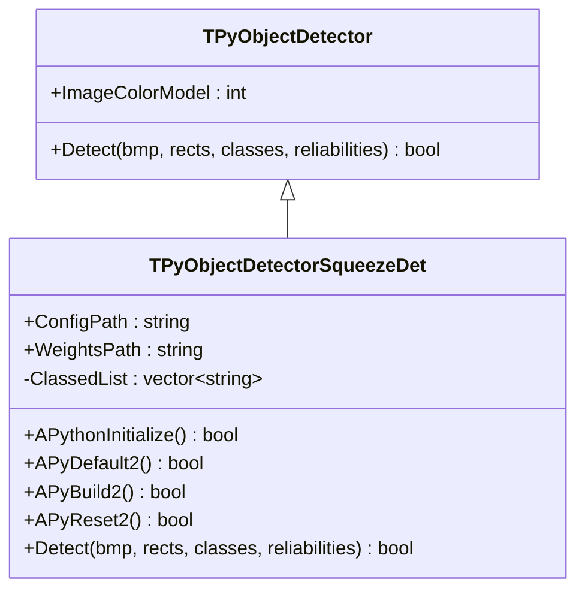
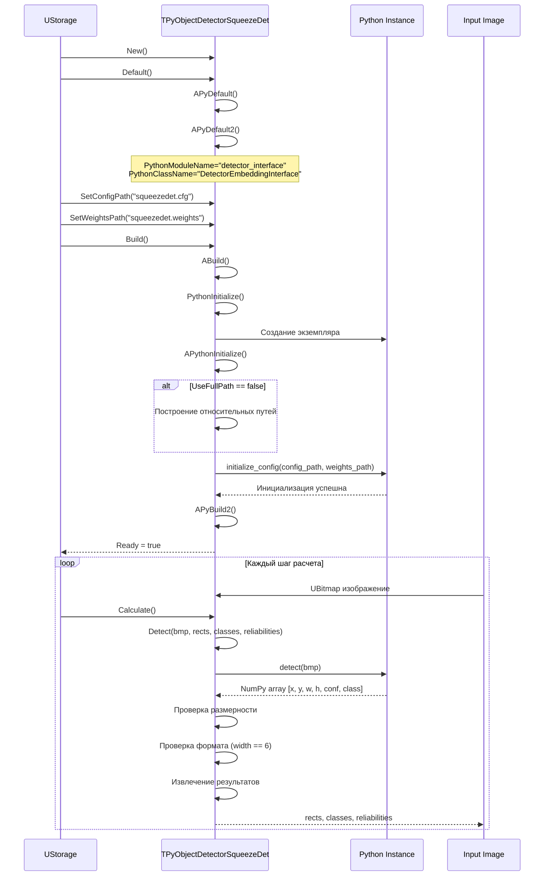
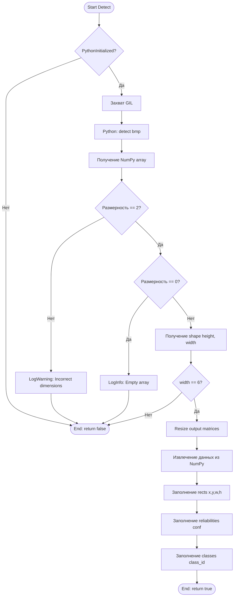
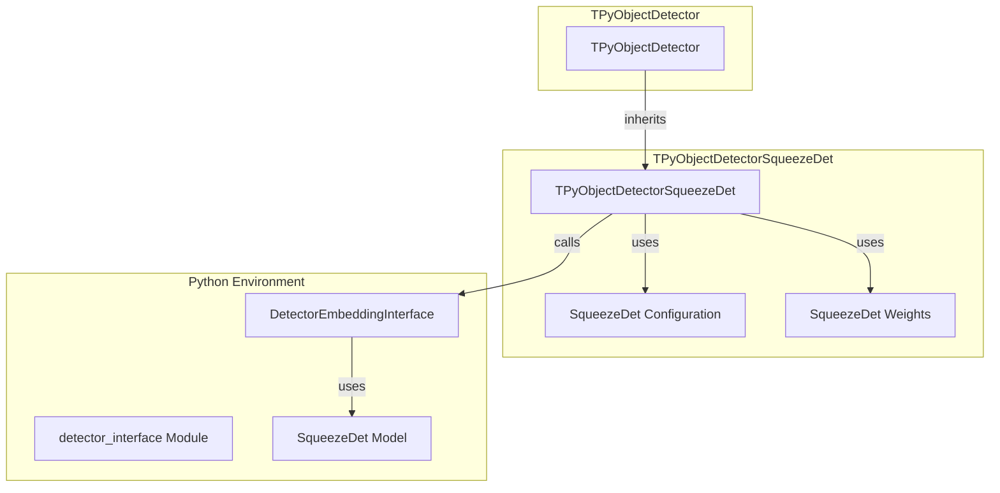

# TPyObjectDetectorSqueezeDet — SqueezeDet детектор объектов через Python

## RU

### Назначение

**Класс**: `TPyObjectDetectorSqueezeDet` — SqueezeDet детектор объектов через Python.  
**Регистрация**: `Core/Lib.cpp` → `UploadClass("TPyObjectDetectorSqueezeDet", "PyObjectDetectorSqueezeDet")`.  
**Storage-инстансы**: `ClassName = "PyObjectDetectorSqueezeDet"` в конфигурационных проектах.

`TPyObjectDetectorSqueezeDet` выполняет детекцию объектов используя SqueezeDet архитектуру через Python. Наследуется от `TPyObjectDetector` и использует конфигурационный файл и файл весов для инициализации.

**Использование:** Детекция объектов на изображениях с использованием SqueezeDet моделей

### UML-диаграмма классов



**Иерархия наследования:**
- `UDetectorBase` (Rdk-CRLib) — базовый детектор
- `TPyComponent` — базовый Python-компонент
- `TPyObjectDetector` — базовый детектор объектов
- `TPyObjectDetectorSqueezeDet` — SqueezeDet детектор

### UML-диаграмма последовательности



### UML-диаграмма состояний

```mermaid
stateDiagram-v2
    [*] --> Uninitialized: New()
    Uninitialized --> Defaulted: Default()
    Defaulted --> Configuring: SetConfigPath()<br/>SetWeightsPath()
    Configuring --> Building: Build()
    Building --> LoadingPython: PythonInitialize()
    LoadingPython --> InitializingSqueezeDet: APythonInitialize()
    InitializingSqueezeDet --> CheckFullPath{UseFullPath?}
    CheckFullPath -->|Нет| BuildRelativePaths: Построение относительных путей
    CheckFullPath -->|Да| UseAbsolutePaths: Использование абсолютных путей
    BuildRelativePaths --> InitConfig: initialize_config(config, weights)
    UseAbsolutePaths --> InitConfig
    InitConfig --> PythonReady: Инициализация успешна
    PythonReady --> Built: APyBuild2()
    Built --> Ready: Ready = true
    Ready --> Detecting: Detect()
    Detecting --> Processing: Обработка изображения
    Processing --> CallingPython: Вызов Python detect()
    CallingPython --> Validating: Проверка размерности и формата
    Validating --> ExtractingResults: Извлечение результатов
    ExtractingResults --> Ready: Детекция завершена
    Ready --> Resetting: Reset()
    Resetting --> Ready: Состояния сброшены
```

### UML-диаграмма активности



### UML-диаграмма компонентов



### Свойства

#### Параметры (ptPubParameter)

- **`ConfigPath`** (string) — путь к конфигурационному файлу SqueezeDet. Используется при инициализации. Если `UseFullPath = false`, путь строится относительно `GetCurrentDataDir()`. Значение по умолчанию: пустая строка

- **`WeightsPath`** (string) — путь к файлу весов SqueezeDet. Используется при инициализации. Если `UseFullPath = false`, путь строится относительно `GetCurrentDataDir()`. Значение по умолчанию: пустая строка

#### Наследуемые свойства

От `TPyObjectDetector`:
- `ImageColorModel` (int) — цветовая модель входного изображения

От `UDetectorBase`:
- `InputImage` (UBitmap) — входное изображение
- `OutputRects` (MDMatrix<double>) — выходные прямоугольники [x, y, width, height]
- `OutputClasses` (MDMatrix<int>) — выходные классы объектов
- `OutputReliabilities` (MDMatrix<double>) — выходные уверенности детекции

От `TPyComponent`:
- `PythonScriptFileName` (string) — путь к Python скрипту
- `PythonModuleName` (string) — имя Python модуля (по умолчанию: "detector_interface")
- `PythonClassName` (string) — имя Python класса (по умолчанию: "DetectorEmbeddingInterface")
- `UseFullPath` (bool) — использовать абсолютный путь

#### Защищенные свойства

- **`ClassedList`** (vector<string>) — список классов (если используется)

### Методы

#### Защищенные методы

- **`APythonInitialize()`** → `bool` — инициализация Python:
  - Если `UseFullPath = false`, строит относительные пути к config и weights
  - Вызывает `initialize_config(config_path, weights_path)`
  - Возвращает `true` при успехе, `false` при ошибке

- **`APyDefault2()`** → `bool` — дополнительная инициализация. Всегда возвращает `true`

- **`APyBuild2()`** → `bool` — дополнительная сборка. Всегда возвращает `true`

- **`APyReset2()`** → `bool` — дополнительный сброс. Всегда возвращает `true`

- **`Detect(UBitmap &bmp, MDMatrix<double> &output_rects, MDMatrix<int> &output_classes, MDMatrix<double> &reliabilities)`** → `bool` — выполняет детекцию объектов:
  - Проверяет инициализацию Python
  - Вызывает Python метод `detect(bmp)`
  - Получает NumPy array с результатами
  - Проверяет размерность (должна быть 2, не должна быть 0)
  - Проверяет ширину (должна быть 6)
  - Извлекает данные и заполняет выходные матрицы
  - Возвращает `true` при успехе, `false` при ошибке

### Примеры использования

#### Пример 1: C++ код

```cpp
auto detector = storage->CreateComponent<TPyObjectDetectorSqueezeDet>();
detector->SetPythonScriptFileName("squeezedet_detector.py");
detector->ConfigPath = "squeezedet.cfg";
detector->WeightsPath = "squeezedet.weights";
detector->UseFullPath = false; // относительный путь
detector->Build();

UBitmap image;
// ... загрузка изображения ...

MDMatrix<double> rects;
MDMatrix<int> classes;
MDMatrix<double> reliabilities;
detector->Detect(image, rects, classes, reliabilities);
```

#### Пример 2: XML конфигурация

```xml
<Detector ClassName="PyObjectDetectorSqueezeDet">
    <Property Name="PythonScriptFileName" Value="squeezedet_detector.py" />
    <Property Name="ConfigPath" Value="squeezedet.cfg" />
    <Property Name="WeightsPath" Value="squeezedet.weights" />
    <Property Name="UseFullPath" Value="false" />
</Detector>
```

### Особенности работы

1. **Инициализация**: Требует как конфигурационный файл, так и файл весов для инициализации

2. **Формат выходных данных**: Python должен возвращать NumPy array с формой [N, 6], где каждая строка содержит [x, y, w, h, conf, class]

3. **Проверка пустых результатов**: Компонент проверяет, что размерность не равна 0 (пустой массив)

4. **Относительные пути**: При `UseFullPath = false` пути к config и weights автоматически строятся относительно `GetCurrentDataDir()`

### См. также

- [`TPyObjectDetector`](TPyObjectDetector.md) — базовый детектор объектов
- [`TPyObjectDetectorYolo`](TPyObjectDetectorYolo.md) — YOLO детектор
- [`TPyDetectorTrainer`](TPyDetectorTrainer.md) — тренер детекторов
- [Architecture.md](../Architecture.md) — архитектура библиотеки

---

## EN

### Purpose

**Class**: `TPyObjectDetectorSqueezeDet` — SqueezeDet object detector via Python.  
**Registration**: `Core/Lib.cpp` → `UploadClass("TPyObjectDetectorSqueezeDet", "PyObjectDetectorSqueezeDet")`.  
**Instances**: `ClassName = "PyObjectDetectorSqueezeDet"` in configuration projects.

`TPyObjectDetectorSqueezeDet` performs object detection using SqueezeDet architecture via Python. Inherits from `TPyObjectDetector`.

**Usage:** Object detection on images using SqueezeDet models

### See also

- [`TPyObjectDetector`](TPyObjectDetector.md) — base object detector
- [`TPyObjectDetectorYolo`](TPyObjectDetectorYolo.md) — YOLO detector
- [`TPyDetectorTrainer`](TPyDetectorTrainer.md) — detector trainer
- [Architecture.md](../Architecture.md) — library architecture
