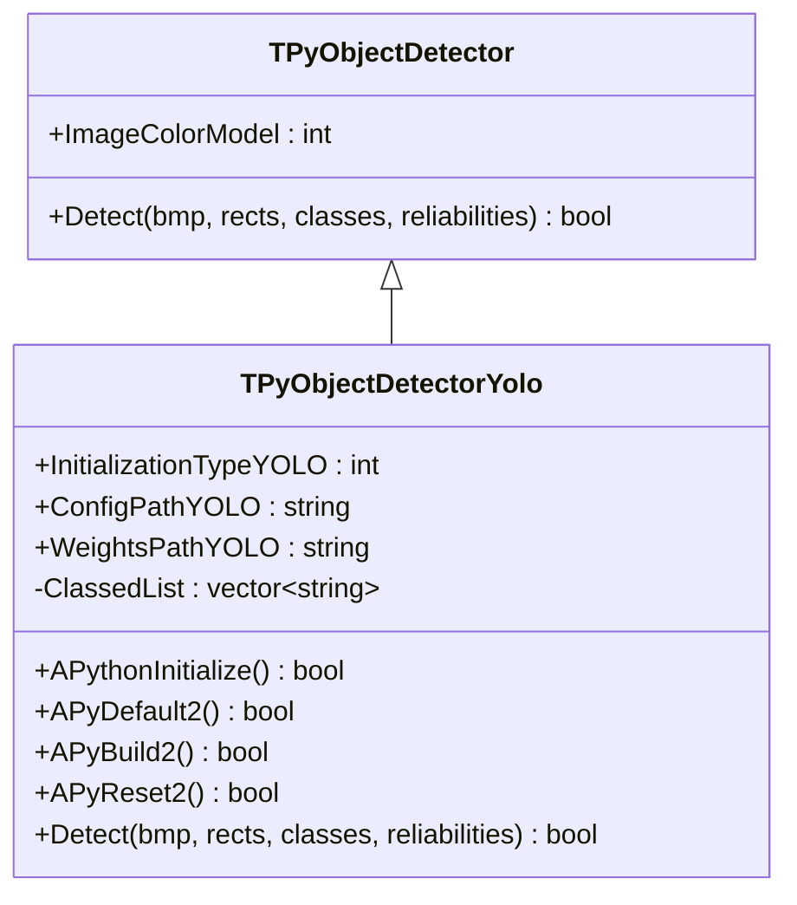
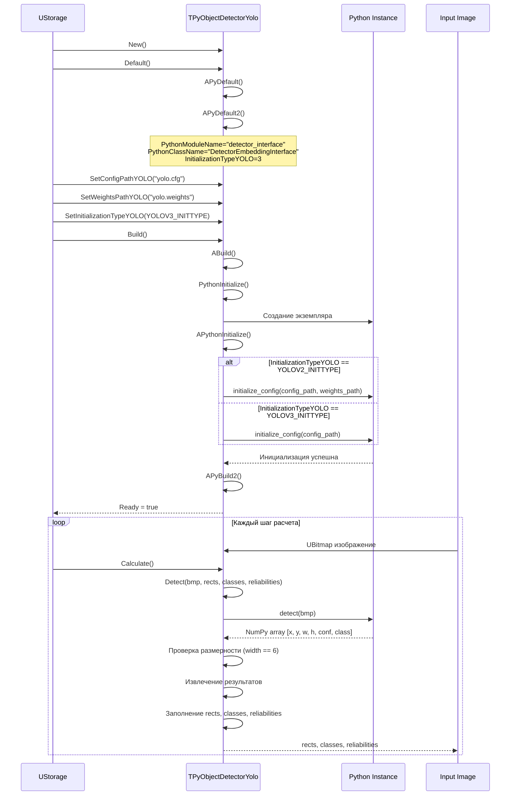
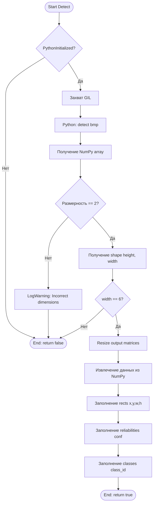
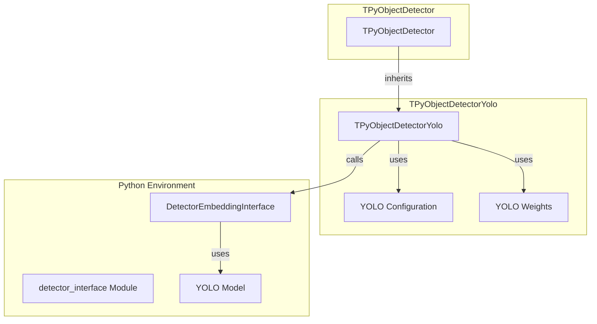

# TPyObjectDetectorYolo — YOLO детектор объектов через Python

## RU

### Назначение

**Класс**: `TPyObjectDetectorYolo` — YOLO детектор объектов через Python.  
**Регистрация**: `Core/Lib.cpp` → `UploadClass("TPyObjectDetectorYolo", "PyObjectDetector")`.  
**Storage-инстансы**: `ClassName = "PyObjectDetector"` в конфигурационных проектах.

`TPyObjectDetectorYolo` выполняет детекцию объектов используя YOLO (You Only Look Once) архитектуру через Python. Наследуется от `TPyObjectDetector` и поддерживает YOLOv2 и YOLOv3.

**Использование:** Детекция объектов на изображениях с использованием YOLO моделей

### UML-диаграмма классов



**Иерархия наследования:**
- `UDetectorBase` (Rdk-CRLib) — базовый детектор
- `TPyComponent` — базовый Python-компонент
- `TPyObjectDetector` — базовый детектор объектов
- `TPyObjectDetectorYolo` — YOLO детектор

### UML-диаграмма последовательности



### UML-диаграмма состояний

```mermaid
stateDiagram-v2
    [*] --> Uninitialized: New()
    Uninitialized --> Defaulted: Default()
    Defaulted --> Configuring: SetConfigPathYOLO()<br/>SetWeightsPathYOLO()<br/>SetInitializationTypeYOLO()
    Configuring --> Building: Build()
    Building --> LoadingPython: PythonInitialize()
    LoadingPython --> InitializingYOLO: APythonInitialize()
    InitializingYOLO --> CheckType{InitializationType?}
    CheckType -->|YOLOV2| InitYOLOv2: initialize_config(config, weights)
    CheckType -->|YOLOV3| InitYOLOv3: initialize_config(config)
    InitYOLOv2 --> PythonReady: Инициализация успешна
    InitYOLOv3 --> PythonReady
    PythonReady --> Built: APyBuild2()
    Built --> Ready: Ready = true
    Ready --> Detecting: Detect()
    Detecting --> Processing: Обработка изображения
    Processing --> CallingPython: Вызов Python detect()
    CallingPython --> Validating: Проверка размерности
    Validating --> ExtractingResults: Извлечение результатов
    ExtractingResults --> Ready: Детекция завершена
    Ready --> Resetting: Reset()
    Resetting --> Ready: Состояния сброшены
```

### UML-диаграмма активности



### UML-диаграмма компонентов



### Свойства

#### Параметры (ptPubParameter)

- **`InitializationTypeYOLO`** (int) — тип инициализации YOLO:
  - `YOLOV2_INITTYPE=2` — YOLOv2 (требует config и weights)
  - `YOLOV3_INITTYPE=3` — YOLOv3 (требует только config)
  Значение по умолчанию: зависит от реализации

- **`ConfigPathYOLO`** (string) — путь к конфигурационному файлу YOLO (.cfg). Используется при инициализации. Если `UseFullPath = false`, путь строится относительно `GetCurrentDataDir()`. Значение по умолчанию: пустая строка

- **`WeightsPathYOLO`** (string) — путь к файлу весов YOLO (.weights). Используется только для YOLOv2. Если `UseFullPath = false`, путь строится относительно `GetCurrentDataDir()`. Значение по умолчанию: пустая строка

#### Наследуемые свойства

От `TPyObjectDetector`:
- `ImageColorModel` (int) — цветовая модель входного изображения

От `UDetectorBase`:
- `InputImage` (UBitmap) — входное изображение
- `OutputRects` (MDMatrix<double>) — выходные прямоугольники [x, y, width, height]
- `OutputClasses` (MDMatrix<int>) — выходные классы объектов
- `OutputReliabilities` (MDMatrix<double>) — выходные уверенности детекции

От `TPyComponent`:
- `PythonScriptFileName` (string) — путь к Python скрипту
- `PythonModuleName` (string) — имя Python модуля (по умолчанию: "detector_interface")
- `PythonClassName` (string) — имя Python класса (по умолчанию: "DetectorEmbeddingInterface")
- `UseFullPath` (bool) — использовать абсолютный путь

#### Защищенные свойства

- **`ClassedList`** (vector<string>) — список классов, загружаемый из файла (если используется)

### Методы

#### Защищенные методы

- **`APythonInitialize()`** → `bool` — инициализация Python:
  - Если `UseFullPath = false`, строит относительные пути к config и weights
  - В зависимости от `InitializationTypeYOLO`:
    - YOLOv2: вызывает `initialize_config(config_path, weights_path)`
    - YOLOv3: вызывает `initialize_config(config_path)`
  - Возвращает `true` при успехе, `false` при ошибке

- **`APyDefault2()`** → `bool` — дополнительная инициализация. Всегда возвращает `true`

- **`APyBuild2()`** → `bool` — дополнительная сборка. Всегда возвращает `true`

- **`APyReset2()`** → `bool` — дополнительный сброс. Всегда возвращает `true`

- **`Detect(UBitmap &bmp, MDMatrix<double> &output_rects, MDMatrix<int> &output_classes, MDMatrix<double> &reliabilities)`** → `bool` — выполняет детекцию объектов:
  - Проверяет инициализацию Python
  - Вызывает Python метод `detect(bmp)`
  - Получает NumPy array с результатами [x, y, w, h, conf, class]
  - Проверяет размерность (должна быть 2) и ширину (должна быть 6)
  - Извлекает данные и заполняет выходные матрицы
  - Возвращает `true` при успехе, `false` при ошибке

### Примеры использования

#### Пример 1: C++ код (YOLOv3)

```cpp
auto detector = storage->CreateComponent<TPyObjectDetectorYolo>();
detector->SetPythonScriptFileName("yolo_detector.py");
detector->InitializationTypeYOLO = YOLOV3_INITTYPE;
detector->ConfigPathYOLO = "yolov3.cfg";
detector->UseFullPath = false; // относительный путь
detector->Build();

UBitmap image;
// ... загрузка изображения ...

MDMatrix<double> rects;
MDMatrix<int> classes;
MDMatrix<double> reliabilities;
detector->Detect(image, rects, classes, reliabilities);

for (int i = 0; i < rects.GetRows(); i++) {
    std::cout << "Object " << i << ": class=" << classes(i,0) 
              << ", conf=" << reliabilities(i,0) 
              << ", rect=[" << rects(i,0) << "," << rects(i,1) 
              << "," << rects(i,2) << "," << rects(i,3) << "]" << std::endl;
}
```

#### Пример 2: XML конфигурация (YOLOv2)

```xml
<Detector ClassName="PyObjectDetector">
    <Property Name="PythonScriptFileName" Value="yolo_detector.py" />
    <Property Name="InitializationTypeYOLO" Value="2" />
    <Property Name="ConfigPathYOLO" Value="yolov2.cfg" />
    <Property Name="WeightsPathYOLO" Value="yolov2.weights" />
    <Property Name="UseFullPath" Value="false" />
</Detector>
```

### Особенности работы

1. **Поддержка YOLOv2 и YOLOv3**: Компонент поддерживает оба варианта YOLO с разными требованиями к инициализации

2. **Формат выходных данных**: Python должен возвращать NumPy array с формой [N, 6], где каждая строка содержит [x, y, w, h, conf, class]

3. **Относительные пути**: При `UseFullPath = false` пути к config и weights автоматически строятся относительно `GetCurrentDataDir()`

4. **Обработка ошибок**: Компонент проверяет размерность и формат возвращаемых данных и логирует предупреждения при ошибках

### См. также

- [`TPyObjectDetector`](TPyObjectDetector.md) — базовый детектор объектов
- [`TPyObjectDetectorYoloEx`](TPyObjectDetectorYoloEx.md) — расширенный YOLO детектор
- [`TPyDetectorTrainer`](TPyDetectorTrainer.md) — тренер детекторов
- [Architecture.md](../Architecture.md) — архитектура библиотеки

---

## EN

### Purpose

**Class**: `TPyObjectDetectorYolo` — YOLO object detector via Python.  
**Registration**: `Core/Lib.cpp` → `UploadClass("TPyObjectDetectorYolo", "PyObjectDetector")`.  
**Instances**: `ClassName = "PyObjectDetector"` in configuration projects.

`TPyObjectDetectorYolo` performs object detection using YOLO (You Only Look Once) architecture via Python. Inherits from `TPyObjectDetector` and supports YOLOv2 and YOLOv3.

**Usage:** Object detection on images using YOLO models

### See also

- [`TPyObjectDetector`](TPyObjectDetector.md) — base object detector
- [`TPyObjectDetectorYoloEx`](TPyObjectDetectorYoloEx.md) — extended YOLO detector
- [`TPyDetectorTrainer`](TPyDetectorTrainer.md) — detector trainer
- [Architecture.md](../Architecture.md) — library architecture
