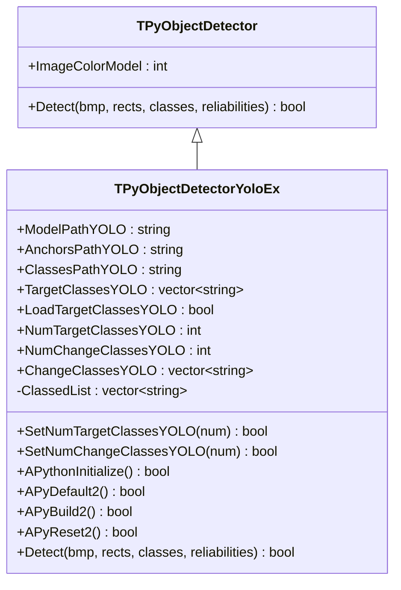
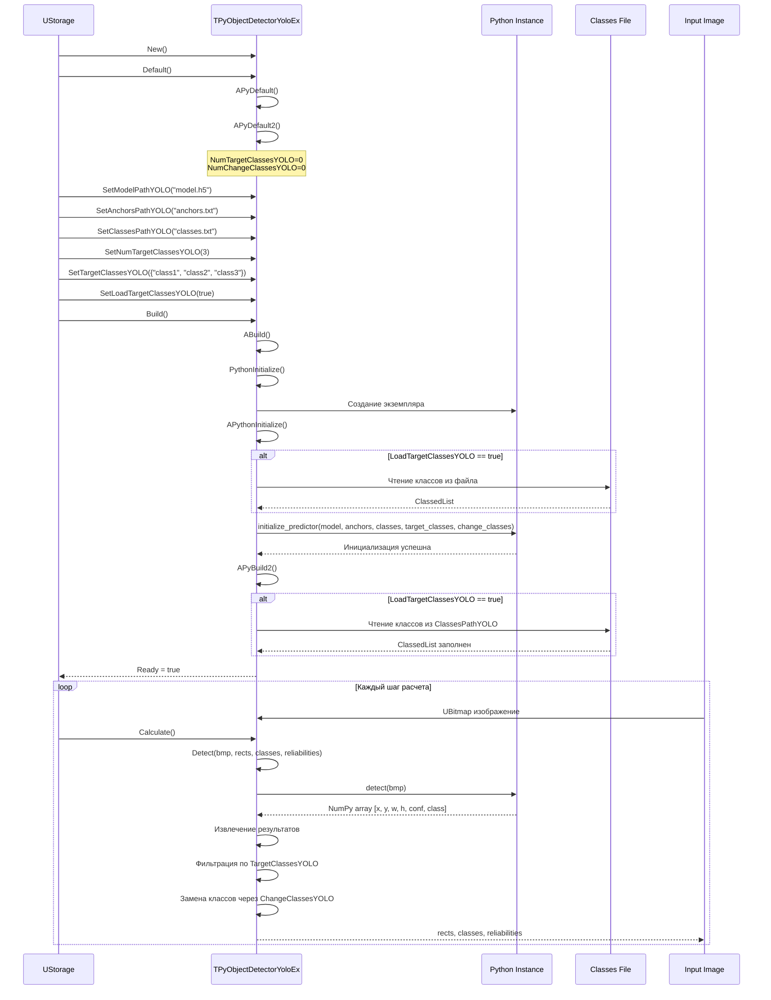
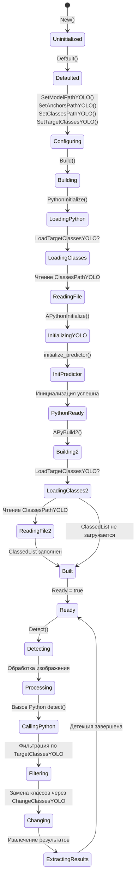
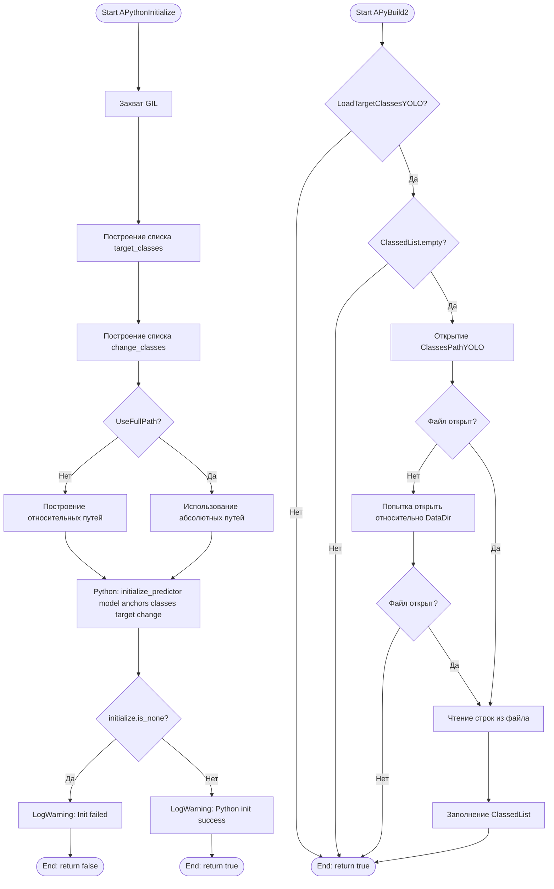
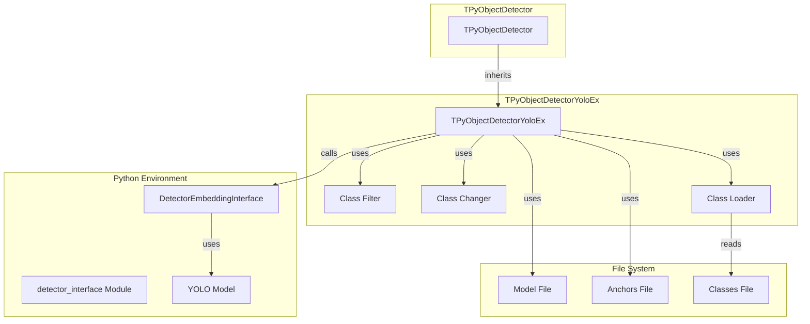

# TPyObjectDetectorYoloEx — расширенный YOLO детектор объектов

## RU

### Назначение

**Класс**: `TPyObjectDetectorYoloEx` — расширенный YOLO детектор объектов с дополнительными возможностями фильтрации и изменения классов.  
**Регистрация**: `Core/Lib.cpp` → `UploadClass("TPyObjectDetectorYoloEx", "PyObjectDetectorBasic")`.  
**Storage-инстансы**: `ClassName = "PyObjectDetectorBasic"` в конфигурационных проектах.

`TPyObjectDetectorYoloEx` расширяет функциональность `TPyObjectDetectorYolo` возможностями фильтрации по целевым классам, замены классов и загрузки классов из файла. Наследуется от `TPyObjectDetector`.

**Использование:** Детекция объектов с фильтрацией и модификацией классов

### UML-диаграмма классов



**Иерархия наследования:**
- `UDetectorBase` (Rdk-CRLib) — базовый детектор
- `TPyComponent` — базовый Python-компонент
- `TPyObjectDetector` — базовый детектор объектов
- `TPyObjectDetectorYoloEx` — расширенный YOLO детектор

### UML-диаграмма последовательности



### UML-диаграмма состояний



### UML-диаграмма активности



### UML-диаграмма компонентов



### Свойства

#### Параметры (ptPubParameter)

- **`ModelPathYOLO`** (string) — путь к файлу модели YOLO. Используется при инициализации. Если `UseFullPath = false`, путь строится относительно `GetCurrentDataDir()`. Значение по умолчанию: пустая строка

- **`AnchorsPathYOLO`** (string) — путь к файлу с якорями (anchors) для YOLO. Используется при инициализации. Если `UseFullPath = false`, путь строится относительно `GetCurrentDataDir()`. Значение по умолчанию: пустая строка

- **`ClassesPathYOLO`** (string) — путь к файлу со списком классов. Используется для загрузки классов при `LoadTargetClassesYOLO = true`. Если `UseFullPath = false`, путь строится относительно `GetCurrentDataDir()`. Значение по умолчанию: пустая строка

- **`TargetClassesYOLO`** (vector<string>) — список целевых классов для фильтрации детекций. Только объекты этих классов будут возвращены. Значение по умолчанию: пустой вектор

- **`LoadTargetClassesYOLO`** (bool) — загружать ли целевые классы из файла `ClassesPathYOLO`. Если `true`, классы загружаются в `ClassedList` при сборке. Значение по умолчанию: `false`

- **`NumTargetClassesYOLO`** (int) — количество целевых классов. Используется для изменения размера `TargetClassesYOLO` через `SetNumTargetClassesYOLO()`. Значение по умолчанию: 0

- **`NumChangeClassesYOLO`** (int) — количество классов для замены. Используется для изменения размера `ChangeClassesYOLO` через `SetNumChangeClassesYOLO()`. Значение по умолчанию: 0

- **`ChangeClassesYOLO`** (vector<string>) — список классов для замены. Используется для модификации классов в результатах детекции. Значение по умолчанию: пустой вектор

#### Наследуемые свойства

От `TPyObjectDetector`:
- `ImageColorModel` (int) — цветовая модель входного изображения

От `UDetectorBase`:
- `InputImage` (UBitmap) — входное изображение
- `OutputRects` (MDMatrix<double>) — выходные прямоугольники
- `OutputClasses` (MDMatrix<int>) — выходные классы объектов
- `OutputReliabilities` (MDMatrix<double>) — выходные уверенности детекции

#### Защищенные свойства

- **`ClassedList`** (vector<string>) — список классов, загружаемый из файла `ClassesPathYOLO` при `LoadTargetClassesYOLO = true`. Заполняется в `APyBuild2()`

### Методы

#### Публичные методы

- **`SetNumTargetClassesYOLO(const int& num)`** → `bool` — устанавливает количество целевых классов и изменяет размер `TargetClassesYOLO`. Всегда возвращает `true`

- **`SetNumChangeClassesYOLO(const int& num)`** → `bool` — устанавливает количество классов для замены и изменяет размер `ChangeClassesYOLO`. Всегда возвращает `true`

#### Защищенные методы

- **`APythonInitialize()`** → `bool` — инициализация Python:
  - Строит списки `target_classes` и `change_classes` из соответствующих свойств
  - Если `UseFullPath = false`, строит относительные пути к model, anchors и classes
  - Вызывает `initialize_predictor(model_path, anchors_path, classes_path, target_classes, change_classes)`
  - Возвращает `true` при успехе, `false` при ошибке

- **`APyDefault2()`** → `bool` — установка значений по умолчанию:
  - `NumTargetClassesYOLO = 0`
  - `NumChangeClassesYOLO = 0`
  - Возвращает `true`

- **`APyBuild2()`** → `bool` — дополнительная сборка:
  - Если `LoadTargetClassesYOLO = true` и `ClassedList` пуст, загружает классы из файла `ClassesPathYOLO`
  - Пытается открыть файл сначала по указанному пути, затем относительно `GetCurrentDataDir()`
  - Читает строки из файла и заполняет `ClassedList`
  - Возвращает `true`

- **`APyReset2()`** → `bool` — дополнительный сброс. Всегда возвращает `true`

- **`Detect(UBitmap &bmp, MDMatrix<double> &output_rects, MDMatrix<int> &output_classes, MDMatrix<double> &reliabilities)`** → `bool` — выполняет детекцию объектов:
  - Проверяет инициализацию Python
  - Вызывает Python метод `detect(bmp)`
  - Получает NumPy array с результатами
  - Проверяет размерность и формат
  - Извлекает данные и заполняет выходные матрицы
  - Фильтрация по `TargetClassesYOLO` и замена классов через `ChangeClassesYOLO` выполняются в Python
  - Возвращает `true` при успехе, `false` при ошибке

### Примеры использования

#### Пример 1: C++ код

```cpp
auto detector = storage->CreateComponent<TPyObjectDetectorYoloEx>();
detector->SetPythonScriptFileName("yolo_detector.py");
detector->ModelPathYOLO = "yolo_model.h5";
detector->AnchorsPathYOLO = "anchors.txt";
detector->ClassesPathYOLO = "classes.txt";
detector->SetNumTargetClassesYOLO(3);
detector->TargetClassesYOLO = {"person", "car", "bicycle"};
detector->LoadTargetClassesYOLO = true;
detector->Build();

UBitmap image;
// ... загрузка изображения ...

MDMatrix<double> rects;
MDMatrix<int> classes;
MDMatrix<double> reliabilities;
detector->Detect(image, rects, classes, reliabilities);
```

#### Пример 2: XML конфигурация

```xml
<Detector ClassName="PyObjectDetectorBasic">
    <Property Name="PythonScriptFileName" Value="yolo_detector.py" />
    <Property Name="ModelPathYOLO" Value="yolo_model.h5" />
    <Property Name="AnchorsPathYOLO" Value="anchors.txt" />
    <Property Name="ClassesPathYOLO" Value="classes.txt" />
    <Property Name="NumTargetClassesYOLO" Value="3" />
    <Property Name="TargetClassesYOLO" Value="person,car,bicycle" />
    <Property Name="LoadTargetClassesYOLO" Value="true" />
    <Property Name="UseFullPath" Value="false" />
</Detector>
```

### Особенности работы

1. **Фильтрация классов**: Компонент поддерживает фильтрацию детекций по целевым классам через `TargetClassesYOLO`

2. **Замена классов**: Поддерживается замена классов в результатах через `ChangeClassesYOLO`

3. **Загрузка классов из файла**: При `LoadTargetClassesYOLO = true` классы автоматически загружаются из файла в `ClassedList`

4. **Относительные пути**: При `UseFullPath = false` все пути автоматически строятся относительно `GetCurrentDataDir()`

### См. также

- [`TPyObjectDetector`](TPyObjectDetector.md) — базовый детектор объектов
- [`TPyObjectDetectorYolo`](TPyObjectDetectorYolo.md) — YOLO детектор
- [`TPyDetectorTrainer`](TPyDetectorTrainer.md) — тренер детекторов
- [Architecture.md](../Architecture.md) — архитектура библиотеки

---

## EN

### Purpose

**Class**: `TPyObjectDetectorYoloEx` — extended YOLO object detector with additional class filtering and modification capabilities.  
**Registration**: `Core/Lib.cpp` → `UploadClass("TPyObjectDetectorYoloEx", "PyObjectDetectorBasic")`.  
**Instances**: `ClassName = "PyObjectDetectorBasic"` in configuration projects.

`TPyObjectDetectorYoloEx` extends `TPyObjectDetectorYolo` with capabilities for filtering by target classes, class replacement and loading classes from file.

**Usage:** Object detection with class filtering and modification

### See also

- [`TPyObjectDetector`](TPyObjectDetector.md) — base object detector
- [`TPyObjectDetectorYolo`](TPyObjectDetectorYolo.md) — YOLO detector
- [`TPyDetectorTrainer`](TPyDetectorTrainer.md) — detector trainer
- [Architecture.md](../Architecture.md) — library architecture
