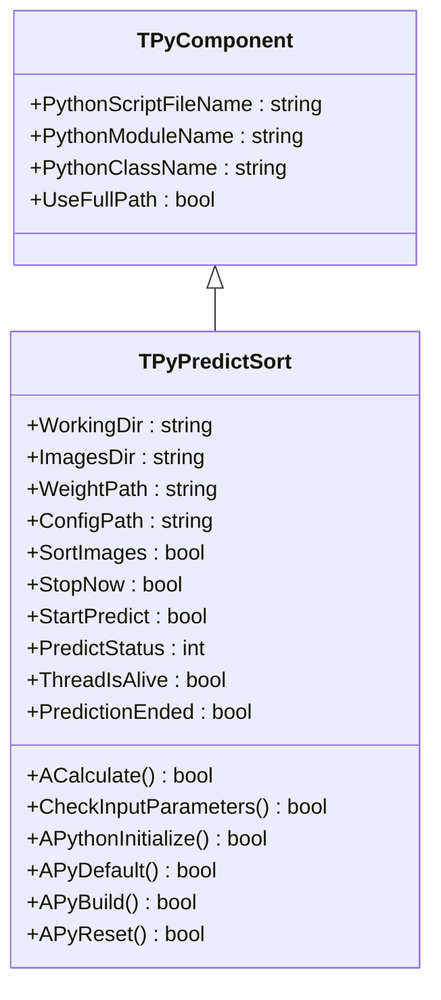
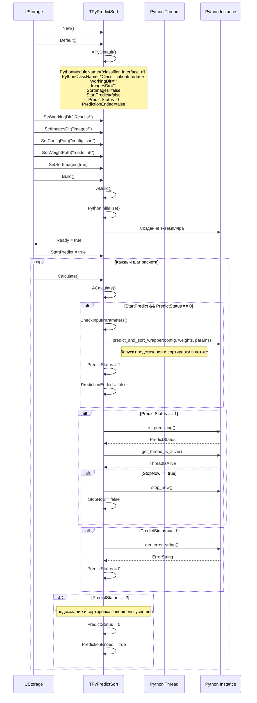
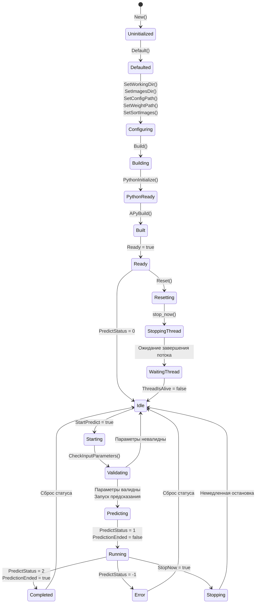
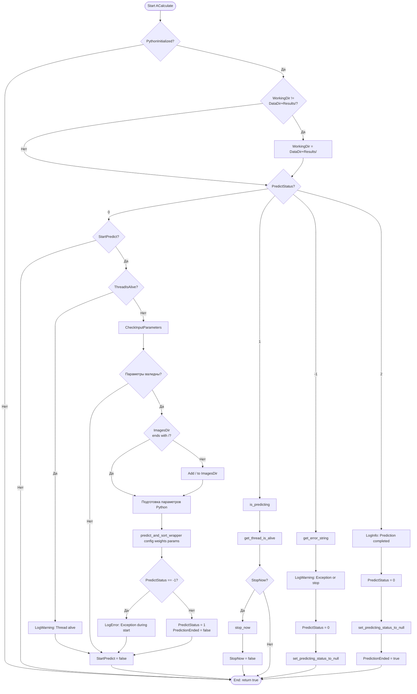
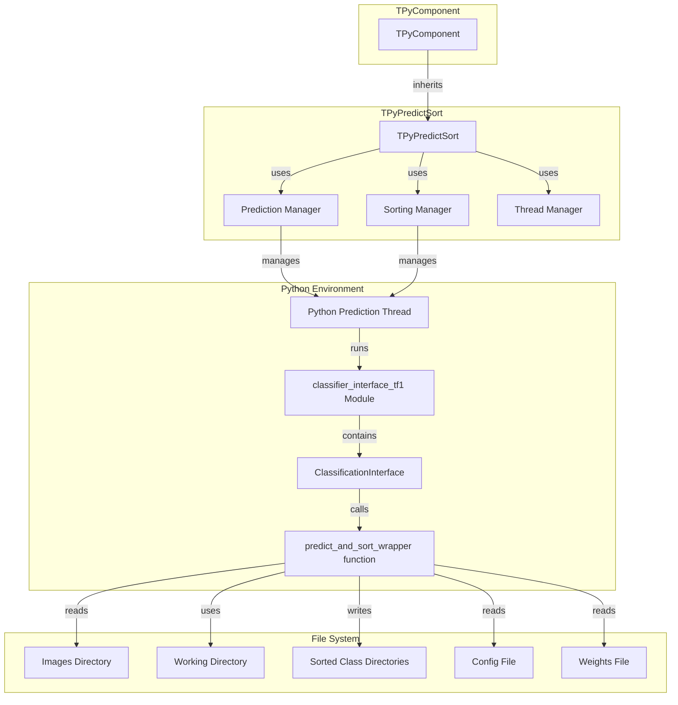

# TPyPredictSort — сортировка предсказаний через Python

## RU

### Назначение

**Класс**: `TPyPredictSort` — компонент для предсказания и сортировки изображений по классам через Python в отдельном потоке.  
**Регистрация**: `Core/Lib.cpp` → `UploadClass("TPyPredictSort", "PyPredictSort")`.  
**Storage-инстансы**: `ClassName = "PyPredictSort"` в конфигурационных проектах.

`TPyPredictSort` выполняет классификацию изображений из указанной директории и сортирует их по классам в отдельные папки. Работает асинхронно в отдельном Python потоке, что позволяет продолжать работу движка во время обработки.

**Использование:** Пакетная классификация и сортировка изображений по классам

### UML-диаграмма классов



**Иерархия наследования:**
- `TPyComponent` — базовый Python-компонент
- `TPyPredictSort` — сортировка предсказаний

### UML-диаграмма последовательности



### UML-диаграмма состояний



### UML-диаграмма активности



### UML-диаграмма компонентов



### Свойства

#### Параметры (ptPubParameter)

- **`WorkingDir`** (string) — рабочая директория для сохранения результатов. Автоматически устанавливается в `GetCurrentDataDir() + "Results/"` если не задана. Значение по умолчанию: пустая строка

- **`ImagesDir`** (string) — директория с изображениями для обработки. Должна быть непустой. Автоматически добавляется завершающий `/` если отсутствует. Значение по умолчанию: пустая строка

- **`WeightPath`** (string) — путь к файлу весов обученной модели. Должен быть непустым. Значение по умолчанию: пустая строка

- **`ConfigPath`** (string) — путь к конфигурационному файлу модели. Должен быть непустым. Значение по умолчанию: пустая строка

- **`SortImages`** (bool) — сортировать ли изображения по классам в отдельные папки. Если `true`, изображения копируются в папки по классам. Значение по умолчанию: `false`

- **`StopNow`** (bool) — флаг немедленной остановки предсказания. Автоматически сбрасывается после обработки. Значение по умолчанию: `false`

- **`StartPredict`** (bool) — флаг запуска предсказания. Устанавливается в `true` для начала предсказания, автоматически сбрасывается после запуска. Значение по умолчанию: `false`

#### Состояние (ptPubState)

- **`PredictStatus`** (int) — статус предсказания:
  - -1 — ошибка или остановка
  - 0 — не запущено (готов к запуску)
  - 1 — предсказание выполняется
  - 2 — предсказание завершено успешно
  Значение по умолчанию: 0

- **`ThreadIsAlive`** (bool) — флаг активности Python потока предсказания. `true` если поток активен, `false` если завершен. Значение по умолчанию: `false`

- **`PredictionEnded`** (bool) — флаг завершения предсказания. Устанавливается в `true` когда `PredictStatus == 2`. Значение по умолчанию: `false`

### Методы

#### Защищенные методы жизненного цикла

- **`APythonInitialize()`** → `bool` — инициализация Python. Всегда возвращает `true`

- **`APyDefault()`** → `bool` — установка значений по умолчанию:
  - `PythonModuleName = "classifier_interface_tf1"`
  - `PythonClassName = "ClassificationInterface"`
  - `WorkingDir = ""`
  - `ImagesDir = ""`
  - `ConfigPath = ""`
  - `WeightPath = ""`
  - `SortImages = false`
  - `StopNow = false`
  - `StartPredict = false`
  - `PredictStatus = 0`
  - `ThreadIsAlive = false`
  - `PredictionEnded = false`

- **`APyBuild()`** → `bool` — сборка компонента. Всегда возвращает `true`

- **`APyReset()`** → `bool` — сброс состояния:
  - Устанавливает `StopNow = false`, `StartPredict = false`
  - Останавливает Python поток через `stop_now()`
  - Ожидает завершения потока
  - Возвращает `true`

- **`ACalculate()`** → `bool` — выполнение расчета:
  - Обновляет `WorkingDir` если необходимо
  - Проверяет и запускает предсказание при `StartPredict = true`
  - Мониторит статус предсказания
  - Обрабатывает команды остановки
  - Обрабатывает завершение предсказания и ошибки
  - Устанавливает `PredictionEnded = true` при успешном завершении
  - Всегда возвращает `true`

- **`CheckInputParameters()`** → `bool` — проверка валидности входных параметров:
  - Проверяет, что `WorkingDir` не пуст
  - Проверяет, что `ConfigPath` не пуст
  - Проверяет, что `WeightPath` не пуст
  - Проверяет, что `ImagesDir` не пуст
  - Добавляет завершающий `/` к `ImagesDir` если отсутствует
  - Возвращает `true` если все параметры валидны, `false` иначе

### Примеры использования

#### Пример 1: C++ код

```cpp
auto sorter = storage->CreateComponent<TPyPredictSort>();
sorter->SetPythonScriptFileName("classifier_interface_tf1.py");
sorter->WorkingDir = "Results/";
sorter->ImagesDir = "test_images";
sorter->ConfigPath = "config.json";
sorter->WeightPath = "model.h5";
sorter->SortImages = true;
sorter->Build();

// Запуск предсказания и сортировки
sorter->Reset();
sorter->StartPredict = true;

// Мониторинг
for (int step = 0; step < numSteps; step++) {
    sorter->Calculate();
    if (sorter->PredictStatus == 1) {
        std::cout << "Prediction and sorting in progress..." << std::endl;
    }
    if (sorter->PredictStatus == 2 && sorter->PredictionEnded) {
        std::cout << "Prediction and sorting completed!" << std::endl;
        break;
    }
    if (sorter->PredictStatus == -1) {
        std::cout << "Prediction error!" << std::endl;
        break;
    }
}
```

#### Пример 2: XML конфигурация

```xml
<Sorter ClassName="PyPredictSort">
    <Property Name="PythonScriptFileName" Value="classifier_interface_tf1.py" />
    <Property Name="WorkingDir" Value="Results/" />
    <Property Name="ImagesDir" Value="test_images" />
    <Property Name="ConfigPath" Value="config.json" />
    <Property Name="WeightPath" Value="model.h5" />
    <Property Name="SortImages" Value="true" />
    <Property Name="StartPredict" Value="true" />
</Sorter>
```

### Особенности работы

1. **Асинхронное выполнение**: Предсказание и сортировка выполняются в отдельном Python потоке

2. **Автоматическая сортировка**: При `SortImages = true` изображения автоматически копируются в папки по классам

3. **Автоматическое управление директориями**: 
   - `WorkingDir` автоматически устанавливается в `DataDir + "Results/"` если не задана явно
   - `ImagesDir` автоматически получает завершающий `/` если отсутствует

4. **Безопасная остановка**: При деструкторе компонент гарантированно дожидается завершения Python потока

5. **Мониторинг**: Статус предсказания и флаг завершения обновляются в каждом вызове `ACalculate()`

### Связи с другими компонентами

- **Использует**: Python модуль `classifier_interface_tf1` с классом `ClassificationInterface`
- **Типичное использование**: После обучения классификатора (`TPyClassifierTrainer`) для пакетной классификации и сортировки изображений

### См. также

- [`TPyClassifierTrainer`](TPyDetectorTrainer.md#tpyclassifiertrainer) — тренер классификаторов
- [`TPyUBitmapClassifier`](TPyUBitmapClassifier.md) — классификатор изображений
- [`TPyDetPredict`](TPyDetPredict.md) — предикт детекции
- [Architecture.md](../Architecture.md) — архитектура библиотеки

---

## EN

### Purpose

**Class**: `TPyPredictSort` — component for prediction and sorting images by classes via Python in a separate thread.  
**Registration**: `Core/Lib.cpp` → `UploadClass("TPyPredictSort", "PyPredictSort")`.  
**Instances**: `ClassName = "PyPredictSort"` in configuration projects.

`TPyPredictSort` performs classification of images from specified directory and sorts them by classes into separate folders. Works asynchronously in a separate Python thread.

**Usage:** Batch classification and sorting images by classes

### See also

- [`TPyClassifierTrainer`](TPyDetectorTrainer.md#tpyclassifiertrainer) — classifier trainer
- [`TPyUBitmapClassifier`](TPyUBitmapClassifier.md) — image classifier
- [`TPyDetPredict`](TPyDetPredict.md) — detection prediction
- [Architecture.md](../Architecture.md) — library architecture
