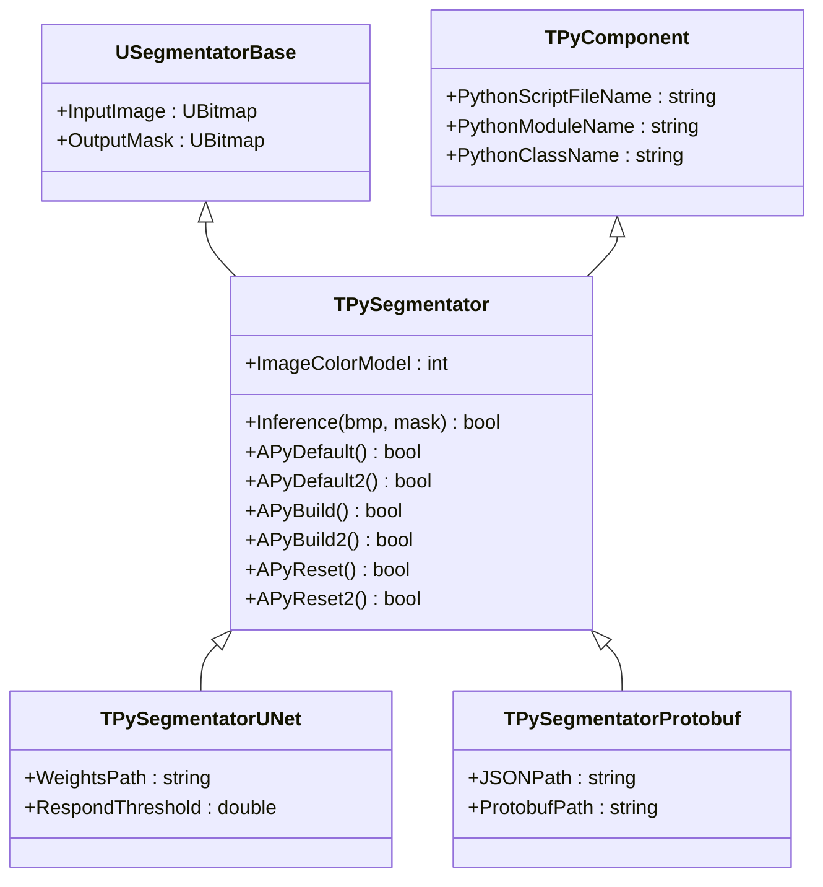
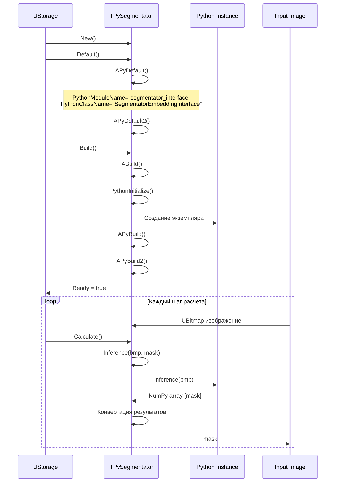
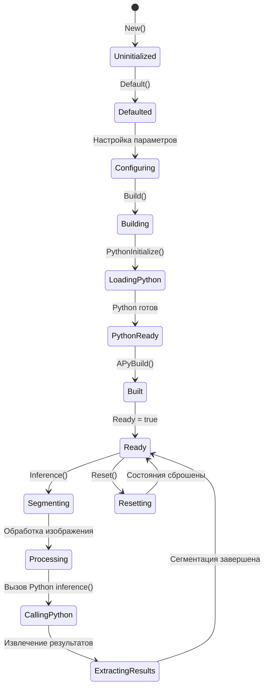
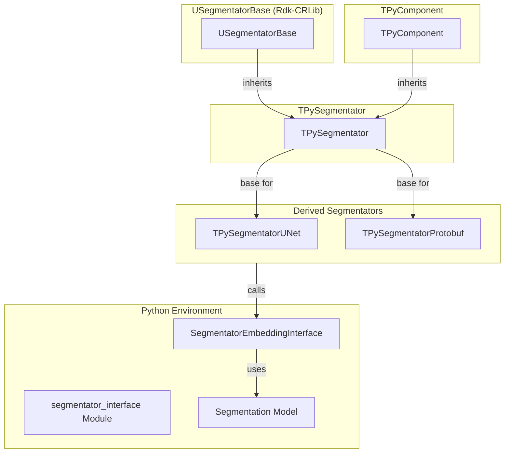

# TPySegmentator — базовый сегментатор через Python

## RU

### Назначение

**Класс**: `TPySegmentator` — базовый сегментатор изображений через Python.  
**Регистрация**: `Core/Lib.cpp` → не регистрируется напрямую, используется как базовый класс для специализированных сегментаторов.  
**Storage-инстансы**: Используется как базовый класс для `TPySegmentatorUNet`, `TPySegmentatorProtobuf`.

`TPySegmentator` является базовым классом для сегментаторов изображений через Python. Наследуется от `USegmentatorBase` и `TPyComponent`. Предоставляет базовую функциональность для семантической сегментации изображений.

**Использование:** Базовый класс для специализированных сегментаторов (U-Net, Protobuf и др.)

### UML-диаграмма классов



**Иерархия наследования:**
- `USegmentatorBase` (Rdk-CRLib) — базовый сегментатор
- `TPyComponent` — базовый Python-компонент
- `TPySegmentator` — базовый сегментатор
- `TPySegmentatorUNet`, `TPySegmentatorProtobuf` — специализированные сегментаторы

### UML-диаграмма последовательности



### UML-диаграмма состояний



### UML-диаграмма компонентов



### Свойства

#### Параметры (ptPubParameter)

- **`ImageColorModel`** (int) — цветовая модель входного изображения:
  - `ubmRGB24=3` — RGB 24-битное
  - `ubmY8=400` — Grayscale 8-битное
  Значение по умолчанию: зависит от базового класса

#### Наследуемые свойства

От `USegmentatorBase`:
- `InputImage` (UBitmap) — входное изображение
- `OutputMask` (UBitmap) — выходная маска сегментации

От `TPyComponent`:
- `PythonScriptFileName` (string) — путь к Python скрипту
- `PythonModuleName` (string) — имя Python модуля (по умолчанию: "segmentator_interface")
- `PythonClassName` (string) — имя Python класса (по умолчанию: "SegmentatorEmbeddingInterface")

### Методы

#### Публичные методы

- **`Inference(UBitmap &bmp, UBitmap &mask)`** → `bool` — выполняет сегментацию изображения. В базовом классе всегда возвращает `true`. Переопределяется в производных классах

#### Защищенные методы

- **`APyDefault()`** → `bool` — установка значений по умолчанию:
  - `PythonModuleName = "segmentator_interface"`
  - `PythonClassName = "SegmentatorEmbeddingInterface"`
  - Вызывает `APyDefault2()` для дополнительной инициализации

- **`APyDefault2()`** → `bool` — дополнительная инициализация в производных классах. В базовом классе всегда возвращает `true`

- **`APyBuild()`** → `bool` — сборка компонента. Вызывает `APyBuild2()` для дополнительной сборки

- **`APyBuild2()`** → `bool` — дополнительная сборка в производных классах. В базовом классе всегда возвращает `true`

- **`APyReset()`** → `bool` — сброс состояния. Вызывает `APyReset2()` для дополнительного сброса

- **`APyReset2()`** → `bool` — дополнительный сброс в производных классах. В базовом классе всегда возвращает `true`

### Примеры использования

#### Пример 1: C++ код

```cpp
// Используется через производные классы
auto segmentator = storage->CreateComponent<TPySegmentatorUNet>();
// или
auto segmentator = storage->CreateComponent<TPySegmentatorProtobuf>();
```

### Специализированные сегментаторы

#### TPySegmentatorUNet

U-Net сегментатор. Дополнительные свойства:
- `WeightsPath` (string) — путь к файлу весов U-Net модели
- `RespondThreshold` (double) — порог для бинаризации маски

**Инициализация:** Вызывается `initialize_config(weights_path)`

#### TPySegmentatorProtobuf

Сегментатор с использованием Protobuf. Дополнительные свойства:
- `ProtobufPath` (string) — путь к Protobuf файлу модели
- `JSONPath` (string) — путь к JSON файлу конфигурации

**Инициализация:** Вызывается `initialize_config(protobuf_path, json_path)`

### См. также

- [`TPyComponent`](TPyComponent.md) — базовый Python-компонент
- [`TPySegmentatorUNet`](TPySegmentatorUNet.md) — U-Net сегментатор
- [`TPySegmentatorProtobuf`](TPySegmentatorProtobuf.md) — Protobuf сегментатор
- [`TPySegmenterTrainer`](TPySegmenterTrainer.md) — тренер сегментаторов
- [Architecture.md](../Architecture.md) — архитектура библиотеки

---

## EN

### Purpose

**Class**: `TPySegmentator` — base image segmentator via Python.  
**Registration**: `Core/Lib.cpp` → not registered directly, used as base class for specialized segmentators.  
**Instances**: Used as base class for `TPySegmentatorUNet`, `TPySegmentatorProtobuf`.

`TPySegmentator` is base class for image segmentators via Python. Inherits from `USegmentatorBase` and `TPyComponent`.

**Usage:** Base class for specialized segmentators (U-Net, Protobuf, etc.)

### See also

- [`TPyComponent`](TPyComponent.md) — base Python component
- [`TPySegmentatorUNet`](TPySegmentatorUNet.md) — U-Net segmentator
- [`TPySegmentatorProtobuf`](TPySegmentatorProtobuf.md) — Protobuf segmentator
- [`TPySegmenterTrainer`](TPySegmenterTrainer.md) — segmentator trainer
- [Architecture.md](../Architecture.md) — library architecture
