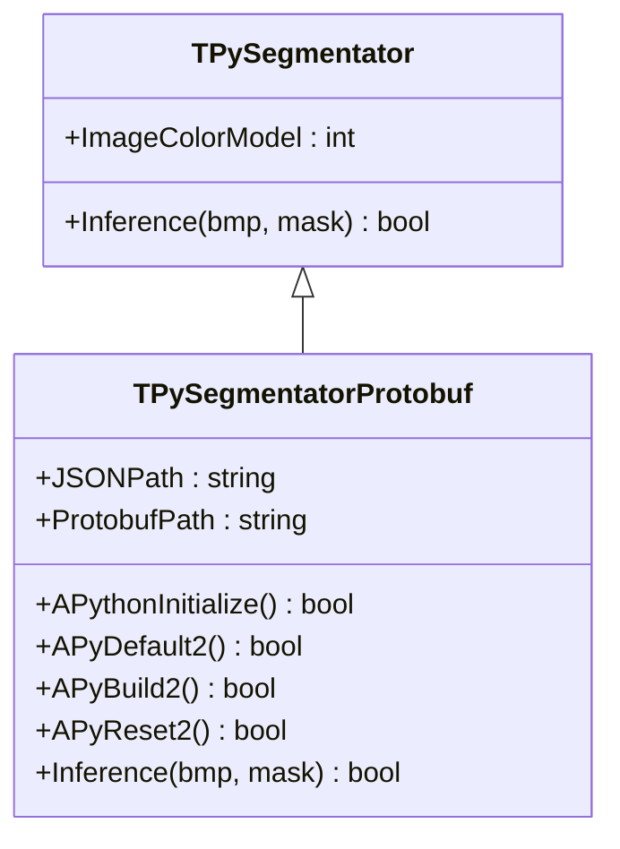
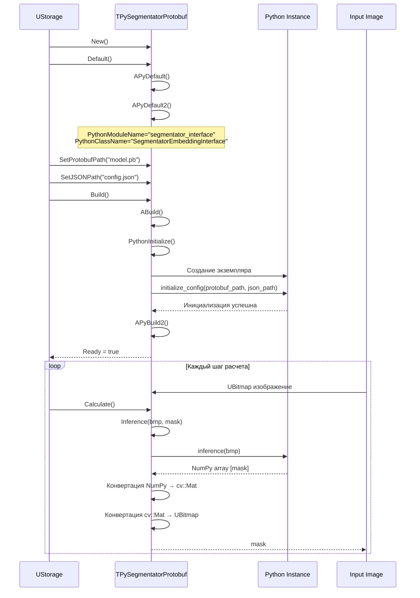
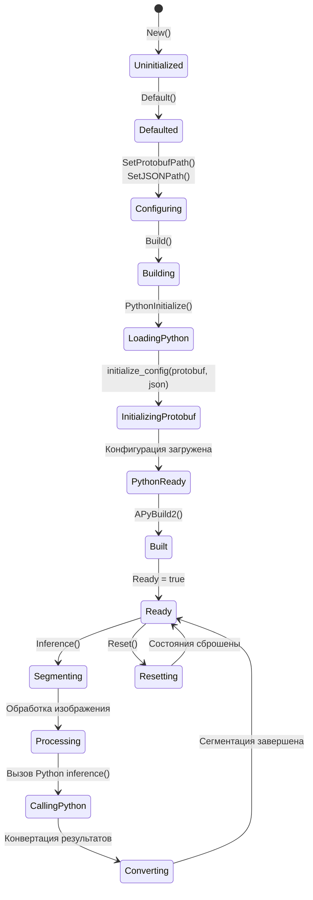
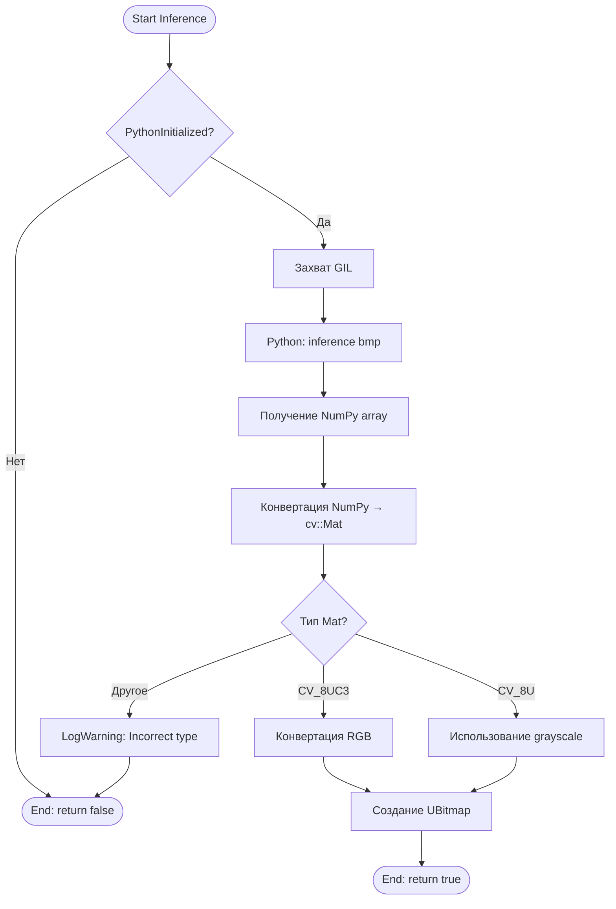
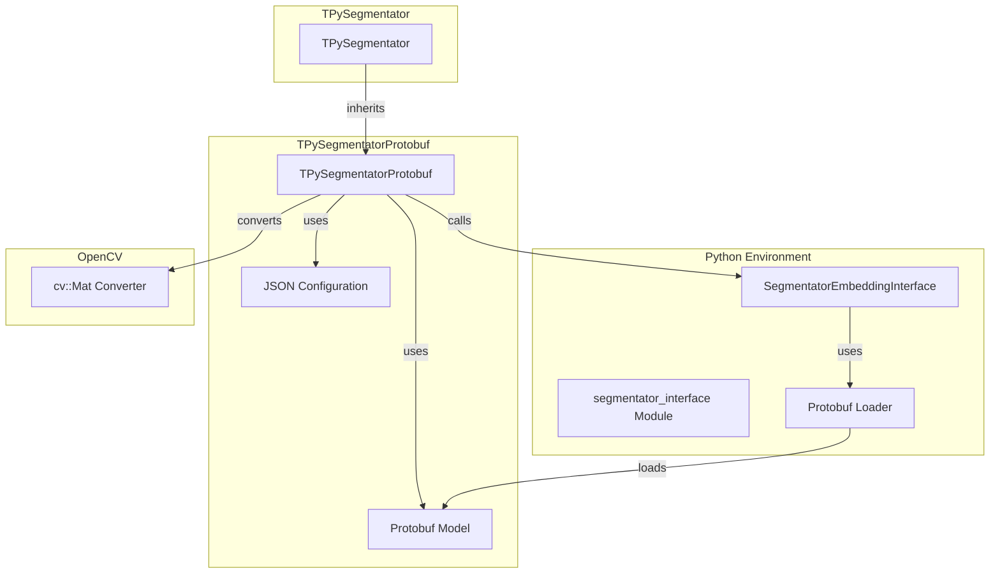

# TPySegmentatorProtobuf — сегментатор с использованием Protobuf

## RU

### Назначение

**Класс**: `TPySegmentatorProtobuf` — сегментатор изображений через Python с использованием Protobuf модели.  
**Регистрация**: `Core/Lib.cpp` → `UploadClass("TPySegmentatorProtobuf", "PySegmentatorProtobuf")`.  
**Storage-инстансы**: `ClassName = "PySegmentatorProtobuf"` в конфигурационных проектах.

`TPySegmentatorProtobuf` выполняет семантическую сегментацию изображений используя Protobuf модель через Python. Наследуется от `TPySegmentator` и `USegmentatorBase`, использует Protobuf файл модели и JSON конфигурацию.

**Использование:** Семантическая сегментация изображений с использованием Protobuf моделей

### UML-диаграмма классов



**Иерархия наследования:**
- `USegmentatorBase` (Rdk-CRLib) — базовый сегментатор
- `TPyComponent` — базовый Python-компонент
- `TPySegmentator` — базовый сегментатор
- `TPySegmentatorProtobuf` — Protobuf сегментатор

### UML-диаграмма последовательности



### UML-диаграмма состояний



### UML-диаграмма активности



### UML-диаграмма компонентов



### Свойства

#### Параметры (ptPubParameter)

- **`ProtobufPath`** (string) — путь к Protobuf файлу модели (.pb). Используется при инициализации через `initialize_config(protobuf_path, json_path)`. Значение по умолчанию: пустая строка

- **`JSONPath`** (string) — путь к JSON файлу с конфигурацией модели. Используется при инициализации. Значение по умолчанию: пустая строка

#### Наследуемые свойства

От `USegmentatorBase`:
- `InputImage` (UBitmap) — входное изображение
- `OutputMask` (UBitmap) — выходная маска сегментации

От `TPySegmentator`:
- `ImageColorModel` (int) — цветовая модель входного изображения

От `TPyComponent`:
- `PythonScriptFileName` (string) — путь к Python скрипту
- `PythonModuleName` (string) — имя Python модуля (по умолчанию: "segmentator_interface")
- `PythonClassName` (string) — имя Python класса (по умолчанию: "SegmentatorEmbeddingInterface")

### Методы

#### Защищенные методы

- **`APythonInitialize()`** → `bool` — инициализация Python:
  - Вызывает `initialize_config(protobuf_path, json_path)` в Python
  - Возвращает `true` при успехе, `false` при ошибке

- **`APyDefault2()`** → `bool` — дополнительная инициализация. Всегда возвращает `true`

- **`APyBuild2()`** → `bool` — дополнительная сборка. Всегда возвращает `true`

- **`APyReset2()`** → `bool` — дополнительный сброс. Всегда возвращает `true`

- **`Inference(UBitmap &bmp, UBitmap &mask)`** → `bool` — выполняет сегментацию изображения:
  - Проверяет инициализацию Python
  - Вызывает Python метод `inference(bmp)`
  - Получает NumPy array с маской сегментации
  - Конвертирует NumPy → cv::Mat через `fromNDArrayToMat()`
  - Определяет тип Mat (RGB или Grayscale)
  - Конвертирует cv::Mat → UBitmap
  - Для RGB применяет `SwapRGBChannels()`
  - Возвращает `true` при успехе, `false` при ошибке

### Примеры использования

#### Пример 1: C++ код

```cpp
auto segmentator = storage->CreateComponent<TPySegmentatorProtobuf>();
segmentator->SetPythonScriptFileName("segmentator_interface.py");
segmentator->ProtobufPath = "model.pb";
segmentator->JSONPath = "config.json";
segmentator->Build();

UBitmap image;
UBitmap mask;
// ... загрузка изображения ...

segmentator->Inference(image, mask);
// mask содержит результат сегментации
```

#### Пример 2: XML конфигурация

```xml
<Segmentator ClassName="PySegmentatorProtobuf">
    <Property Name="PythonScriptFileName" Value="segmentator_interface.py" />
    <Property Name="ProtobufPath" Value="models/segmentator.pb" />
    <Property Name="JSONPath" Value="models/config.json" />
    <Property Name="UseFullPath" Value="false" />
</Segmentator>
```

### Особенности работы

1. **Protobuf формат**: Использует Protobuf формат для модели, что обеспечивает компактность и эффективность

2. **JSON конфигурация**: Требует JSON файл с конфигурацией модели для инициализации

3. **Конвертация форматов**: Автоматическая конвертация между NumPy arrays, cv::Mat и UBitmap

4. **Поддержка форматов**: Поддерживает как RGB, так и Grayscale изображения

5. **Обработка RGB**: Для RGB изображений автоматически применяется `SwapRGBChannels()` для корректного отображения

### См. также

- [`TPySegmentator`](TPySegmentator.md) — базовый сегментатор
- [`TPySegmentatorUNet`](TPySegmentatorUNet.md) — U-Net сегментатор
- [`TPySegmenterTrainer`](TPySegmenterTrainer.md) — тренер сегментаторов
- [Architecture.md](../Architecture.md) — архитектура библиотеки

---

## EN

### Purpose

**Class**: `TPySegmentatorProtobuf` — image segmentator via Python using Protobuf model.  
**Registration**: `Core/Lib.cpp` → `UploadClass("TPySegmentatorProtobuf", "PySegmentatorProtobuf")`.  
**Instances**: `ClassName = "PySegmentatorProtobuf"` in configuration projects.

`TPySegmentatorProtobuf` performs semantic image segmentation using Protobuf model via Python. Inherits from `TPySegmentator` and `USegmentatorBase`.

**Usage:** Semantic image segmentation using Protobuf models

### See also

- [`TPySegmentator`](TPySegmentator.md) — base segmentator
- [`TPySegmentatorUNet`](TPySegmentatorUNet.md) — U-Net segmentator
- [`TPySegmenterTrainer`](TPySegmenterTrainer.md) — segmentator trainer
- [Architecture.md](../Architecture.md) — library architecture
