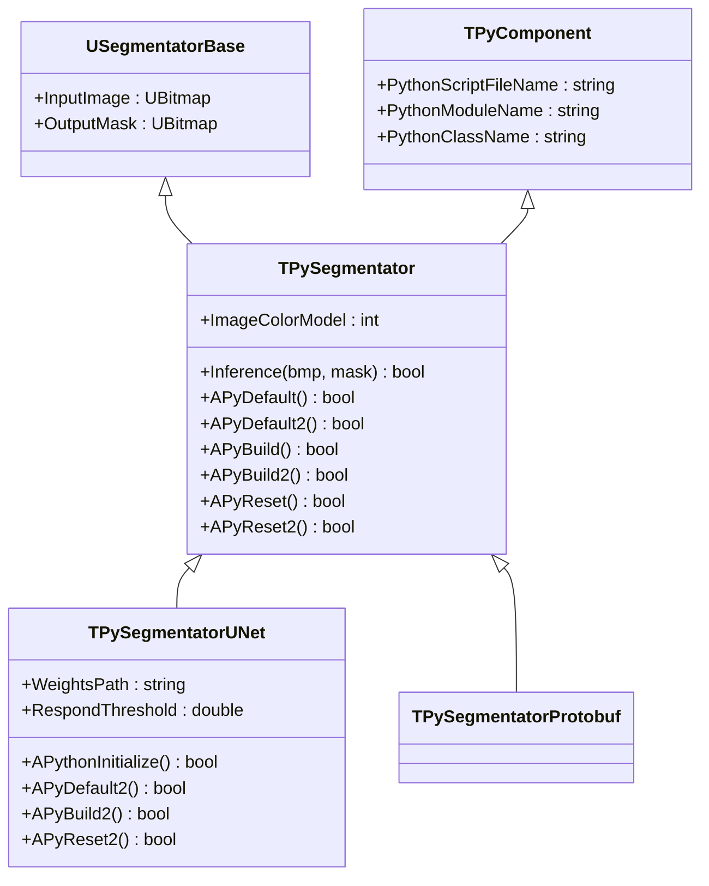
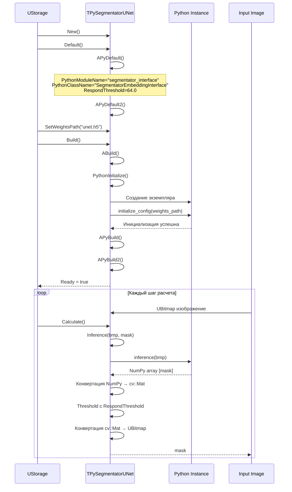
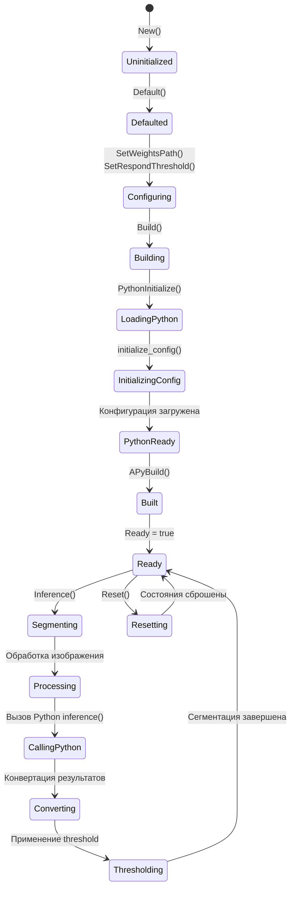
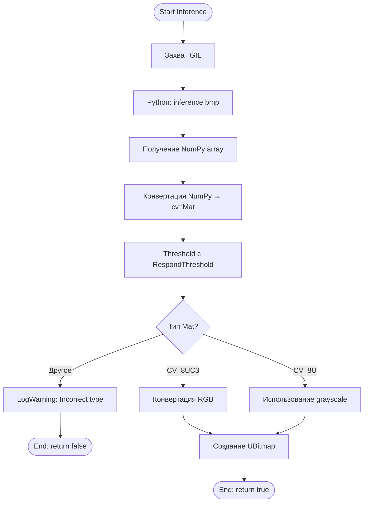
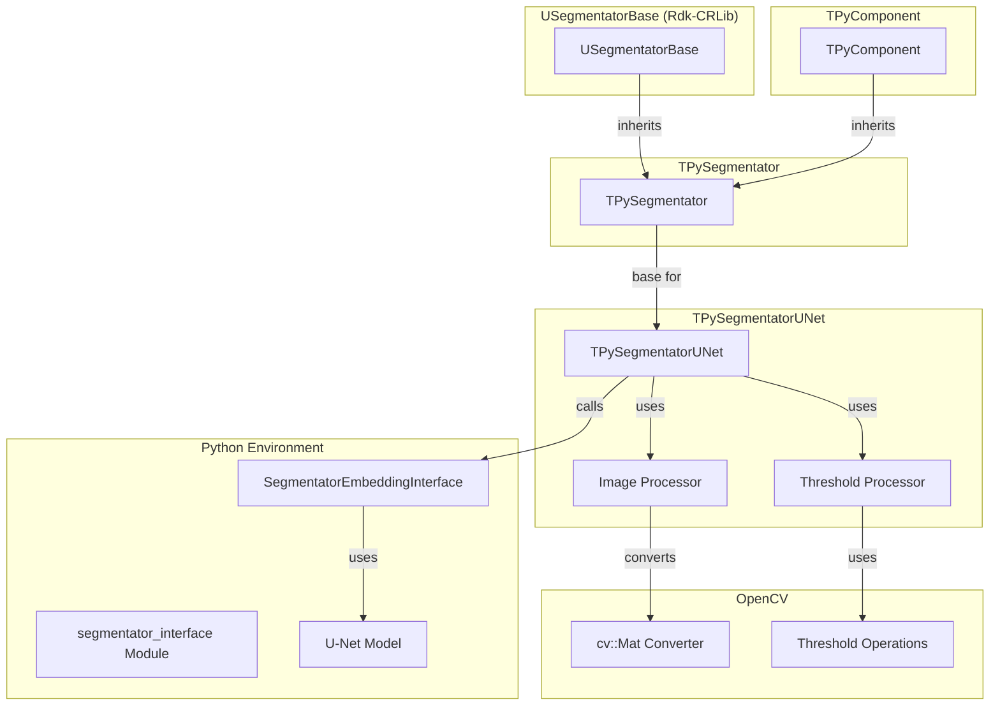

# TPySegmentatorUNet — U-Net сегментатор через Python

## RU

### Назначение

**Класс**: `TPySegmentatorUNet` — U-Net сегментатор изображений через Python.  
**Регистрация**: `Core/Lib.cpp` → `UploadClass("TPySegmentatorUNet", "TPySegmentatorUNet")`.  
**Storage-инстансы**: `ClassName = "TPySegmentatorUNet"` в конфигурационных проектах.

`TPySegmentatorUNet` выполняет семантическую сегментацию изображений используя U-Net архитектуру через Python. Наследуется от `TPySegmentator` и `USegmentatorBase`, получая функциональность сегментатора и Python-интеграции.

**Использование:** Семантическая сегментация изображений с использованием U-Net моделей

### UML-диаграмма классов



**Иерархия наследования:**
- `USegmentatorBase` (Rdk-CRLib) — базовый сегментатор
- `TPyComponent` — базовый Python-компонент
- `TPySegmentator` — базовый сегментатор
- `TPySegmentatorUNet` — U-Net сегментатор

### UML-диаграмма последовательности



### UML-диаграмма состояний



### UML-диаграмма активности



### UML-диаграмма компонентов



### Свойства

#### Параметры (ptPubParameter)

- **`WeightsPath`** (string) — путь к файлу весов U-Net модели (например, .h5 для Keras/TensorFlow). Используется при инициализации через `initialize_config(weights_path)`. Значение по умолчанию: пустая строка

- **`RespondThreshold`** (double) — порог для бинаризации маски сегментации. Применяется к результату через `cv::threshold()`. Значение по умолчанию: 64.0

#### Наследуемые свойства

От `USegmentatorBase`:
- `InputImage` (UBitmap) — входное изображение
- `OutputMask` (UBitmap) — выходная маска сегментации

От `TPySegmentator`:
- `ImageColorModel` (int) — цветовая модель входного изображения

От `TPyComponent`:
- `PythonScriptFileName` (string) — путь к Python скрипту
- `PythonModuleName` (string) — имя Python модуля (по умолчанию: "segmentator_interface")
- `PythonClassName` (string) — имя Python класса (по умолчанию: "SegmentatorEmbeddingInterface")

### Методы

#### Публичные методы

- **`Inference(UBitmap &bmp, UBitmap &mask)`** → `bool` — выполняет сегментацию изображения:
  - Вызывает Python метод `inference(bmp)`
  - Получает NumPy array с маской сегментации
  - Конвертирует NumPy → cv::Mat
  - Применяет threshold с `RespondThreshold`
  - Конвертирует cv::Mat → UBitmap
  - Возвращает `true` при успехе

#### Защищенные методы

- **`APythonInitialize()`** → `bool` — инициализация Python. Вызывает `initialize_config(weights_path)` в Python. Возвращает `true` при успехе

- **`APyDefault2()`** → `bool` — установка значений по умолчанию:
  - `RespondThreshold = 64.0`

- **`APyBuild2()`** → `bool` — сборка компонента. Всегда возвращает `true`

- **`APyReset2()`** → `bool` — сброс состояния. Всегда возвращает `true`

### Примеры использования

#### Пример 1: C++ код

```cpp
auto segmentator = storage->CreateComponent<TPySegmentatorUNet>();
segmentator->SetPythonScriptFileName("segmentator_interface.py");
segmentator->SetWeightsPath("unet_model.h5");
segmentator->RespondThreshold = 128.0;
segmentator->Build();

UBitmap image;
UBitmap mask;
// ... загрузка изображения ...

segmentator->Inference(image, mask);
// mask содержит результат сегментации
```

#### Пример 2: XML конфигурация

```xml
<Segmentator ClassName="TPySegmentatorUNet">
    <Property Name="PythonScriptFileName" Value="segmentator_interface.py" />
    <Property Name="WeightsPath" Value="models/unet.h5" />
    <Property Name="UseRelativeWeightsPath" Value="true" />
    <Property Name="RespondThreshold" Value="128.0" />
</Segmentator>
```

### Особенности работы

1. **Threshold обработка**: Результат сегментации из Python автоматически проходит через бинаризацию с порогом `RespondThreshold`

2. **Конвертация форматов**: Автоматическая конвертация между NumPy arrays, cv::Mat и UBitmap

3. **Поддержка форматов**: Поддерживает как RGB, так и Grayscale изображения

### Специализированные сегментаторы

#### TPySegmentatorProtobuf

Сегментатор с использованием Protobuf модели.

**Дополнительные свойства:**
- `JSONPath` (string) — путь к JSON файлу с конфигурацией
- `ProtobufPath` (string) — путь к Protobuf файлу модели

**Инициализация:** Вызывается `initialize_config(protobuf_path, json_path)`

**Особенности:**
- Использует Protobuf формат для модели
- Требует JSON конфигурационный файл

### См. также

- [`TPyComponent`](TPyComponent.md) — базовый Python-компонент
- [`TPySegmentator`](TPySegmentatorUNet.md#tpysegmentator) — базовый сегментатор
- [`TPySegmenterTrainer`](TPyDetectorTrainer.md#tpysegmentertrainer) — тренер сегментаторов
- [Architecture.md](../Architecture.md) — архитектура библиотеки

---

## EN

### Purpose

**Class**: `TPySegmentatorUNet` — U-Net image segmentator via Python.  
**Registration**: `Core/Lib.cpp` → `UploadClass("TPySegmentatorUNet", "TPySegmentatorUNet")`.  
**Instances**: `ClassName = "TPySegmentatorUNet"` in configuration projects.

`TPySegmentatorUNet` performs semantic image segmentation using U-Net architecture via Python. Inherits from `TPySegmentator` and `USegmentatorBase`.

**Usage:** Semantic image segmentation using U-Net models

### See also

- [`TPyComponent`](TPyComponent.md) — base Python component
- [`TPySegmenterTrainer`](TPyDetectorTrainer.md#tpysegmentertrainer) — segmentator trainer
- [Architecture.md](../Architecture.md) — library architecture
