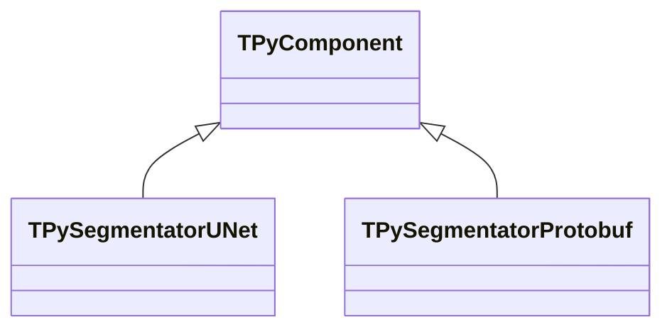
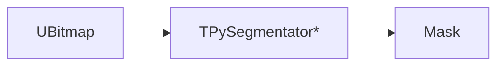
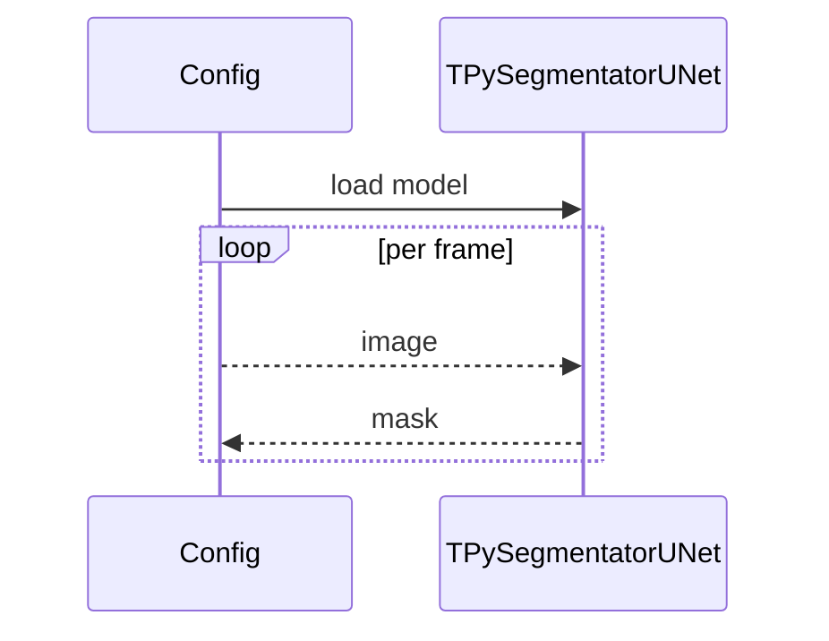

## TPySegmentatorUNet / Protobuf — сегментаторы в Python

**Классы**: `TPySegmentatorUNet`, `TPySegmentatorProtobuf` — сегментация изображений через Python/UNet или protobuf-модель.  
**Регистрация**: `Lib.cpp` → `UploadClass("PySegmentatorUNet", ...)`, `"PySegmentatorProtobuf"`.  
**Storage-инстансы**: `ClassName` сегментатора; параметры: модель/скрипт, классы/цвета.

### Входы/выходы
- Вход: `UBitmap`.
- Выход: маска/карта сегментации.

Пояснение: блок-схема показывает поток данных/сигналов (входы → компонент → выходы).

Пояснение: диаграмма последовательности показывает типовой сценарий взаимодействия и порядок вызовов.

---

## TPySegmentator* — Python segmentators

Produce segmentation masks from images using Python models (UNet/protobuf).
