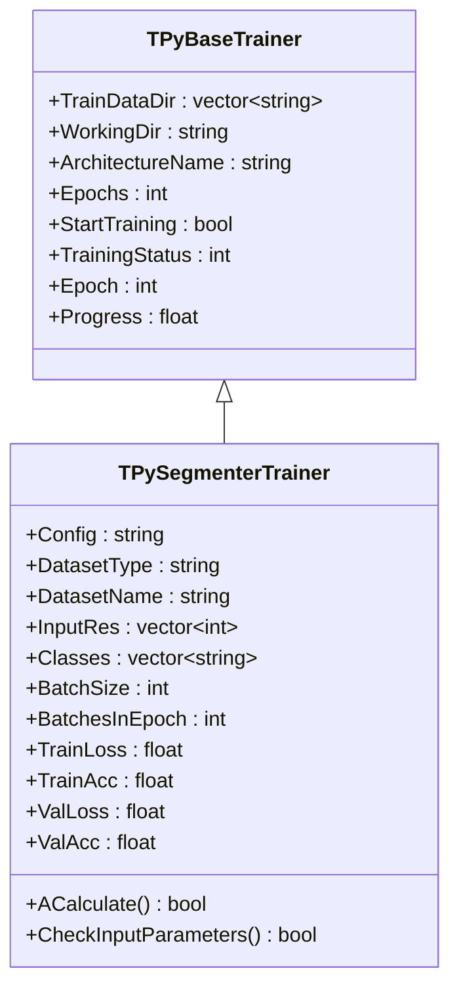
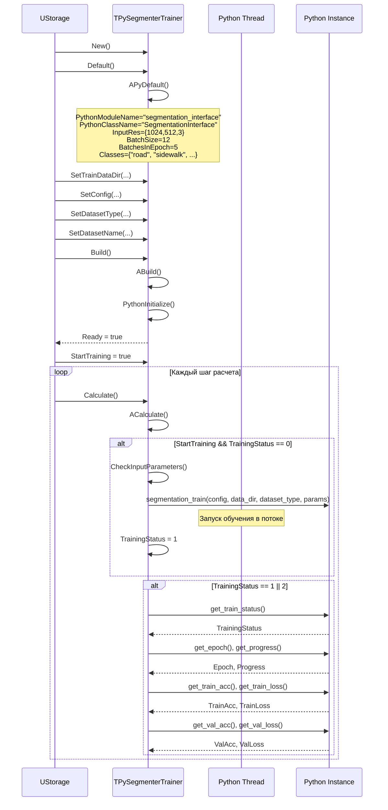
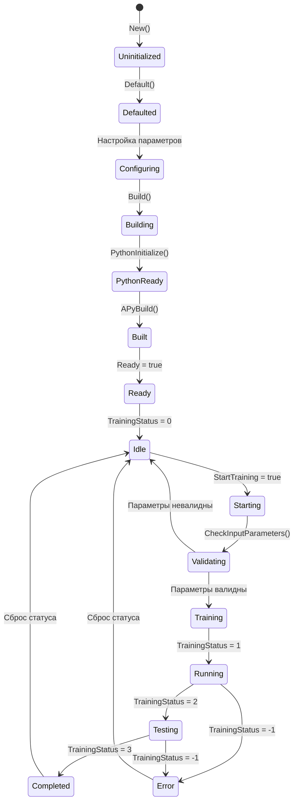
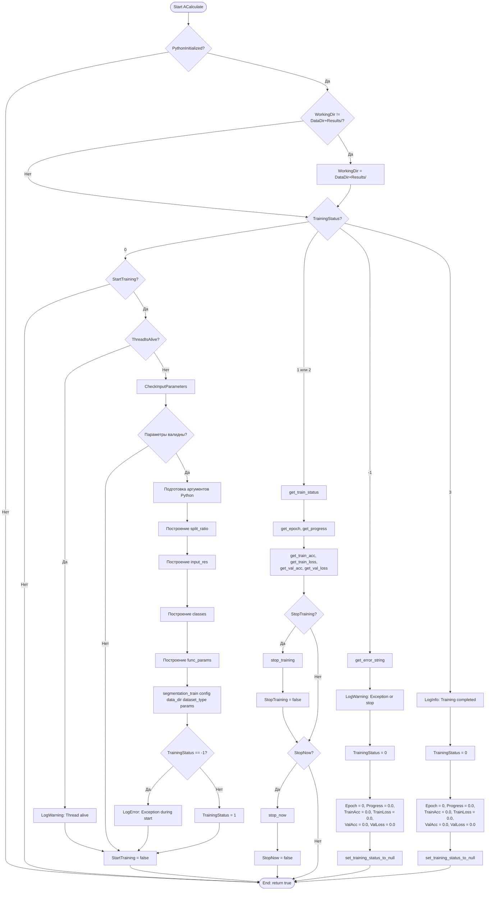
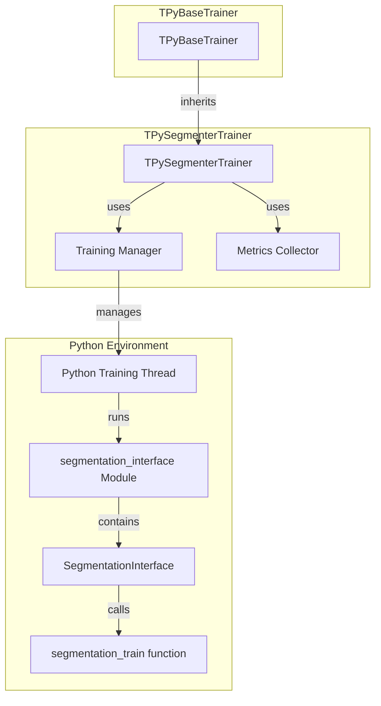

# TPySegmenterTrainer — тренер сегментаторов через Python

## RU

### Назначение

**Класс**: `TPySegmenterTrainer` — тренер сегментаторов через Python.  
**Регистрация**: `Core/Lib.cpp` → `UploadClass("TPySegmenterTrainer", "PySegmenterTrainer")`.  
**Storage-инстансы**: `ClassName = "PySegmenterTrainer"` в конфигурационных проектах.

`TPySegmenterTrainer` выполняет обучение моделей семантической сегментации изображений через Python в отдельном потоке. Наследуется от `TPyBaseTrainer` и предоставляет специализированную функциональность для обучения сегментаторов.

**Использование:** Обучение моделей семантической сегментации изображений через Python

### UML-диаграмма классов



**Иерархия наследования:**
- `TPyComponent` — базовый Python-компонент
- `TPyBaseTrainer` — базовый класс тренера
- `TPySegmenterTrainer` — тренер сегментаторов

### UML-диаграмма последовательности



### UML-диаграмма состояний



### UML-диаграмма активности



### UML-диаграмма компонентов



### Свойства

#### Параметры (ptPubParameter)

- **`Config`** (string) — путь к конфигурационному файлу модели сегментации. Используется при запуске обучения. Значение по умолчанию: пустая строка

- **`DatasetType`** (string) — тип датасета:
  - "txt_data" — данные в текстовом формате
  - "split_data" — разделенные данные
  - "not_split_data" — неразделенные данные
  Значение по умолчанию: пустая строка

- **`DatasetName`** (string) — имя датасета для обучения. Используется при запуске обучения. Значение по умолчанию: пустая строка

- **`InputRes`** (vector<int>) — разрешение входных изображений [height, width, channels]. Должно содержать 3 значения. Значение по умолчанию: {1024, 512, 3}

- **`Classes`** (vector<string>) — список классов для сегментации. По умолчанию содержит стандартные классы Cityscapes: {"road", "sidewalk", "building", "wall", "fence", "pole", "traffic light", "traffic sign", "vegetation", "terrain", "sky", "person", "rider", "car", "truck", "bus", "train", "motocycle", "bicycle"}. Значение по умолчанию: стандартный список классов

- **`BatchSize`** (int) — размер батча для обучения. Значение по умолчанию: 12

- **`BatchesInEpoch`** (int) — количество батчей в одной эпохе. Значение по умолчанию: 5

#### Состояние (ptPubState)

- **`TrainLoss`** (float) — текущая потеря на обучающем наборе. Обновляется во время обучения. Значение по умолчанию: 0.0

- **`TrainAcc`** (float) — текущая точность на обучающем наборе (accuracy). Обновляется во время обучения. Значение по умолчанию: 0.0

- **`ValLoss`** (float) — текущая потеря на валидационном наборе. Обновляется во время обучения. Значение по умолчанию: 0.0

- **`ValAcc`** (float) — текущая точность на валидационном наборе (accuracy). Обновляется во время обучения. Значение по умолчанию: 0.0

#### Наследуемые свойства

От `TPyBaseTrainer`:
- `TrainDataDir` (vector<string>) — директории с обучающими данными (2 элемента: "basedir_ann" для аннотаций, "basedir_img" для изображений)
- `WorkingDir` (string) — рабочая директория
- `ArchitectureName` (string) — имя архитектуры (по умолчанию: пустая строка)
- `SplitRatio` (vector<int>) — соотношение разделения [train, val, test] (по умолчанию: {70, 15, 15})
- `Epochs` (int) — количество эпох (по умолчанию: 5)
- `Weights` (string) — путь к предобученным весам (по умолчанию: пустая строка)
- `StartTraining` (bool) — флаг запуска обучения
- `TrainingStatus` (int) — статус обучения
- `Epoch` (int) — текущая эпоха
- `Progress` (float) — прогресс текущей эпохи

### Методы

#### Защищенные методы

- **`APythonInitialize()`** → `bool` — инициализация Python. Всегда возвращает `true`

- **`APyDefault()`** → `bool` — установка значений по умолчанию:
  - `PythonModuleName = "segmentation_interface"`
  - `PythonClassName = "SegmentationInterface"`
  - Устанавливает все параметры обучения по умолчанию

- **`APyBuild()`** → `bool` — сборка компонента. Всегда возвращает `true`

- **`ACalculate()`** → `bool` — выполнение расчета:
  - Управляет жизненным циклом обучения
  - Проверяет и запускает обучение при `StartTraining = true`
  - Мониторит статус и получает метрики во время обучения
  - Обрабатывает команды остановки
  - Обрабатывает завершение обучения и ошибки
  - Всегда возвращает `true`

- **`CheckInputParameters()`** → `bool` — проверка валидности входных параметров:
  - Проверяет, что `TrainDataDir` не пуст
  - Проверяет, что `Config` не пуст
  - Проверяет, что `DatasetType` не пуст
  - Проверяет, что `DatasetName` не пуст
  - Проверяет, что `WorkingDir` пуст (должна быть пустой при запуске)
  - Возвращает `true` если все параметры валидны, `false` иначе

### Примеры использования

#### Пример 1: C++ код

```cpp
auto trainer = storage->CreateComponent<TPySegmenterTrainer>();
trainer->TrainDataDir = {"annotations/", "images/"};
trainer->WorkingDir = "Results/";
trainer->Config = "segmentation_config.json";
trainer->DatasetType = "txt_data";
trainer->DatasetName = "cityscapes";
trainer->InputRes = {1024, 512, 3};
trainer->BatchSize = 8;
trainer->BatchesInEpoch = 10;
trainer->Epochs = 100;
trainer->Build();

// Запуск обучения
trainer->Reset();
trainer->StartTraining = true;

// Мониторинг
for (int step = 0; step < numSteps; step++) {
    trainer->Calculate();
    if (trainer->TrainingStatus == 1) {
        std::cout << "Epoch: " << trainer->Epoch 
                  << ", Progress: " << trainer->Progress 
                  << ", TrainAcc: " << trainer->TrainAcc 
                  << ", ValAcc: " << trainer->ValAcc << std::endl;
    }
    if (trainer->TrainingStatus == 3) {
        std::cout << "Training completed!" << std::endl;
        break;
    }
}
```

#### Пример 2: XML конфигурация

```xml
<Trainer ClassName="PySegmenterTrainer">
    <Property Name="TrainDataDir" Value="annotations/,images/" />
    <Property Name="WorkingDir" Value="Results/" />
    <Property Name="Config" Value="segmentation_config.json" />
    <Property Name="DatasetType" Value="txt_data" />
    <Property Name="DatasetName" Value="cityscapes" />
    <Property Name="InputRes" Value="1024,512,3" />
    <Property Name="BatchSize" Value="8" />
    <Property Name="BatchesInEpoch" Value="10" />
    <Property Name="Epochs" Value="100" />
    <Property Name="StartTraining" Value="true" />
</Trainer>
```

### Особенности работы

1. **Специализация для сегментации**: Компонент оптимизирован для обучения моделей семантической сегментации

2. **Структура TrainDataDir**: Для сегментации `TrainDataDir` должен содержать 2 элемента:
   - Первый элемент ("basedir_ann") — директория с аннотациями (масками)
   - Второй элемент ("basedir_img") — директория с изображениями

3. **Метрики обучения**: Отслеживает точность (accuracy) и потери (loss) на train и val наборах

4. **Гибкая настройка**: Поддерживает различные разрешения входных изображений, размеры батчей, количество батчей в эпохе

5. **Стандартные классы**: По умолчанию содержит список классов Cityscapes, который можно переопределить

### См. также

- [`TPyBaseTrainer`](TPyBaseTrainer.md) — базовый класс тренера
- [`TPySegmentatorUNet`](TPySegmentatorUNet.md) — U-Net сегментатор
- [`TPySegmentatorProtobuf`](TPySegmentatorProtobuf.md) — Protobuf сегментатор
- [Architecture.md](../Architecture.md) — архитектура библиотеки

---

## EN

### Purpose

**Class**: `TPySegmenterTrainer` — segmentator trainer via Python.  
**Registration**: `Core/Lib.cpp` → `UploadClass("TPySegmenterTrainer", "PySegmenterTrainer")`.  
**Instances**: `ClassName = "PySegmenterTrainer"` in configuration projects.

`TPySegmenterTrainer` performs training of semantic image segmentation models via Python in a separate thread. Inherits from `TPyBaseTrainer`.

**Usage:** Training semantic image segmentation models via Python

### See also

- [`TPyBaseTrainer`](TPyBaseTrainer.md) — base trainer class
- [`TPySegmentatorUNet`](TPySegmentatorUNet.md) — U-Net segmentator
- [`TPySegmentatorProtobuf`](TPySegmentatorProtobuf.md) — Protobuf segmentator
- [Architecture.md](../Architecture.md) — library architecture
