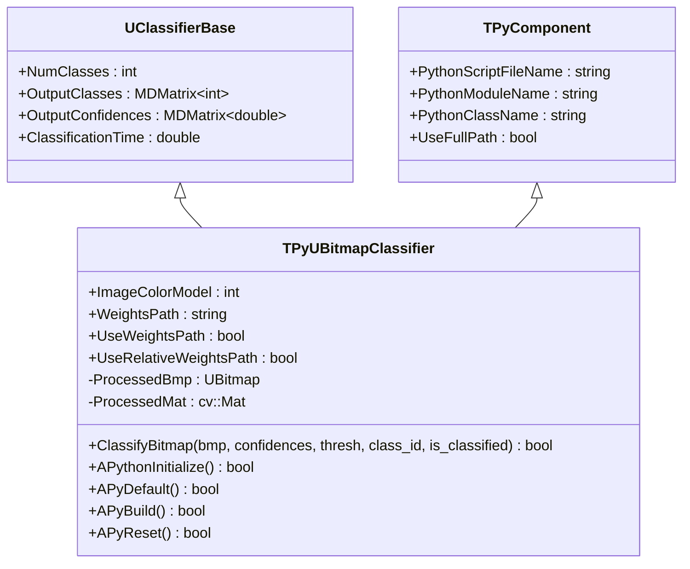
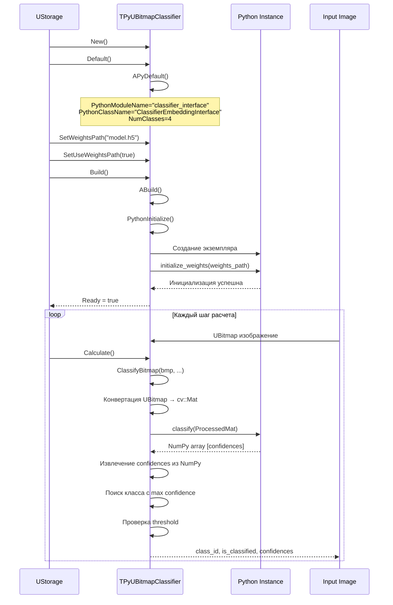
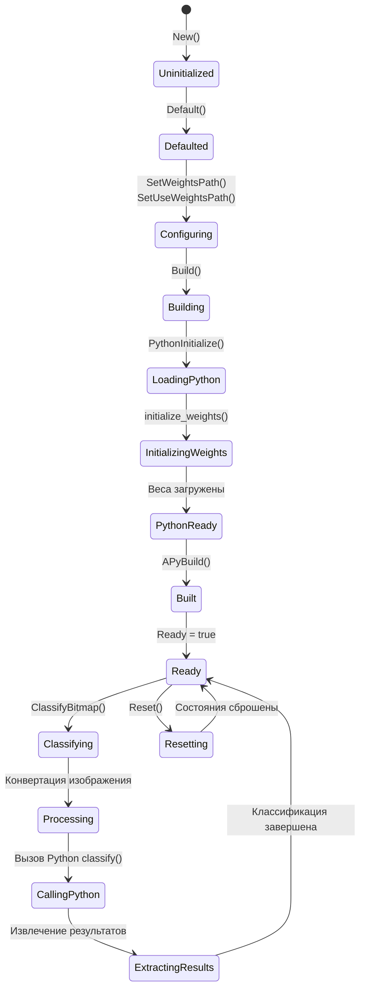
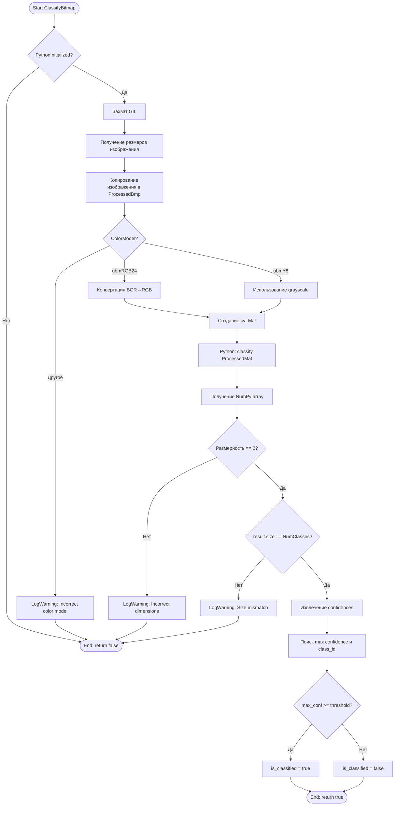
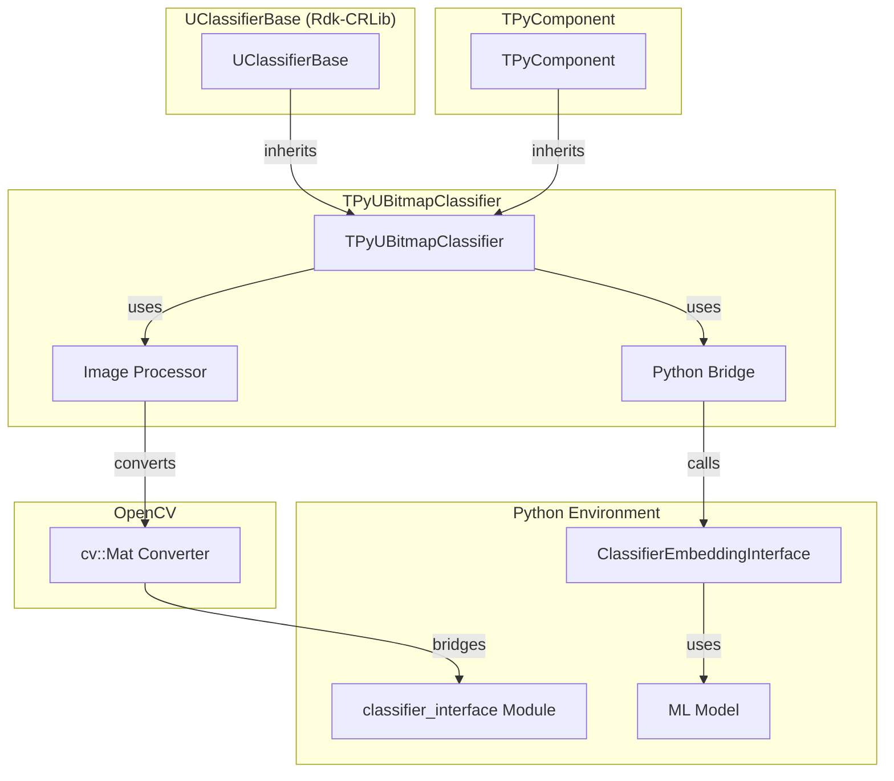

# TPyUBitmapClassifier — классификатор растровых изображений через Python

## RU

### Назначение

**Класс**: `TPyUBitmapClassifier` — классификатор растровых изображений через Python.  
**Регистрация**: `Core/Lib.cpp` → `UploadClass("TPyUBitmapClassifier", "PyUBitmapClassifier")`.  
**Storage-инстансы**: `ClassName = "PyUBitmapClassifier"` в конфигурационных проектах.

`TPyUBitmapClassifier` классифицирует растровые изображения (UBitmap) используя Python модели машинного обучения. Наследуется от `UClassifierBase` и `TPyComponent`, получая функциональность классификатора и Python-интеграции.

**Использование:** Классификация изображений на классы с использованием Python ML библиотек

### UML-диаграмма классов



**Иерархия наследования:**
- `UClassifierBase` (Rdk-CRLib) — базовый классификатор
- `TPyComponent` — базовый Python-компонент
- `TPyUBitmapClassifier` — классификатор изображений

### UML-диаграмма последовательности



### UML-диаграмма состояний



### UML-диаграмма активности



### UML-диаграмма компонентов



### Свойства

#### Параметры (ptPubParameter)

- **`ImageColorModel`** (int) — цветовая модель входного изображения:
  - `ubmRGB24=3` — RGB 24-битное
  - `ubmY8=400` — Grayscale 8-битное
  Значение по умолчанию: зависит от базового класса

- **`WeightsPath`** (string) — путь к файлу весов модели (например, .h5 для Keras/TensorFlow). Используется при `UseWeightsPath = true`. Значение по умолчанию: пустая строка

- **`UseWeightsPath`** (bool) — использовать ли путь к весам для инициализации модели. Если `true`, вызывается `initialize_weights(weights_path)` в Python. Значение по умолчанию: `false`

- **`UseRelativeWeightsPath`** (bool) — использовать относительный путь к весам. Если `true`, путь строится относительно `GetCurrentDataDir()`. Значение по умолчанию: `false`

#### Наследуемые свойства

От `UClassifierBase`:
- `NumClasses` (int) — количество классов для классификации
- `OutputClasses` (MDMatrix<int>) — выходные классы
- `OutputConfidences` (MDMatrix<double>) — выходные уверенности (confidences)
- `ClassificationTime` (double) — время классификации в секундах

От `TPyComponent`:
- `PythonScriptFileName` (string) — путь к Python скрипту
- `PythonModuleName` (string) — имя Python модуля (по умолчанию: "classifier_interface")
- `PythonClassName` (string) — имя Python класса (по умолчанию: "ClassifierEmbeddingInterface")
- `UseFullPath` (bool) — использовать абсолютный путь

### Методы

#### Публичные методы

- **`ClassifyBitmap(UBitmap &bmp, MDVector<double> &output_confidences, double conf_thresh, int &class_id, bool &is_classified)`** → `bool` — классифицирует изображение:
  - Конвертирует `UBitmap` в `cv::Mat`
  - Вызывает Python метод `classify(ProcessedMat)`
  - Извлекает confidences из NumPy array
  - Находит класс с максимальной уверенностью
  - Проверяет threshold и устанавливает `is_classified`
  - Возвращает `true` при успехе, `false` при ошибке

#### Защищенные методы

- **`APythonInitialize()`** → `bool` — инициализация Python. Если `UseWeightsPath = true`, вызывает `initialize_weights(weights_path)` в Python. Возвращает `true` при успехе

- **`APyDefault()`** → `bool` — установка значений по умолчанию:
  - `PythonModuleName = "classifier_interface"`
  - `PythonClassName = "ClassifierEmbeddingInterface"`
  - `NumClasses = 4`

- **`APyBuild()`** → `bool` — сборка компонента. Всегда возвращает `true`

- **`APyReset()`** → `bool` — сброс состояния:
  - `ClassificationTime = 0.0`
  - `OutputClasses->Resize(0, 1)`
  - `OutputConfidences->Resize(0, NumClasses)`

### Примеры использования

#### Пример 1: C++ код

```cpp
auto classifier = storage->CreateComponent<TPyUBitmapClassifier>();
classifier->SetPythonScriptFileName("classifier.py");
classifier->SetWeightsPath("model.h5");
classifier->UseWeightsPath = true;
classifier->NumClasses = 10;
classifier->Build();

UBitmap image;
// ... загрузка изображения ...

MDVector<double> confidences;
int class_id;
bool is_classified;
classifier->ClassifyBitmap(image, confidences, 0.5, class_id, is_classified);

if (is_classified) {
    std::cout << "Class: " << class_id << ", Confidence: " << confidences(class_id) << std::endl;
}
```

#### Пример 2: XML конфигурация

```xml
<Classifier ClassName="PyUBitmapClassifier">
    <Property Name="PythonScriptFileName" Value="classifier_interface.py" />
    <Property Name="WeightsPath" Value="models/classifier.h5" />
    <Property Name="UseWeightsPath" Value="true" />
    <Property Name="UseRelativeWeightsPath" Value="true" />
    <Property Name="NumClasses" Value="10" />
</Classifier>
```

### См. также

- [`TPyComponent`](TPyComponent.md) — базовый Python-компонент
- [`TPyClassifierTrainer`](TPyDetectorTrainer.md#tpyclassifiertrainer) — тренер классификаторов
- [Architecture.md](../Architecture.md) — архитектура библиотеки

---

## EN

### Purpose

**Class**: `TPyUBitmapClassifier` — bitmap image classifier via Python.  
**Registration**: `Core/Lib.cpp` → `UploadClass("TPyUBitmapClassifier", "PyUBitmapClassifier")`.  
**Instances**: `ClassName = "PyUBitmapClassifier"` in configuration projects.

`TPyUBitmapClassifier` classifies bitmap images (UBitmap) using Python machine learning models. Inherits from `UClassifierBase` and `TPyComponent`.

**Usage:** Image classification into classes using Python ML libraries

### See also

- [`TPyComponent`](TPyComponent.md) — base Python component
- [`TPyClassifierTrainer`](TPyDetectorTrainer.md#tpyclassifiertrainer) — classifier trainer
- [Architecture.md](../Architecture.md) — library architecture
