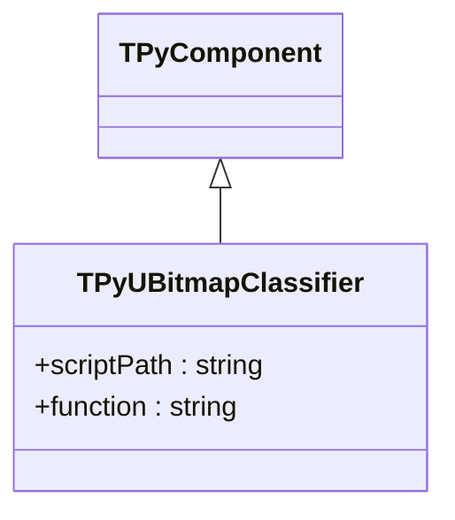
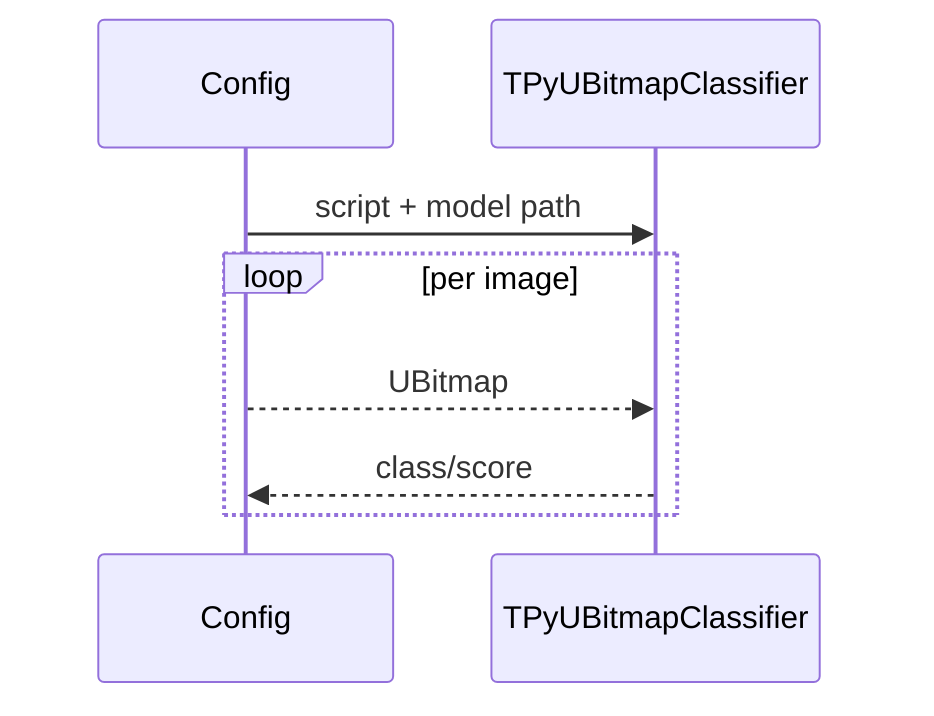

## TPyUBitmapClassifier — Python классификатор изображений

**Класс**: `TPyUBitmapClassifier` (`PyUBitmapClassifier`) — вызывает Python-код для классификации bitmap.  
**Регистрация**: `Lib.cpp` → `UploadClass("PyUBitmapClassifier", ...)`.  
**Storage-инстансы**: `ClassName = "PyUBitmapClassifier"`; параметры: путь к скрипту/модели, имя функции.

### Входы/выходы
- Вход: `UBitmap` изображение.
- Выход: класс/скор.

Пояснение: блок-схема показывает поток данных/сигналов (входы → компонент → выходы).

Пояснение: диаграмма последовательности показывает типовой сценарий взаимодействия и порядок вызовов.

---

## TPyUBitmapClassifier — Python image classifier

Runs Python inference on bitmaps; outputs class/score from provided script/model.
