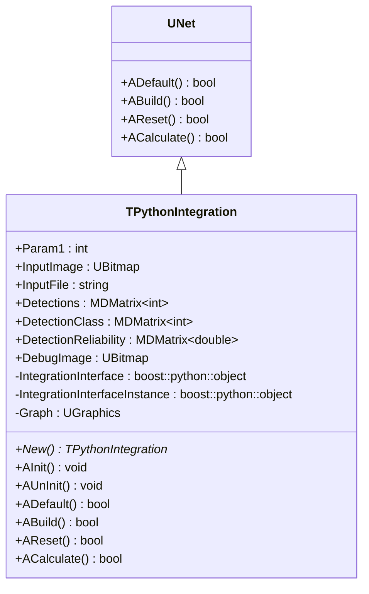
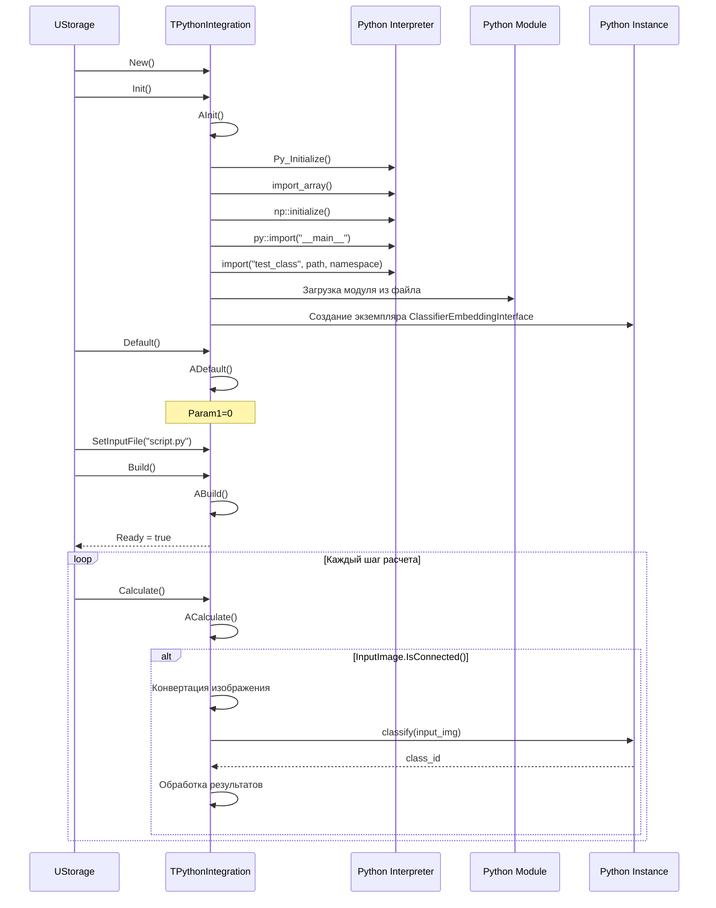
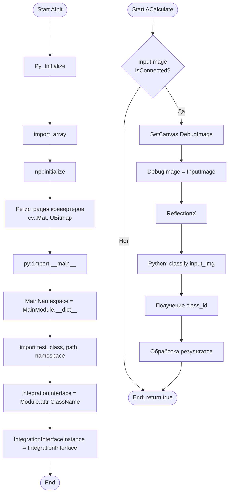
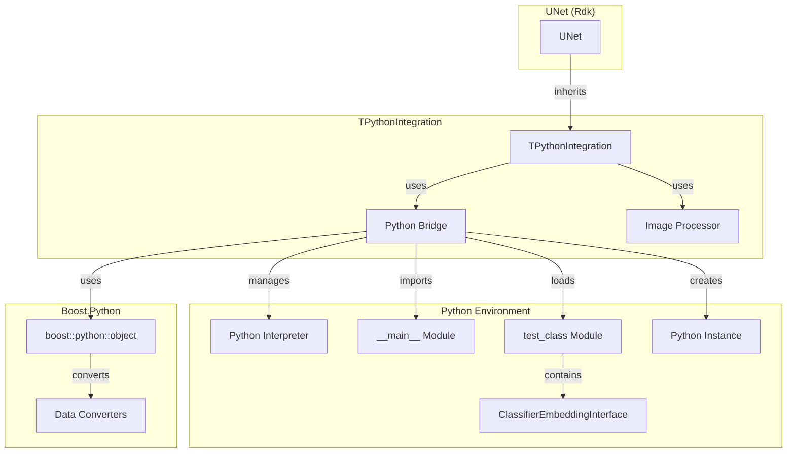

# TPythonIntegration — вспомогательный класс интеграции с Python

## RU

### Назначение

**Класс**: `TPythonIntegration` — вспомогательный класс для интеграции с Python, пример реализации Python-интеграции.  
**Регистрация**: Не регистрируется в `Core/Lib.cpp`, используется как пример/вспомогательный класс.  
**Storage-инстансы**: Не используется напрямую в конфигурационных проектах.

`TPythonIntegration` является примером реализации Python-интеграции, демонстрирующим базовые принципы работы с Python через Boost.Python. Наследуется от `UNet` и предоставляет простой интерфейс для вызова Python функций.

**Использование:** Вспомогательный класс, пример реализации Python-интеграции

### UML-диаграмма классов



**Иерархия наследования:**
- `UNet` (Rdk) — базовая сеть компонентов
- `TPythonIntegration` — вспомогательный класс интеграции

### UML-диаграмма последовательности



### UML-диаграмма состояний

```mermaid
stateDiagram-v2
    [*] --> Uninitialized: New()
    Uninitialized --> Initializing: Init()
    Initializing --> InitializingPython: Py_Initialize()
    InitializingPython --> InitializingNumPy: import_array(), np::initialize()
    InitializingNumPy --> LoadingModule: import module
    LoadingModule --> CreatingInstance: Создание экземпляра
    CreatingInstance --> Initialized: AInit завершена
    Initialized --> Defaulted: Default()
    Defaulted --> Configuring: SetInputFile()
    Configuring --> Building: Build()
    Building --> Built: ABuild()
    Built --> Ready: Ready = true
    Ready --> Calculating: Calculate()
    Calculating --> Processing: ACalculate()
    Processing --> CallingPython: Вызов Python classify()
    CallingPython --> Ready: Расчет завершен
    Ready --> Resetting: Reset()
    Resetting --> Ready: Состояния сброшены
```

### UML-диаграмма активности



### UML-диаграмма компонентов



### Свойства

#### Параметры (ptPubParameter)

- **`Param1`** (int) — пример параметра. Значение по умолчанию: 0

- **`InputImage`** (UBitmap) — входное изображение для классификации. Значение по умолчанию: не подключено

- **`InputFile`** (string) — путь к Python скрипту. Используется при инициализации. Значение по умолчанию: пустая строка

- **`DebugImage`** (UBitmap) — изображение для отладки. На него копируется входное изображение с отражением по X. Значение по умолчанию: пустое изображение

#### Состояние

- **`Detections`** (MDMatrix<int>) — выходная матрица детекций [x, y, width, height]. В текущей реализации не заполняется. Значение по умолчанию: пустая матрица

- **`DetectionClass`** (MDMatrix<int>) — выходная матрица классов детекций. В текущей реализации не заполняется. Значение по умолчанию: пустая матрица

- **`DetectionReliability`** (MDMatrix<double>) — выходная матрица уверенностей детекций. В текущей реализации не заполняется. Значение по умолчанию: пустая матрица

#### Защищенные свойства

- **`IntegrationInterface`** (boost::python::object) — объект Python класса (не экземпляр)

- **`IntegrationInterfaceInstance`** (boost::python::object) — экземпляр Python класса

- **`Graph`** (UGraphics) — графический контекст для визуализации

### Методы

#### Публичные методы

- **`New()`** → `TPythonIntegration*` — создает новый экземпляр класса

#### Защищенные методы жизненного цикла

- **`AInit()`** → `void` — инициализация компонента:
  - Инициализирует Python интерпретатор (`Py_Initialize()`)
  - Инициализирует NumPy (`import_array()`, `np::initialize()`)
  - Регистрирует конвертеры для `cv::Mat` и `UBitmap`
  - Импортирует главный модуль Python
  - Загружает пользовательский модуль из файла `InputFile`
  - Создает экземпляр класса `ClassifierEmbeddingInterface`

- **`AUnInit()`** → `void` — деинициализация компонента. В текущей реализации пустая

- **`ADefault()`** → `bool` — установка значений по умолчанию:
  - `Param1 = 0`
  - Возвращает `true`

- **`ABuild()`** → `bool` — сборка компонента. Всегда возвращает `true`

- **`AReset()`** → `bool` — сброс состояния. Всегда возвращает `true`

- **`ACalculate()`** → `bool` — выполнение расчета:
  - Проверяет подключение `InputImage`
  - Копирует изображение в `DebugImage`
  - Применяет отражение по X
  - Вызывает Python метод `classify(input_img)`
  - Получает `class_id` из результата
  - В текущей реализации результаты не обрабатываются полностью
  - Возвращает `true`

### Примеры использования

#### Пример 1: C++ код

```cpp
auto integration = storage->CreateComponent<TPythonIntegration>();
integration->SetInputFile("classifier_interface.py");
integration->Init();
integration->Default();
integration->Build();

UBitmap image;
// ... загрузка изображения ...

integration->InputImage.Connect(&image);
integration->Reset();
integration->Calculate();

// Получение результатов (в текущей реализации не реализовано полностью)
```

### Особенности работы

1. **Инициализация Python**: Компонент инициализирует Python интерпретатор при вызове `AInit()`

2. **Конвертеры данных**: Автоматически регистрирует конвертеры для `cv::Mat` и `UBitmap` в NumPy arrays

3. **Пример реализации**: Компонент служит примером базовой интеграции с Python и может использоваться как основа для создания новых компонентов

4. **Ограничения**: В текущей реализации обработка результатов классификации не завершена

### Связи с другими компонентами

- **Базовый класс для**: Не используется как базовый класс, служит примером
- **Использует**: Python модуль `test_class` с классом `ClassifierEmbeddingInterface`
- **Связан с**: `TPyComponent` — более продвинутая реализация Python-интеграции

### См. также

- [`TPyComponent`](TPyComponent.md) — базовый Python-компонент (рекомендуется для использования)
- [Architecture.md](../Architecture.md) — архитектура библиотеки
- [Python-Integration.md](../Diagrams/Python-Integration.md) — диаграммы интеграции с Python

---

## EN

### Purpose

**Class**: `TPythonIntegration` — helper class for Python integration, example implementation of Python integration.  
**Registration**: Not registered in `Core/Lib.cpp`, used as example/helper class.  
**Instances**: Not used directly in configuration projects.

`TPythonIntegration` is an example implementation of Python integration, demonstrating basic principles of working with Python via Boost.Python. Inherits from `UNet`.

**Usage:** Helper class, example implementation of Python integration

### See also

- [`TPyComponent`](TPyComponent.md) — base Python component (recommended for use)
- [Architecture.md](../Architecture.md) — library architecture
- [Python-Integration.md](../Diagrams/Python-Integration.md) — Python integration diagrams
