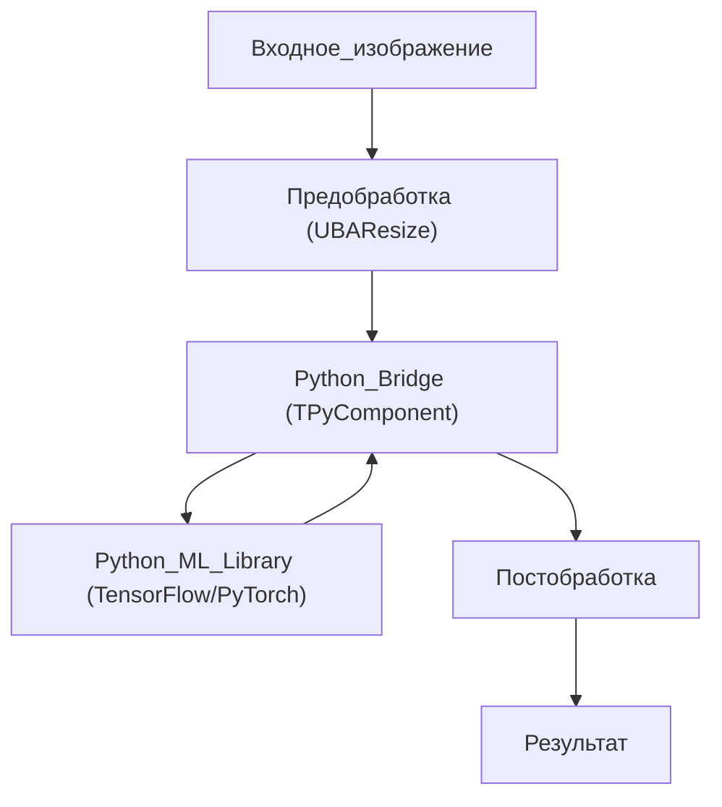
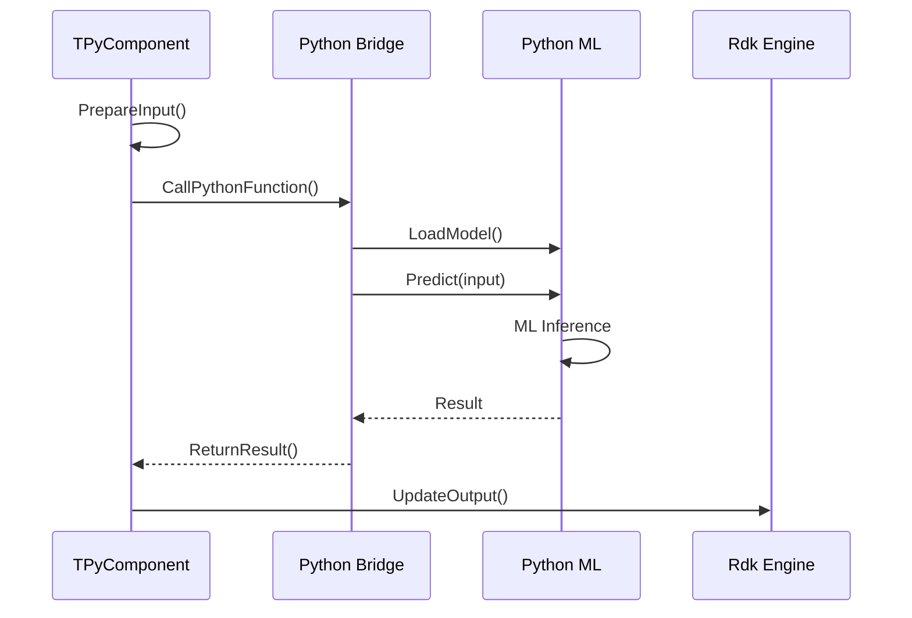
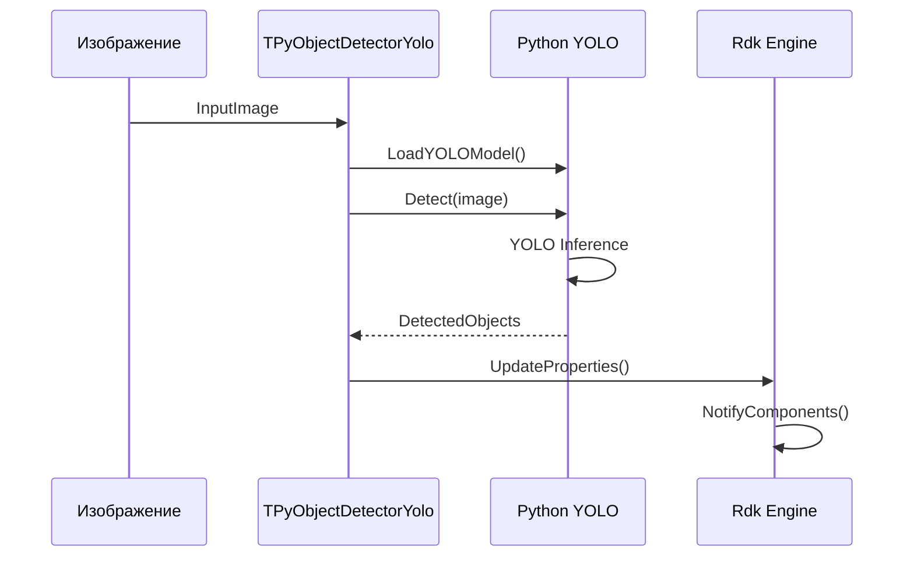

# ML-пайплайн интеграции Python

## RU

### Типичный ML-пайплайн

### Последовательность выполнения ML-пайплайна

### Интеграция YOLO детектора

---

Диаграммы показывают типичный ML‑пайплайн с использованием Python‑моста: входное изображение проходит предобработку (например, изменение размера через `UBAResize`), затем передаётся в Python‑компонент (`TPyComponent`), который вызывает Python ML библиотеку (TensorFlow/PyTorch), выполняет инференс и возвращает результат обратно в C++ код для постобработки и вывода.

Специальная диаграмма для YOLO детектора детализирует процесс: компонент `TPyObjectDetectorYolo` загружает YOLO модель в Python, выполняет детекцию на изображении, получает список обнаруженных объектов и обновляет свойства компонента, что уведомляет движок о новых данных.

## EN

### Typical ML Pipeline

The diagrams show a typical ML pipeline using a Python bridge: input image undergoes preprocessing (e.g., resizing via `UBAResize`), then is passed to a Python component (`TPyComponent`), which calls a Python ML library (TensorFlow/PyTorch), performs inference, and returns the result back to C++ code for postprocessing and output.

### ML Pipeline Execution Sequence

The sequence diagram details the execution flow: component prepares input, calls Python bridge, which loads the model and performs prediction, then returns results to the component for output property updates.

### YOLO Detector Integration

The special diagram for YOLO detector details the process: `TPyObjectDetectorYolo` component loads YOLO model in Python, performs detection on image, receives a list of detected objects, and updates component properties, which notifies the engine about new data.
