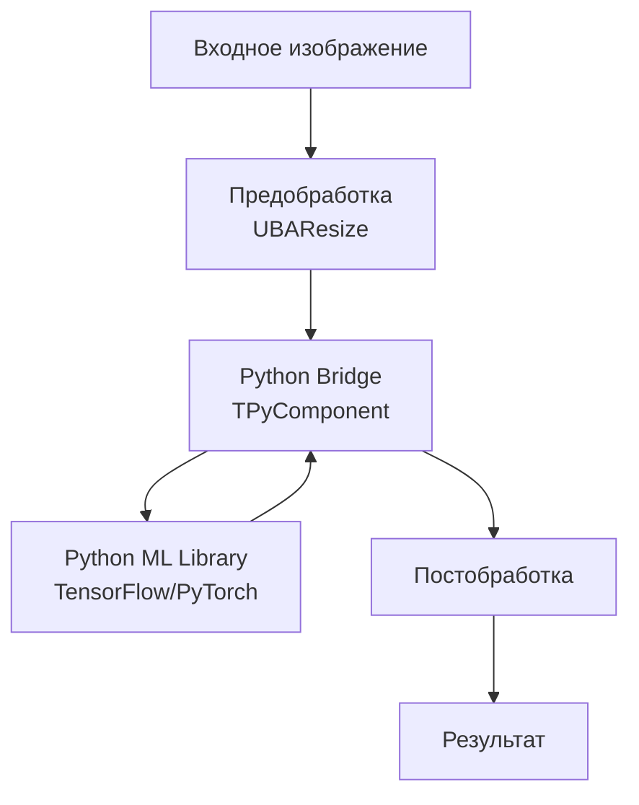
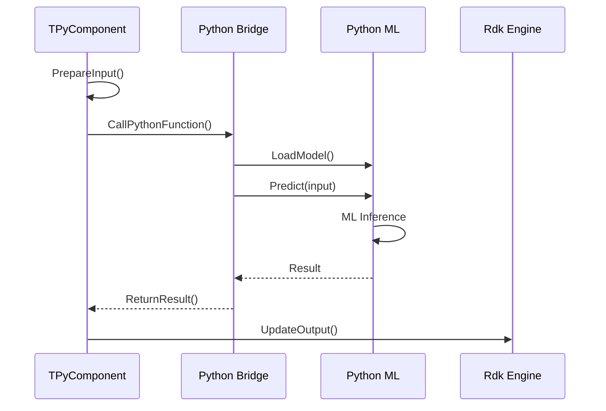
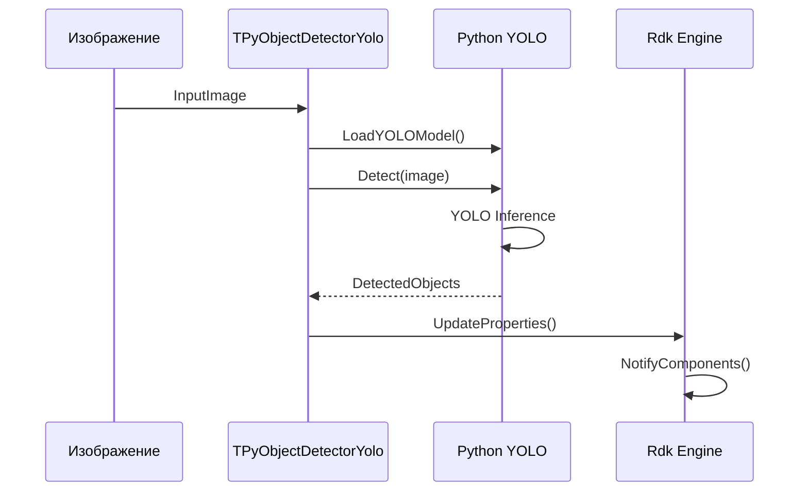

# ML-пайплайн интеграции Python

## RU

### Типичный ML-пайплайн

### Последовательность выполнения ML-пайплайна

### Интеграция YOLO детектора

---

## EN

### Typical ML Pipeline

### ML Pipeline Execution Sequence

### YOLO Detector Integration
