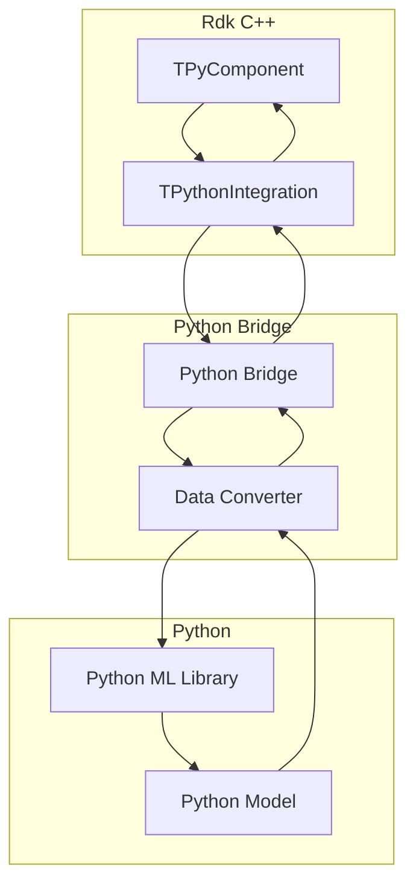
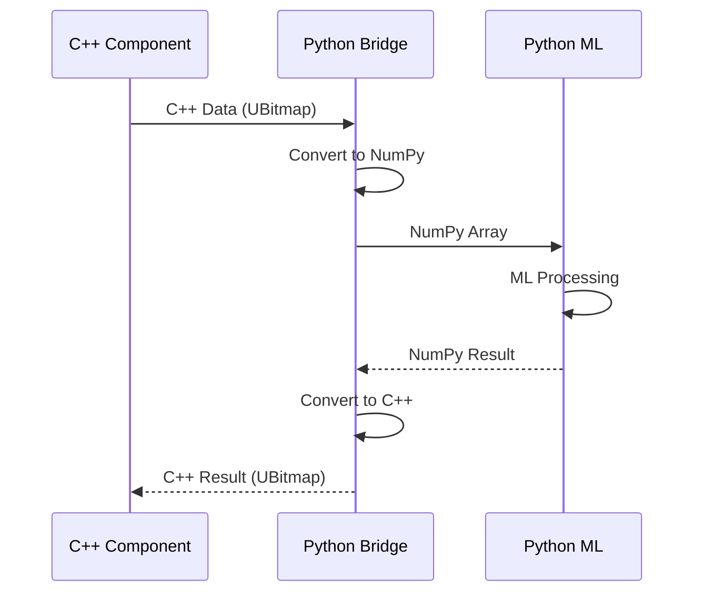

# Интеграция Python с движком Rdk

## RU

### Архитектура интеграции

```mermaid
flowchart TB
    subgraph "Rdk C++"
        Component[TPyComponent]
        Integration[TPythonIntegration]
    end
    
    subgraph "Python Bridge"
        Bridge[Python Bridge]
        Converter[Data Converter]
    end
    
    subgraph "Python"
        PyLib[Python ML Library]
        PyModel[Python Model]
    end
    
    Component --> Integration
    Integration --> Bridge
    Bridge --> Converter
    Converter --> PyLib
    PyLib --> PyModel
    PyModel --> Converter
    Converter --> Bridge
    Bridge --> Integration
    Integration --> Component
```

### Поток данных

```mermaid
sequenceDiagram
    participant Cpp as C++ Component
    participant Bridge as Python Bridge
    participant Python as Python ML
    
    Cpp->>Bridge: C++ Data (UBitmap)
    Bridge->>Bridge: Convert to NumPy
    Bridge->>Python: NumPy Array
    Python->>Python: ML Processing
    Python-->>Bridge: NumPy Result
    Bridge->>Bridge: Convert to C++
    Bridge-->>Cpp: C++ Result (UBitmap)
```

---

## EN

### Integration Architecture

### Data Flow
